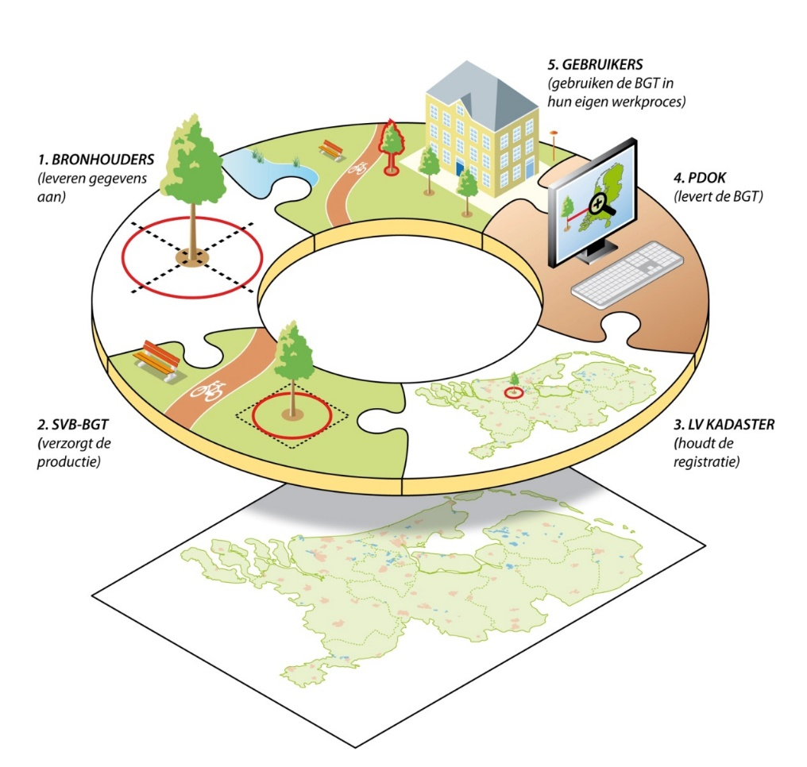

Inleiding
=========

Dit hoofdstuk geeft een inleiding op het BGT berichtenverkeer en de reikwijdte
van dit document.

1.  Introductie

    1.  Inleiding

In het kader van de wet Basisregistratie Grootschalige Topografie (BGT) leveren
de bronhouders gegevens van grootschalige topografische objecten aan de
Landelijk Voorziening BGT (LV-BGT) van het Kadaster. Bronhouders leveren deze
gegevens aan de LV-BGT via het Samenwerkingsverband van bronhouders BGT
(SVB-BGT).

Het geheel aan centrale (SVB-BGT, LV-BGT) en decentrale systemen (bronhouders en
gebruikers) vormt gezamenlijk de BGT-infrastructuur en wordt de ‘BGT-keten’
genoemd.

1.  Begrippenkader BGT berichtenverkeer

De Basisregistratie Grootschalige Topografie (BGT) wordt gevormd door een
verzameling **gegevens** waarvan bij wet bepaald is dat deze een
basisregistratie vormen. Het hier gegeven begrippenkader heeft alleen betrekking
op deze gegevens. Bij het uitwisselen van gegevens is in dit begrippenkader
alleen de uitwisseling tussen bronhouder, SVB-BGT en LV-BGT van toepassing.

Het uitwisselen van gegevens vindt altijd plaats in de vorm van **berichten**.
In de Standaard BGT Berichtenverkeer ligt vast welke berichten er zijn en hoe
deze technisch en inhoudelijk zijn opgebouwd. Een bericht bevat informatie over
één of meerdere gegevens.

Het leveren van nieuwe of gewijzigde gegevens door bronhouders vindt plaats door
middel van **mutatieberichten**. Het mutatiebericht is een van de berichten uit
de Standaard BGT Berichtenverkeer.

Het feitelijke elektronische transport van de berichten vindt plaats door middel
van **bestanden**. Ieder bestand bevat altijd precies één bericht. Ieder bestand
is gecomprimeerd tot een ZIP-archief.

Een bronhouder verzendt berichten met gegevens aan SVB-BGT via het Portaal
BRAVO. De **levering** van gegevens bestaat uit één of meerdere bestanden. Deze
bestanden worden via een handmatige upload functie in het Portaal BRAVO naar
SVB-BGT verzonden. Als alternatieve werkwijze kan een bronhouder de bestanden
leveren via automatisch berichtenverkeer op basis van de Digikoppeling
standaard.

De eerste levering van gegevens voor een stuk grondgebied wordt de **initiële
levering** genoemd. Deze leveringen worden gedaan tijdens de opbouwfase van de
BGT.

Het leveren van gewijzigde gegevens voor een stuk grondgebied wordt een
**mutatielevering** genoemd. Deze leveringen worden gedaan tijdens de bijhouding
van de BGT.

Aan de hand van het soort **kennisgevingen** in het mutatiebericht kan worden
afgeleid of het een initiële levering of een mutatielevering betreft.

In de BGT documentatie wordt veelvuldig gesproken over **mutaties**. Deze
generieke term betreft het totale proces van leveren en verwerken van
mutatieberichten en heeft derhalve alleen betrekking op de bijhouding van de
BGT.

1.  Reikwijdte van dit document

Dit document beschrijft het berichtenverkeer tussen een bronhouder, het SVB-BGT
en de LV-BGT voor uitwisseling van BGT\|IMGeo gegevens. Dit kan in ieder geval
via handmatige upload/download en optioneel via automatisch berichtenverkeer.

De reikwijdte van dit document beperkt zich tot de uitwisseling tussen
bronhouders, het SVB-BGT en de LV-BGT. De distributie naar en uitwisseling met
gebruikers, door middel van de gemeenschappelijke geo-leveringsvoorziening PDOK,
valt buiten de reikwijdte van dit document.

Dit document beschrijft de reguliere werkwijze van het BGT berichtenverkeer.
Alternatieve werkwijzen voor onder andere terugvalscenario’s zijn in dit
document niet beschreven en dienen in werkafspraken tussen de betrokkenen te
worden geregeld.

1.  Leeswijzer

In dit document wordt de standaard van het BGT berichtenverkeer voor
uitwisseling van BGT\|IMGeo gegevens van een bronhouder via SVB-BGT naar de
LV-BGT vastgelegd. Dit document beschrijft het BGT berichtenverkeer; de StUF-Geo
IMGeo berichten in dit berichtenverkeer zijn functioneel beschreven in een
berichtencatalogus (bron: [StUFGeo]). Op deze twee documenten is de technische
implementatie in de vorm van berichtenschema’s (XSD’s) en servicebeschrijvingen
(WSDL’s) gebaseerd. De inhoud van de berichten wordt bepaald door de
Gegevenscatalogus BGT (bron: [BGT]) en de Gegevenscatalogus IMGeo (bron:
[IMGeo]).

In het document worden verschillende scenario’s van het BGT berichtenverkeer
beschreven. De scenario’s zijn uitgewerkt in sequentiediagrammen. Een
sequentiediagram geeft de interacties weer tussen verschillende objecten die een
bepaalde functionaliteit (of een deel ervan) implementeren. De pijlen laten zien
tussen welke actoren gegevens worden uitgewisseld; de pijl wijst waar de data
naar toe gaat. De tijdsvolgorde staat centraal in het sequentiediagram.

1.  Referenties

Deze standaard voor het BGT Berichtenverkeer is gebaseerd op de volgende
standaarden:

| **Afkorting** | **Document**                                                         | **Versie**    | **Datum**        | **Auteur c.q. beheerder** |
|---------------|----------------------------------------------------------------------|---------------|------------------|---------------------------|
| [BGT]         | Gegevenscatalogus BGT                                                | 1.1.1         | Juli 2013        | Geonovum                  |
| [IMGeo]       | Gegevenscatalogus IMGeo                                              | 2.1.1         | Juli 2013        | Geonovum                  |
| [StUFGeo]     | StUF-Geo IMGeo berichtencatalogus                                    | \*\*\*        | \*\*\*           | Geonovum                  |
| [StUF]        | StUF 03.01: In Gebruik                                               | 17            | 1 november 2013  | KING                      |
| [DK]          | Architectuur Digikoppeling 3.0                                       | 1.0           | 26 november 2013 | Logius                    |
| [DKWUS]       | Koppelvlakstandaard WUS voor Digikoppeling 3.0                       | 3.0           | 29 augustus 2013 | Logius                    |
| [DKGB]        | Koppelvlakstandaard Grote Berichten Digikoppeling 2.0                | 1.1           | 5 april 2013     | Logius                    |
| [PKI]         | PKIOverheid standaard https://www.logius.nl/standaarden/pkioverheid/ | November 2014 | Logius           |                           |

\*\*\* Voor de vigerende versie van de StUF-Geo IMGeo berichtencatalogus, zie de
website van Geonovum:

<http://www.geonovum.nl/onderwerpen/bgt-imgeo-standaarden>.

Deze standaard voor het BGT Berichtenverkeer hanteert verder de volgende
documenten en bestanden die toegepast dienen te worden bij de implementatie:

| **Afkorting** | **Document / bestand**                   | **Versie** | **Datum** | **Auteur c.q. beheerder** |
|---------------|------------------------------------------|------------|-----------|---------------------------|
| [LVBGT]       | Toelichting controles LV-BGT             | †††        | †††       | Kadaster                  |
| [BHL]         | Lijst een bronhoudercodes LV-BGT         | †††        | †††       | Kadaster                  |
| [XSD]         | Berichtenschema StUF-Geo IMGeo           | ‡‡‡        | ‡‡‡       | Geonovum                  |
| [WSDL]        | Servicebeschrijving StUF-Geo IMGeo       | ‡‡‡        | ‡‡‡       | Geonovum                  |
| [HUS]         | Handreiking Uitwisselingsstandaard IMGeo | ‡‡‡        | ‡‡‡       | Geonovum                  |

††† Voor de vigerende versie van de BGT documentatie, zie website van het
Kadaster:

<http://www.kadaster.nl/web/Themas/Registraties/BGT/BGTartikelen/BGT-documentatie.htm>.

‡‡‡ Voor de vigerende versie van de StUF-Geo IMGeo implementatietoolkit, zie de
website van Geonovum:

<http://www.geonovum.nl/onderwerpen/bgt-imgeo-standaarden>.

Bij deze documenten en bestanden zijn, ter ondersteuning van de implementatie,
werkafspraken gepubliceerd op de website van Geonovum:

<http://www.geonovum.nl/onderwerpen/bgt-imgeo-standaarden/werkafspraken-bgtimgeo>
