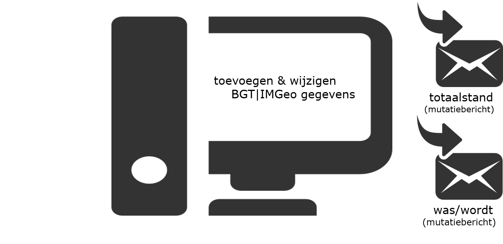
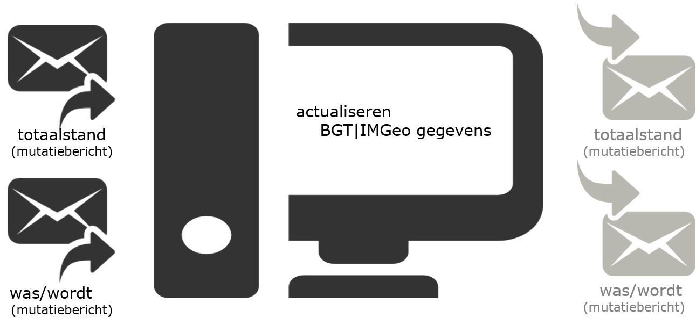
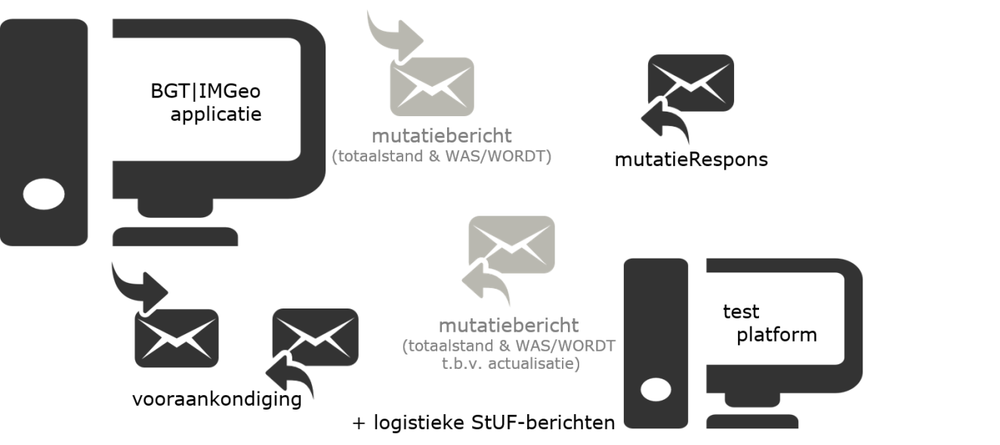
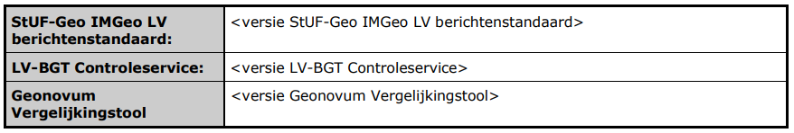
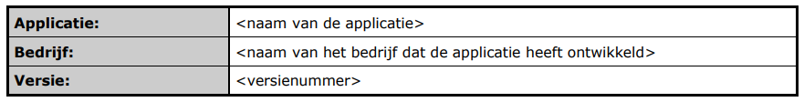
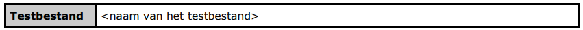
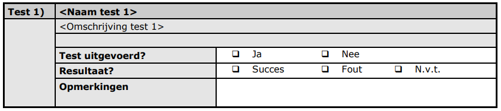
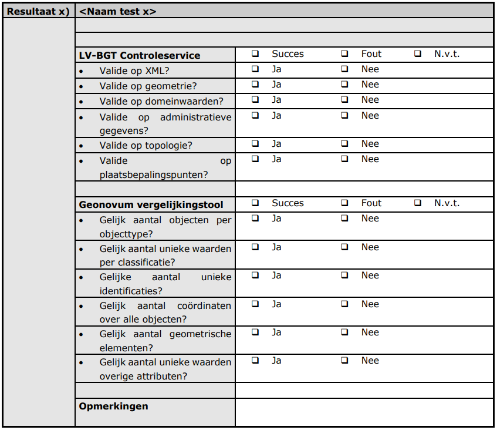
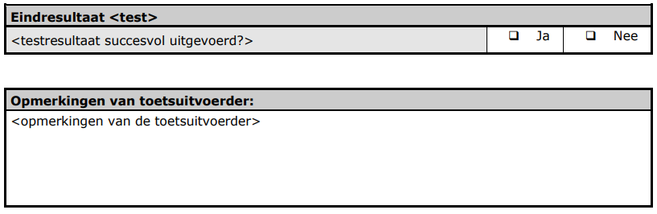
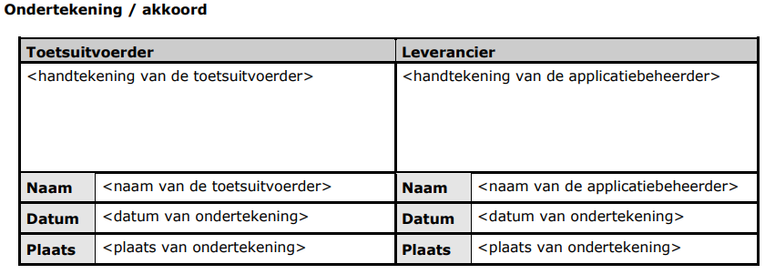

Inleiding
=========

Dit hoofdstuk geeft een inleiding op de uitvoering van de certificeringstoets.

Dit document beschrijft de inhoudelijke opzet van de certificering en bestaat
naast het Toetsprotocol waarin de organisatorische en procesmatige aspecten van
certificeren van BGT bronhoudersoftware beschreven staat.

Het document bevat:

-   De algemene inhoud van de verschillende certificeringsniveaus, ofwel de te
    testen functionaliteit in de BGT\|IMGeo-applicatie per certificeringsniveau.

-   Beschrijving van de validatietools waar tegen geëxporteerde bestanden/
    berichten uit de BGT\|IMGeo applicatie worden gecontroleerd.

-   De algemene opzet van een toetsformulier waarin de testresultaten van de
    toets worden vastgelegd.

Bij dit document zijn de volgende bijlagen beschikbaar:

-   Toetsformulier voor certificeringsniveau BASIS.

-   Voorbeeld testscenario voor certificeringsniveau BASIS.

-   Toetsformulier voor het certificeringsniveau UITGEBREID.

-   Voorbeeld testscenario voor certificeringsniveau UITGEBREID.

-   Toetsformulier voor certificeringsniveau AUTOMATISCH.

-   Voorbeeld testscenario voor certificeringsniveau AUTOMATISCH.

Dit document is opgesteld door Geonovum, als beheerder van de BGT\|IMGeo
Standaarden, in opdracht van het Ministerie van BZK.

Versiehistorie
--------------

| **Datum**  | **Versie** | **Auteur(s)**  | **Beschrijving**                           |
|------------|------------|----------------|--------------------------------------------|
| 30-10-2014 | 1.0        | Arnoud de Boer | Definitieve versie                         |
| 12-05-2015 | 1.1        | Arnoud de Boer | Certificeringsniveau UITGEBREID aangepast  |
| 01-03-2016 | 1.2        | Arnoud de Boer | Certificeringsniveau AUTOMATISCH aangepast |
| 01-10-2020 | 1.3        | Arnoud de Boer | Onderdeel MACHTIGINGEN toegevoegd          |
| 01-09-2021 | 1.3.1      | Arnoud de Boer | Omgezet naar HTML.                         |

Certificeringniveaus
====================

Dit hoofdstuk beschrijft een toelichting op de verschillende niveaus van
certificering van BGT\|IMGeo bronhoudersoftware: BASIS, UITGEBREID en
AUTOMATISCH.

BASIS: Toevoegen en wijzigen BGT\|IMGeo gegevens
------------------------------------------------

Voor dit onderdeel wordt getoetst of de BGT bronhoudersoftware objecten kan
aanmaken (toevoegen) en geometrische en administratieve gegevens van deze
objecten kan muteren (wijzigen). De objectgegevens dienen na toevoeging en
wijziging respectievelijk als initiële levering (totaalstand) en mutatielevering
(was/wordt) naar een valide StUF-Geo IMGeo mutatiebericht (mtbSVBDi01) te worden
geëxporteerd.

De volgende functionaliteit wordt getoetst in niveau BASIS:

-   Aanmaken / tekenen van geometrieën van BGT\|IMGeo objecten

-   Bewerken / wijzigen van attribuutgegevens van BGT\|IMGeo objecten inclusief
    PBP’s.

-   Exporteren van initiële levering en mutatielevering naar een StUF-Geo IMGeo
    mutatiebericht (mtbSVBDi01)

Het verwacht testresultaat is dat alle gegevens zoals opgevoerd in de BGT
bronhoudersoftware in het geëxporteerde mutatiebericht zijn opgenomen
(volledigheid) en dat het mutatiebericht succesvol valideert tegen de
validatietools (juistheid).

Figuur 1 Certificeringniveau BASIS: Toevoegen en wijzigen BGT\|IMGeo gegevens

UITGEBREID: Actualiseren BGT\|IMGeo gegevens
--------------------------------------------

Voor dit onderdeel wordt getoetst of de BGT bronhoudersoftware het inlezen van
actualisatieberichten ondersteunt om de eigen registratie te kunnen bijwerken na
assemblage of mutatie door een andere bronhouder binnen een interessegebied.

Naast de functionaliteit van niveau BASIS, wordt in niveau UITGEBREID de
volgende functionaliteit getoetst:

-   Importeren van een StUF-Geo IMGeo actualisatiebericht na assemblage

-   Importeren van een StUF-Geo IMGeo actualisatiebericht na mutatie (zowel een
    bericht met een nulstand vergelijkbaar met een bericht welke wordt verstuurd
    na afsluiten van een abonnement in BRAVO, als een bericht met mutaties na
    een succesvol verwerkte mutatielevering van een andere bronhouder)

Het verwacht testresultaat is dat alle gegevens in de StUF-Geo
actualisatieberichten volledig[^1] en juist zijn overgenomen in de BGT
bronhoudersoftware. Dit wordt beoordeeld door het opnieuw exporteren van de
verwerkte gegevens naar een initiële levering of mutatielevering in een valide
StUF-Geo IMGeo mutatiebericht, danwel door visuele controle door het opvragen
van de objectgegevens in de BGT bronhoudersoftware middels een steekproef.

[^1]: In ieder geval voor zover deze objecten binnen het interessegebied vallen.

Figuur 2 Certificeringniveau UITGEBREID: Actualiseren BGT\|IMGeo gegevens

AUTOMATISCH: Uitwisselen via automatisch berichtenverkeer
---------------------------------------------------------

Voor dit certificeringsniveau wordt getoetst of de BGT bronhoudersoftware
StUF-Geo IMGeo dienst- en responsberichten via automatisch berichtenverkeer kan
aanmaken/verzenden en ontvangen/verwerken.

Dit certificeringsniveau is een aanvulling op het niveau UITGEBREID en toetst
vooral de logistieke aspecten van het automatische berichtenverkeer via
Digikoppeling WUS. Randvoorwaarde voor deelname van een leverancier aan
certificering voor het niveau AUTOMATISCH is dat leverancier geslaagd is voor de
niveau UITGEBREID.

Voor dit certificeringsniveau wordt het volgende getoetst:

-   Verzenden van een mutatiebericht via een ophaalverzoek.

-   Ontvangen en verwerken van een mutatieRepons.

-   Ontvangen, ophalen en verwerken van een actualisatiebericht via een
    ophaalverzoek

-   Aanmaken en verzenden van een vooraankondiging

-   Ontvangen en verwerken van een vooraankondiging

-   Verzenden en ontvangen van technische en functionele fout- en
    bevestigingsberichten conform StUF.

Figuur 3 Certificeringniveau AUTOMATISCH: Uitwisselen via automatisch
berichtenverkeer

Voor meer informatie over de testopzet en validatietools, zie §3.3 BRAVO. Afname
van de toets verloopt op een soortgelijke wijze als bij niveau BASIS en
UITGEBREID.

Het onderdeel MACHTIGINGEN bevat, als uitbreiding op het automatisch niveau,
functionaliteit voor het via de machtigingenmodule middels automatisch
berichtenverkeer uitwisselen van BGT\|IMGeo-gegevens en procesberichten.

Tabel 1. Relatie tussen certificeringsniveaus, processen/functionaliteit en
benodigde berichten

| **Certificeringsniveau**                    | **BASIS** | **UITGEBREID** | **AUTOMATISCH** |
|---------------------------------------------|-----------|----------------|-----------------|
| **Processen / functionaliteit**             |           |                |                 |
| Opbouw en initiële levering                 |           |                |                 |
| Bijhouding en mutaties                      |           |                |                 |
| Actualiseren                                |           |                |                 |
| Vooraankondigen                             |           |                |                 |
| Responsafhandeling                          |           |                |                 |
|                                             |           |                |                 |
| **StUF-Geo IMGeo LV berichten**             |           |                |                 |
| Mutatiebericht (mtbSVBDi01)                 | E         | E              | E,Z             |
| Actualisatiebericht na mutatie (mtbSVBDi01) |           | I              | I,O             |
| Actualisatiebericht na assemblage (mtoDi01) |           | I              | n.v.t.          |
| Mutatierespons (mtbDu01)                    |           |                | I,O             |
| Vooraankondiging (vavDi01)                  |           |                | E,Z             |
| ophaalVerzoek (opvDi01)                     |           |                | I,E,Z,O         |
| Logistieke StUF-berichten                   |           |                | I,E,Z,O         |

I = Importeren E = exporteren Z=Zenden O=Ontvangen

*Toelichting bovenstaande tabel:*

BASIS + UITGEBREID is voor bronhouders die werken via het Portaal van SVB-BGT.
Dus aanleveren en actualiseren via handmatige upload/download, status en respons
via email en download PDF/XML verwerkingsverslag, en vooraankondigingen via
kaartfunctie (geen download-functie).

AUTOMATISCH is voor bronhouders die werken via automatisch berichtenverkeer
(systeem-systeemkoppeling). Dus aanleveren en actualiseren via direct zenden
vanuit applicatie, status en respons via te ontvangen mutatierespons met evt.
automatische download PDF/XML verwerkingsverslag, en vooraankondigingen maken en
verzenden vanuit BGT\|IMGeo applicatie, en rakende vooraankondiging ontvangen en
verwerken in de BGT\|IMGeo applicatie.

Validatietools
==============

Dit hoofdstuk beschrijft de validatietools voor de certificering. Afhankelijk
van het certificeringsniveau wordt gebruik gemaakt van één of meer
validatietools om de uitvoer van een applicatie te beoordelen.

LV-BGT Controleservice
----------------------

De LV-BGT Controleservice is onderdeel van de Landelijke Voorziening BGT die
gerealiseerd en beheerd wordt door het Kadaster. De Controleservice controleert
of de BGT\|IMGeo gegevens in een aangeleverd StUF-Geo IMGeo LV mutatiebericht
cf. de BGT\|IMGeo standaarden zijn. Een mutatiebericht wordt o.a. gecontroleerd
op de volgende aspecten:

-   XML:

Controle of de XML well-formed en tegen het berichtenschema valide is.

-   Geometrie:

Controle of de geometrie technisch en functioneel valide is, d.w.z. geen
zelfdoorsnijdingen, sluitende polygonen etc.

-   Domeinwaarden:

Controle of de domeinwaarden van de bgt- en plus-classificaties cf. de
BGT\|IMGeo standaard zijn d.w.z. de domeinwaarde is geldig voor het kenmerk en
komt voor in de codelist, geldige combinatie van bgt- en plus domeinwaarde.

-   Administratief:

Controle of de administratieve gegevens valide zijn, zoals geldige en unieke
objectidentificaties, juiste en aansluitende tijdstippen voor objectversies etc.

-   Topologie:

Controle of de BGT\|IMGeo objecten cf. informatiemodel objecten topologisch
gestructureerd zijn, d.w.z. geen overlap op maaiveldniveau tussen de BGT
vlakobjecten.

-   Plaatsbepalingspunten

Controle of voor ieder coördinaat in de objectgeometrie een Plaatbepalingspunt
voorkomt in bestand of de LV, voor zover het informatiemodel bepaalt dat dit
BGT\|IMGeo object Plaatsbepalingspunten heeft.

Naast deze functionele controles gelden nog enkele technische beperkingen t.a.v.
geometrie en bestandsgrootte (ketenparameters) waaraan de StUF-Geo IMGeo LV
mutatieberichten moeten voldoen om te worden geaccepteerd als valide aanlevering
van BGT\|IMGeo gegevens.

De LV-BGT Controleservice wordt voor het certificeringniveau BASIS en UITGEBREID
ingezet voor het controleren van geëxporteerde StUF-Geo IMGeo LV
mutatieberichten uit de BGT\|IMGeo bronhoudersoftware. Een mutatiebericht uit de
BGT\|IMGeo bronhoudersoftware moet valide zijn tegen de LV-BGT Controleservice,
anders is een test niet succesvol doorlopen.

Geonovum vergelijkingstool
--------------------------

De Geonovum vergelijkingstool controleert twee bestanden (input/output) in
StUF-Geo IMGeo LV tegen elkaar en constateert verschillen tussen de bestanden
o.b.v. tellingen.

De input en output wordt o.a. gecontroleerd op de volgende aspecten:

-   Aantal objecten per objecttype:

Het aantal objecten per objecttype wordt geteld in input en output bestand.

-   Aantal unieke waarden per classificatie:

>   Het aantal unieke domeinwaarden wordt per objectkenmerk (bgt- /
>   plus-classificatie) geteld in input en output bestand.

-   Aantal unieke identificaties:

Het aantal unieke IMGeo objectidentificaties wordt geteld in input en output
bestand.

-   Aantal coördinaten over alle objecten:

Het aantal coördinaten in de \<gml:poslist\>’s over alle objecten wordt geteld
in input en output bestand.

-   Aantal geometrisch elementen:

>   Het aantal elementen per GML-type (gml:Arc, gml:Surface) wordt geteld in
>   input en output bestand.

-   Aantal unieke waarden voor andere attributen:

Van alle attributen (XML-elementen) worden de unieke waarden geteld in input en
output bestand.

-   Random verschillende coördinaten:

Van een aantal willekeurig gekozen (random) coördinaten wordt vergeleken of deze
zowel input als output bij het zelfde object voorkomt.

De Geonovum vergelijkingstool wordt voor het certificeringniveau BASIS en
UITGEBREID ingezet om de geïmporteerde mutatieberichten (totaalstand of
was/wordt) te vergelijken tegen de geëxporteerde mutatieberichten uit de
BGT\|IMGeo software.

BRAVO
-----

Voor het certificeren van niveau AUTOMATISCH wordt getest of de *BGT
bronhouderapplicatie* van een softwareleverancier kan aansluiten op zowel de
zelftestvoorziening in BRAVO als op de mutatie- en
vooraankondigingsfunctionaliteit in BRAVO. Leverancier dient zelf te zorgen voor
PKI overheidscertificaten.

De zelftestvoorziening (ZTV) in BRAVO is gemaakt voor bronhouders die hun
productieomgeving gaan aansluiten op SVB-BGT. Met de BRAVO zelftestvoorziening
kunnen logistieke aspecten van het automatische berichtenverkeer worden getest.
Vanaf een applicatie worden berichten verzonden naar de BRAVO
zelftestvoorziening; de ZTV bevestigt de ontvangst van berichten en genereert
eventueel een gerelateerd responsbericht. In de ZTV worden de BGT\|IMGeo
gegevens niet verwerkt in een registratie.

Om de uitwisseling tussen bronhouder en SVB-BGT via automatisch berichtenverkeer
werkend te krijgen is het van belang dat stuurgegevens én de inhoud goed door de
BGT bronhouderapplicatie verwerkt worden. Dit wordt getoetst met de mutatie- en
vooraankondigingsfunctionaliteit in de testomgeving van BRAVO. Hiervoor moet de
BGT bronhouderapplicatie kunnen aansluiten op BRAVO, d.w.z. dat vanuit de
applicatie BRAVO benaderd kan worden, endpoints van de applicatie van buitenaf
benaderd kunnen worden en te downloaden bestanden kunnen worden benaderd van
buitenaf, allemaal conform de geldende digikoppelingstandaard.

Toetsformulier
==============

Dit hoofdstuk beschrijft de algemene elementen van het toetsformulier die worden
ingevuld tijdens de uitvoering van de toets. Voor elk certificeringniveau is een
apart toetsformulier beschikbaar op de website van Geonovum waarop in de titel
het te certificeren niveau staat.

Testcondities
-------------

De gegevens van de toetsuitvoerder en de datum waarop de toets is afgenomen
worden vastgelegd in de volgende tabel:

| **Toetsuitvoerder:**         | \<naam van de toetsuitvoerder\>                                                                                         |
|------------------------------|-------------------------------------------------------------------------------------------------------------------------|
| **Organisatie:**             | \<naam van de organisatie van de toetsuitvoerder\>                                                                      |
| **Contactgegevens:**         | \<telefoonnummer van de organisatie van de toetsuitvoerder \> \<emailadres van de organisatie van de toetsuitvoerder \> |
| **Plaats van de toets:**     | \<naam van de plaats\>                                                                                                  |
| **Startdatum van de toets:** | \<datum/tijd: dd-mm-jjj hh:ii:ss\>                                                                                      |
| **Einddatum van de toets:**  | \<datum/tijd: dd-mm-jjj hh:ii:ss\>                                                                                      |

Testbasis
---------

De testbasis – d.w.z. versies van geldende standaarden en controletools- worden
vastgelegd in de volgende tabel.

Te testen applicatie
--------------------

De gegevens van de testen applicatie worden vastgelegd in de volgende tabel:

Uitgevoerde test(s)
-------------------

De gegevens van de uitgevoerde testen worden als volgt vastgelegd.

Indien er een of meerdere testbestanden als input worden gebruikt voor een test
worden de gegevens van de testbestanden vastgelegd in de volgende tabel:

De uitgevoerde tests incl. omschrijving van de test en een samenvatting van het
resultaat worden vastgelegd in de volgende tabel:

Overzicht resultaat
-------------------

Een detail overzicht van de resultaten van de uitvoering van de toets en
controles van de geëxporteerde bestanden en berichten uit de applicatie tegen de
controletools LV-BGT Controleservice en/of Geonovum vergelijkingstool worden
vastgelegd in de aparte tabel. Deze tabel verschilt per certificeringsniveau en
kan o.a. de volgende gegevens bevatten.

Evaluatie
---------

Een evaluatie van de uitgevoerde tests en resultaten wordt vastgelegd in de
volgende tabel:

Ondertekening
-------------

De ondertekening voor akkoord van de uitvoering van de toets wordt vastgelegd in
de volgende tabel:

