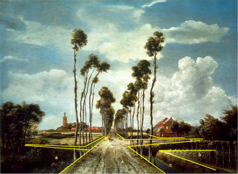

IMGeo objectenhandboek
======================

-   [Over het objectenhandboek](#over-het-objectenhandboek)

-   [Gebruik objectenhandboek](#gebruik-objectenhandboek)

-   [Toelichting bij de voorbeelden](#toelichting-bij-de-voorbeelden)

-   [Uitgewerkt voorbeeld](#uitgewerkt-voorbeeld)

-   [Deze versie](#deze-versie)

Over het objectenhandboek
-------------------------

Het objectenhandboek omvat

-   de inwinregels en praktijkvoorbeelden van de verplichte inhoud van de
    Basisregistratie Grootschalige Topografie (BGT),

-   de inwinregels en praktijkvoorbeelden van de optionele inhoud van het
    InformatieModel Geografie (IMGeo),

-   en afstemmingsvoorbeelden voor wat betreft de inwinning in combinatie met de
    Basisregistratie Adressen en Gebouwen (BAG)

De drie delen staan niet op zichzelf, maar zijn opgesteld ter ondersteuning van
de gegevenscatalogi van de
[BGT](https://docs.geostandaarden.nl/imgeo/catalogus/bgt/) en van het
[IMGeo](https://docs.geostandaarden.nl/imgeo/catalogus/imgeo/). De
gegevenscatalogi beschrijven informatiekundig de objecttypen, attributen en
domeinwaarden die behoren tot de gegevensverzamelingen van respectievelijk de
BGT en het IMGeo. Aangezien een plaatje meer zegt dan 1000 woorden, is ervoor
gekozen een objectenhandboek op te stellen dat aan de hand van een aantal
praktijkvoorbeelden de gegevenscatalogi toelicht.

Het objectenhandboek is een dynamisch document is. In het werkveld zal
ongetwijfeld behoefte ontstaan aan meer voorbeelden om de gegevenscatalogi te
ondersteunen. Ook deze versie is daarom geen eindstation maar een volgende stap
in een traject.

Het objectenhandboek biedt ondersteuning op welke wijze topografische objecten
zijn gemodelleerd in de BGT en het IMGeo. Dit gebeurt in eerste instantie aan de
hand van fotovoorbeelden waarop de begrenzing van objecten en zoveel mogelijk 
de objecten zelf zijn weergegeven. Dit is zowel van belang bij de inwinning als
bij het gebruik van de datasets.

Gebruik objectenhandboek
------------------------

Onder objecten staan voorbeelden van de verplichte BGT-objecten én de
niet-verplichte IMGeo-objecten. Steeds is een foto het uitgangspunt waarna er
een op de foto voorkomend object wordt behandeld. De voorbeeldsituaties bieden
hulp voor het juist kunnen classificeren van BGT objecten en de bijbehorende
attributen, met name die specifiek voor het afgebeelde object zijn. Daaronder
vallen niet de attributen voor identificatie, objecttijden, registratietijden,
bronhouder en -in onderzoek-. Deze laatste geeft overigens aan of er een
geaccepteerde mutatiemelding voor het object is geregistreerd.

Het onderscheid binnen IMGeo tussen verplichte BGT- en vrijwillige plusinhoud is
in het informatiemodel duidelijker aangebracht. Er is een attribuut
'BGT-classificatie' en een attribuut 'plus-classificatie'. Er is voor gekozen om
expliciet -geen BGT- ook in de benaming op te nemen wanneer het een uitbreiding
van de objectklasse betreft. Wanneer deze vermelding niet voorkomt, is het een
specialisatie van het betreffende BGT-type.

Ook wordt aandacht besteedt aan de afstemming tussen de BGT en de BAG. Beide
onderdelen van het stelsels registreren weliswaar verschillende geometrieën van
panden, maar ten behoeve van de efficiency moeten beide tegelijkertijd worden
ingewonnen. Dit onderdeel biedt handvatten voor de afstemming van geometrie ten
behoeve van panden. Bij panden geldt dat, gebaseerd op de eisen van veel
gebruikers, de BGT de geometrie van het maaiveld oftewel de voetafdruk
registreert, terwijl de BAG datzelfde doet met de buitenomtrek van panden,
waarbij het niet uitmaakt of deze boven- of ondergronds is gelegen. Om het
inwinningsproces ten behoeve van BGT en BAG niet nodeloos complex en vooral
efficiënt te laten verlopen, is het van belang deze inwinning zoveel mogelijk te
combineren.

Toelichting bij de voorbeelden
------------------------------

Het is toegestaan om aan elkaar grenzende BGT of IMGeo-objecten met gelijke
attributen als afzonderlijke objecten aan de landelijke voorziening aan te
bieden. Dit biedt bronhouders de mogelijkheid tot het aanbieden van
beheerobjecten. Hierdoor kunnen er in de praktijk meer objecten voorkomen dan in
de fotovoorbeelden is aangegeven. De fotovoorbeelden beperken zich dus tot de
BGT respectievelijk IMGeo objecten.

Bij iedere foto worden één of meerdere objecten behandeld die op de foto
zichtbaar zijn. Een aantal zaken zijn van belang om te noemen voor het juiste
begrip van de toelichting:

-   Als bij een attribuut lijn of vlak wordt genoemd, dan wordt bedoeld dat dit
    object als lijn respectievelijk als vlak moet worden vastgelegd. Dus dat de
    geometrie een lijn of een vlak representeert.

-   Als bij een terreindeel de kruinlijngeometrie *niet* wordt genoemd, dan
    houdt dat in dat deze voor dit specifieke terreindeel-object niet hoeft te
    worden ingewonnen.

-   Op foto’s komen ook letters voor die niet nader worden uitgewerkt. Dit is om
    duidelijk te maken dat dit andere objecten zijn, maar voor het specifieke
    voorbeeld niet ter zake doen. Hier is bewust voor gekozen.

Uitgewerkt voorbeeld
--------------------

In deze afbeelding staan een aantal objecten afgebeeld die nader beschreven
zijn.

1.  Dit **wegdeel** is een lokale weg. Let op: het zandpad naar rechts hoort ook
    bij dezelfde lokale weg omdat in principe de eigenschappen gelijk blijven.
    Het is aan de bronhouder om te bepalen of hij het al dan niet wenselijk acht
    om beide zandwegen als één of twee objecten te beschouwen.

| **Wegdeel**       | **Attribuutwaarde** | **Opmerkingen** |
|-------------------|---------------------|-----------------|
| functie           | rijbaan: lokale weg |                 |
| fysieke voorkomen | onverhard           |                 |
| geometrie         | vlak                |                 |

2.  Dit begroeide **terreindeel** is een bos met loofbomen.

| **BegroeidTerreindeel** | **Attribuutwaarde** | **Opmerkingen** |
|-------------------------|---------------------|-----------------|
| fysieke voorkomen       | loofbos             |                 |
| geometrie               | vlak                |                 |

3.  Dit **waterdeel** is een waterloop. De afbakening van de waterloop loopt van
    kant insteek aan de zijde van de zandweg tot aan de kant insteek aan de
    zijde van de akker.

| **Waterdeel** | **Attribuutwaarde** | **Opmerkingen** |
|---------------|---------------------|-----------------|
| type          | waterloop           |                 |
| geometrie     | vlak                |                 |

4.  Dit terreindeel is een akker en krijgt daarom het kenmerk ‘bouwland’.

| **BegroeidTerreindeel** | **Attribuutwaarde** | **Opmerkingen** |
|-------------------------|---------------------|-----------------|
| fysieke voorkomen       | bouwland            |                 |
| geometrie               | vlak                |                 |

5.  Deze boerderij is een opdelend **pand** en grenst aan het hiervoor genoemde
    erf.

| **Pand**  | **Attribuutwaarde** | **Opmerkingen** |
|-----------|---------------------|-----------------|
| geometrie | multivlak           |                 |

6.  Dit onbegroeide **terreindeel** is een erf dat grenst aan de boerderij.

| **OnbegroeidTerreindeel** | **Attribuutwaarde** | **Opmerkingen** |
|---------------------------|---------------------|-----------------|
| fysieke voorkomen         | erf                 |                 |
| geometrie                 | vlak                |                 |

Deze versie
-----------
Het IMGeo objectenhandboek is een dynamisch document en wordt continue aangevuld met voorbeelden. Voor een overzicht van de wijzigingen zie:
release notes.

