BegroeidTerreindeel
===================

**Definitie**

Kleinste functioneel onafhankelijk stukje van een terrein dat er binnen het
objecttype Terrein van NEN 3610 wordt onderscheiden, met aaneengesloten
vegetatie.

inwinningsregels
----------------

### BGT

Bron: [Gegevenscatalogus BGT 1.2](https://docs.geostandaarden.nl/imgeo/catalogus/bgt/#objectafbakening-begroeidterreindeel)

>   **Indeling**
>   
>   Deze terreindelen worden eveneens ingedeeld naar fysiek voorkomen en ook
>   hier wordt, indien noodzakelijk, een kruinlijn opgenomen.
>   
>   **Regels voor opname**
>   
>   De kruinlijn moet bij het begroeid terreindeel worden opgenomen indien de
>   helling een verhouding heeft van verticaal:horizontaal van 1:4 of steiler en
>   het hoogteverschil \>1m bedraagt. Een van de zijden van het begroeid
>   terreindeel valt altijd samen met de kruinlijn, zijnde bovenkant talud. De
>   coördinaten van de kruinlijn zijn identiek met die van de objectbegrenzing
>   ter plaatse. Het gedeelte van een object dat op het talud ligt is altijd een
>   apart begrensd vlak ten opzichte van het deel van het object dat niet op het
>   talud ligt.
>   
>   **Bos**
>   
>   Om een terreindeel als loofbos af te bakenen dient het minimimum percentage
>   loofboom groter dan of gelijk aan 90% te zijn.
>   
>   Om een terreindeel als naaldbos af te bakenen dient het minimum percentage
>   naaldboom groter dan of gelijk aan 90 % te zijn.
>   
>   Om een terreindeel als gemengd bos af te bakenen dient het maximum
>   percentage naaldboom of het maximum percentage loofboom kleiner dan 90% te
>   zijn.
>   
>   Bij deze percentages worden het eventueel aanwezige onderhout en smalle
>   stroken loof- en of naaldbos gelegen naast of als uitloper van het bos
>   buiten beschouwing gelaten.

### IMGeo

Bron: [Gegevenscatalogus IMGeo 2.2](https://docs.geostandaarden.nl/imgeo/catalogus/imgeo/#begroeidterreindeel-0)

>   In IMGeo kunnen begroeide terreindelen desgewenst nader worden ingedeeld
>   naar fysiek voorkomen. Er zijn nadere detailleringen voor
>   groenvoorzieningen, bouwland, fruitteelt, loofbos en duin.

fysiekvoorkomen
---------------

**Definitie**

Classificatie van het vegetatiedek, ingedeeld naar soort vegetatie.

### loofbos

**Definitie**

Terreindeel begroeid met een dusdanige aantal loofbomen dat deze een min of meer
gesloten geheel vormen of, na volgroeiing van de bomen, zullen vormen.

**Verplicht?**

Nee, optionele inhoud IMGeo.

**Voorbeeld**

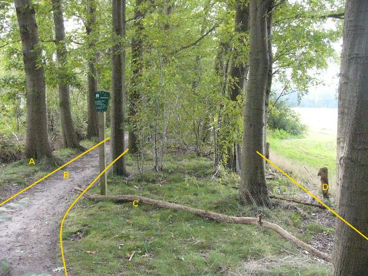

A:

| **BegroeidTerreindeel** | **Attribuutwaarde** | **Opmerkingen** |
|-------------------------|---------------------|-----------------|
| fysiekVoorkomen         | loofbos             |                 |
| relatieveHoogteligging  |  0                  |                 |

#### griend en hakhout

**Definitie**

Terreindeel met opgaande begroeiing van loofbomen, in een dicht groeiverband, en
die periodiek wordt afgezet.

**Verplicht?**

Ja, verplichte inhoud BGT.

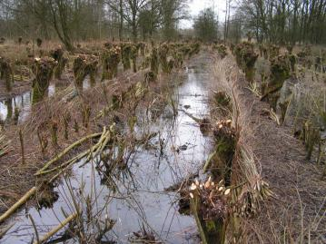

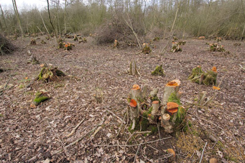

| **BegroeidTerreindeel** | **Attribuutwaarde**        | **Opmerkingen** |
|-------------------------|----------------------------|-----------------|
| fysiekVoorkomen         | loofbos: griend en hakhout |                 |
| relatieveHoogteligging  |                            |                 |

### gemengd bos

**Definitie**

Terreindeel begroeid met een dusdanige aantal naald- en loofbomen dat deze een
min of meer gesloten geheel vormen of, na volgroeiing van de bomen, zullen
vormen.

**Verplicht?**

Nee, optionele inhoud IMGeo.

**Voorbeeld**

| **BegroeidTerreindeel** | **Attribuutwaarde** | **Opmerkingen** |
|-------------------------|---------------------|-----------------|
| fysiekVoorkomen         | gemengd bos         |                 |
| relatieveHoogteligging  |  0                  |                 |

### naaldbos

**Definitie**

Terreindeel begroeid met een dusdanige aantal naaldbomen dat deze een min of
meer gesloten geheel vormen of, na volgroeiing van de bomen, zullen vormen.

**Verplicht?**

Nee, optionele inhoud IMGeo.

**Voorbeeld**

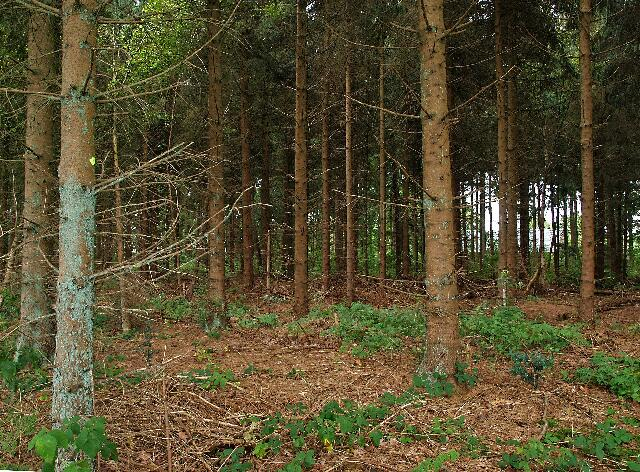

| **BegroeidTerreindeel** | **Attribuutwaarde** | **Opmerkingen** |
|-------------------------|---------------------|-----------------|
| fysiekVoorkomen         | naaldbos            |                 |
| relatieveHoogteligging  |  0                  |                 |

### heide

**Definitie**

Terreindeel overwegend begroeid met heide en heideachtige vegetaties.

**Verplicht?**

Nee, optionele inhoud IMGeo.

**Voorbeeld**

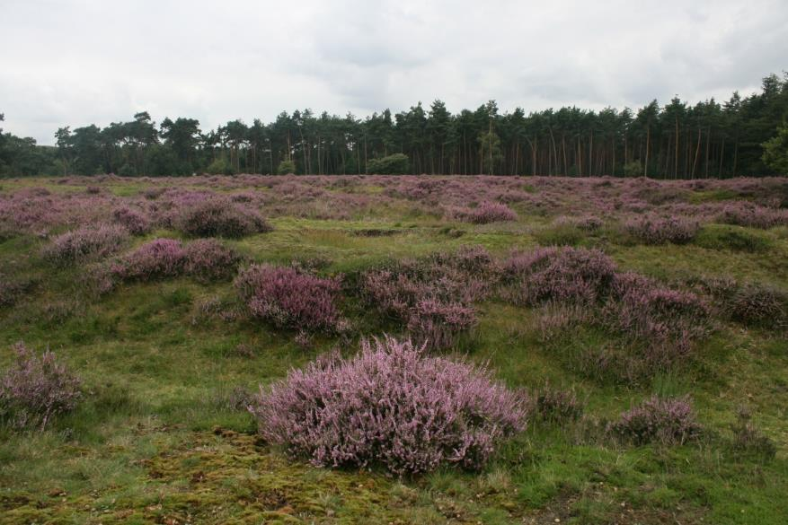

| **BegroeidTerreindeel** | **Attribuutwaarde** | **Opmerkingen** |
|-------------------------|---------------------|-----------------|
| fysiekVoorkomen         | heide               |                 |
| relatieveHoogteligging  |  0                  |                 |

### struiken

**Definitie**

Terreindeel bedekt met niet-gecultiveerde (natuurlijke), lage, houtachtige,
overblijvende planten gekenmerkt door verschillende vertakkingen dicht bij de
wortel en afwezigheid van opvallende stammen.

**Verplicht?**

Nee, optionele inhoud IMGeo.

**Voorbeeld**

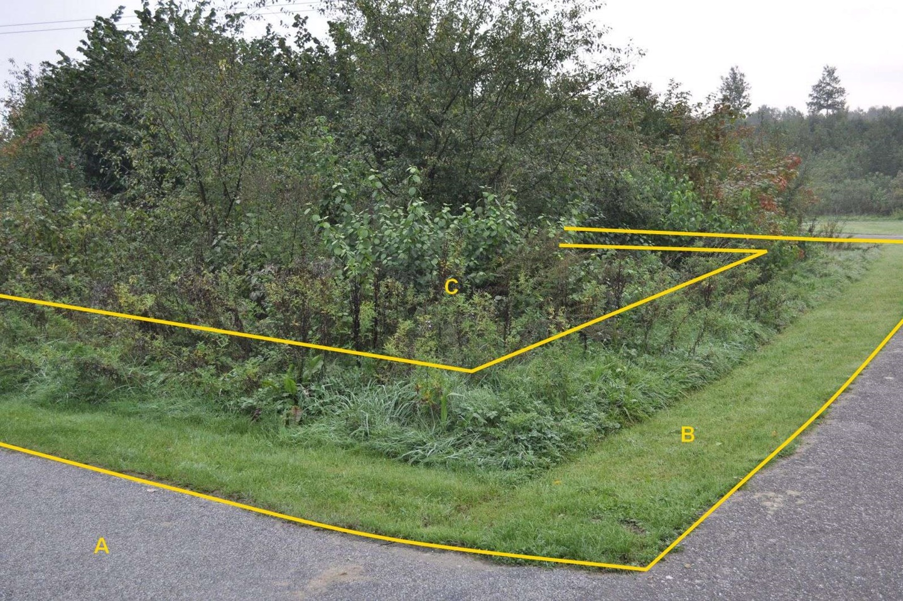

B is een ondersteunend wegdeel type berm, fysiek voorkomen groenvoorziening.

C:

| **BegroeidTerreindeel** | **Attribuutwaarde** | **Opmerkingen** |
|-------------------------|---------------------|-----------------|
| fysiekVoorkomen         | struiken            |                 |
| relatieveHoogteligging  |  0                  |                 |

### houtwal

**Definitie**

Terreindeel zijnde een afscheiding met beperkte breedte en beplant met bomen of
struiken.

**Verplicht?**

Nee, optionele inhoud IMGeo.

**Voorbeeld**

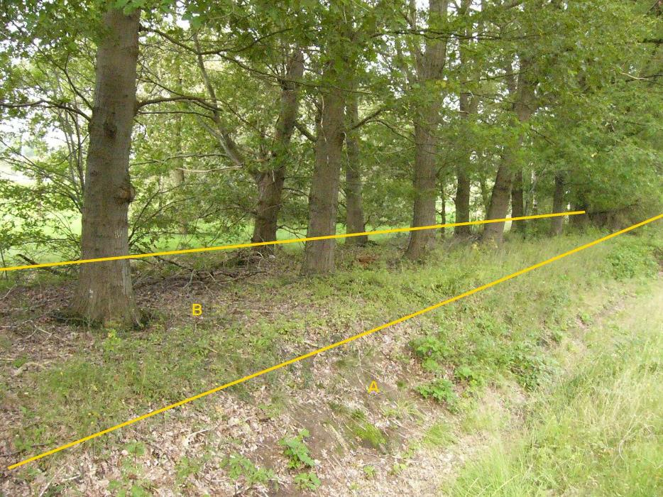

B:

| *BegroeidTerreindeel*  | *Attribuutwaarde* | *Opmerkingen* |
|------------------------|-------------------|---------------|
| fysiekVoorkomen        | houtwal           |               |
| relatieveHoogteligging | 0                 |               |

A: waterdeel, greppel/droge sloot.

### duin

**Definitie**

Verhoging of heuvel van zand of fijne losse aarde en verpulverd gesteente
opgeworpen door wind of door stromend water.

**Verplicht?**

Nee, optionele inhoud IMGeo.

**Voorbeeld**

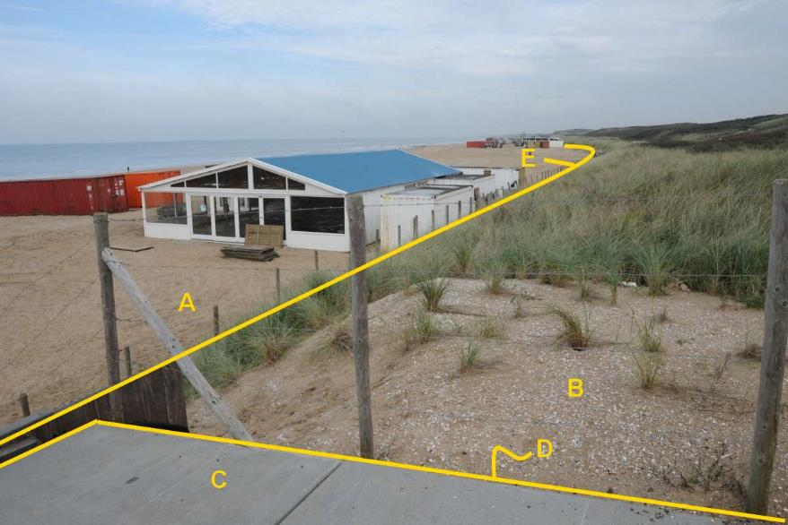

B:

| **BegroeidTerreindeel** | **Attribuutwaarde** | **Opmerkingen** |
|-------------------------|---------------------|-----------------|
| fysiekVoorkomen         | duin                |                 |
| relatieveHoogteligging  |  0                  |                 |

#### open duinvegetatie

**Definitie**

Duin met een overwegend grasachtige vegetatie.

**Verplicht?**

Ja, verplichte inhoud BGT.

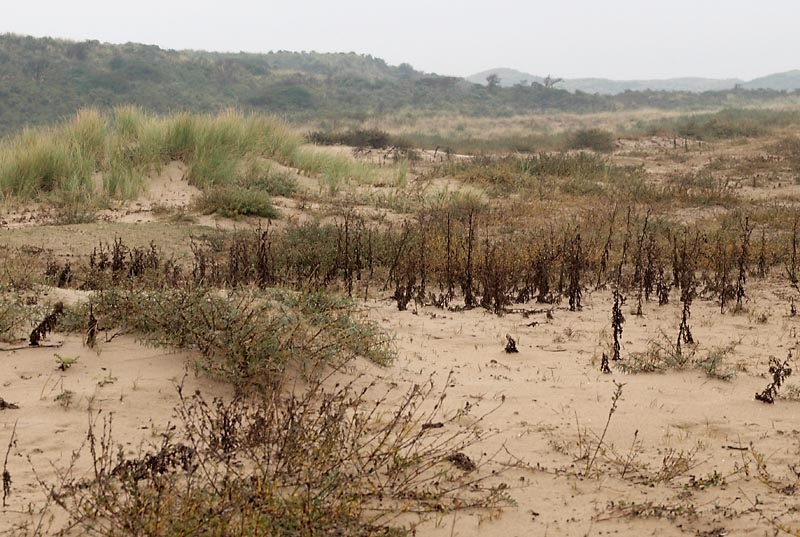

| **BegroeidTerreindeel** | **Attribuutwaarde**      | **Opmerkingen** |
|-------------------------|--------------------------|-----------------|
| fysiekVoorkomen         | duin: open duinvegetatie |                 |
| relatieveHoogteligging  |                          |                 |

#### gesloten duinvegetatie

**Definitie**

Duin met een overwegend opgaande vegetatie van struiken en of bomen.

**Verplicht?**

Ja, verplichte inhoud BGT.

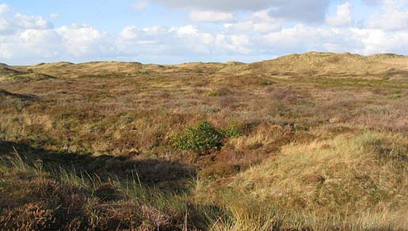

| **BegroeidTerreindeel** | **Attribuutwaarde**          | **Opmerkingen** |
|-------------------------|------------------------------|-----------------|
| fysiekVoorkomen         | duin: gesloten duinvegetatie |                 |
| relatieveHoogteligging  |                              |                 |

### grasland overig

**Definitie**

Terreindeel met een vegetatie bestaande uit grassen en of grasachtigen, en met
de in graslanden voorkomende kruiden, dat niet in gebruik is voor agrarische
doeleinden.

**Verplicht?**

Nee, optionele inhoud IMGeo.

**Voorbeeld**

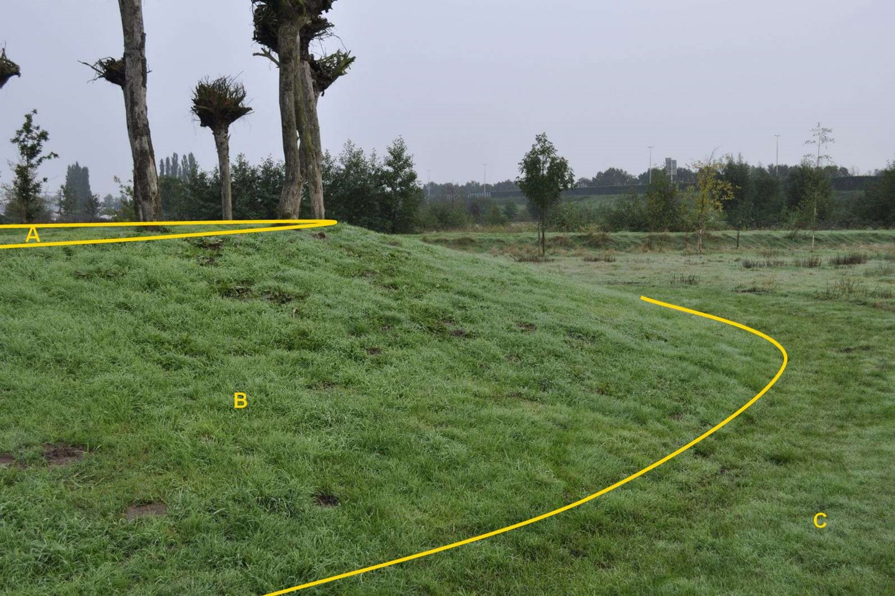

Grasland met een talud met kruinlijngeometrie

B:

| *BegroeidTerreindeel*  | *Attribuutwaarde* | *Opmerkingen* |
|------------------------|-------------------|---------------|
| fysiekVoorkomen        | Grasland overig   |               |
| Talud                  | ja                |               |
| Kruinlijngeometrie     | ja                |               |
| relatieveHoogteligging |  0                |               |

A en C: begroeid terreindeel, grasland overig.

### moeras

**Definitie**

Terreindeel met moerasvegetatie in stilstaand water van geringe diepte zonder
merkbare toe- of afvloeiing.

**Verplicht?**

Nee, optionele inhoud IMGeo.

**Voorbeeld**

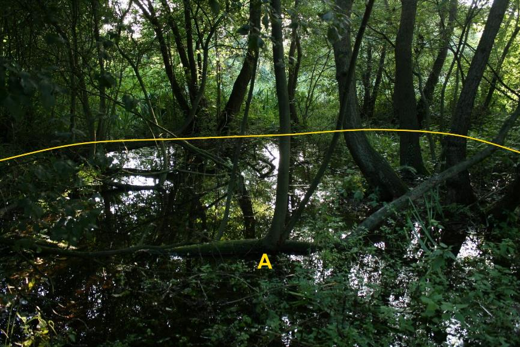

A:

| **BegroeidTerreindeel** | **Attribuutwaarde** | **Opmerkingen** |
|-------------------------|---------------------|-----------------|
| fysiekVoorkomen         | moeras              |                 |
| relatieveHoogteligging  |  0                  |                 |

### rietland

**Definitie**

Terreindeel overwegend begroeid met rietvegetatie.

**Verplicht?**

Nee, optionele inhoud IMGeo.

**Voorbeeld**

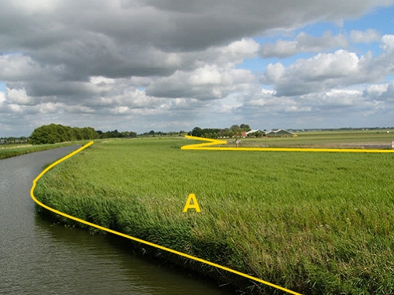

A:

| **BegroeidTerreindeel** | **Attribuutwaarde** | **Opmerkingen** |
|-------------------------|---------------------|-----------------|
| fysiekVoorkomen         | rietland            |                 |
| relatieveHoogteligging  |  0                  |                 |

### kwelder

**Definitie**

Buitendijks gelegen aangeslibd land van een wad, dat bij gewone vloed niet meer
onder loopt.

**Verplicht?**

Nee, optionele inhoud IMGeo.

**Voorbeeld**

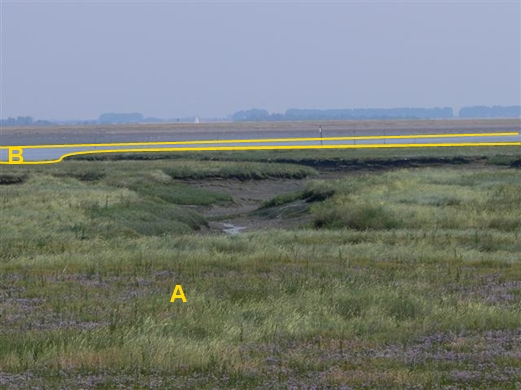

A:

| **OnbegroeidTerreindeel** | **Attribuutwaarde** | **Opmerkingen** |
|---------------------------|---------------------|-----------------|
| fysiekVoorkomen           | kwelder             |                 |
| relatieveHoogteligging    |  0                  |                 |

B: waterloop.

### fruitteelt

**Definitie**

Terreindeel begroeid met fruitbomen in de vorm van hoogstam en
laagstamboomgaard, druiven of kleinfruit.

**Verplicht?**

Nee, optionele inhoud IMGeo.

**Voorbeeld**

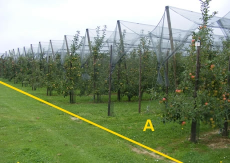

A:

| **BegroeidTerreindeel** | **Attribuutwaarde** | **Opmerkingen** |
|-------------------------|---------------------|-----------------|
| fysiekVoorkomen         | fruitteelt          |                 |
| relatieveHoogteligging  |  0                  |                 |

#### laagstam boomgaarden

**Definitie**

Terreindeel begroeid met laagstamfruitbomen.

**Verplicht?**

Ja, verplichte inhoud BGT.

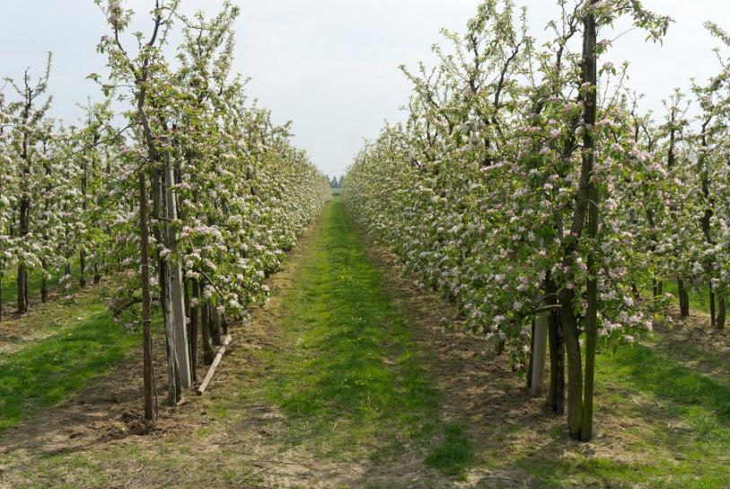

| **BegroeidTerreindeel** | **Attribuutwaarde**              | **Opmerkingen** |
|-------------------------|----------------------------------|-----------------|
| fysiekVoorkomen         | fruitteelt: laagstam boomgaarden |                 |
| relatieveHoogteligging  |                                  |                 |

#### hoogstam boomgaarden

**Definitie**

Terreindeel begroeid met hoogstamfruitbomen.

**Verplicht?**

Ja, verplichte inhoud BGT.

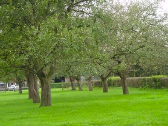

| **BegroeidTerreindeel** | **Attribuutwaarde**              | **Opmerkingen** |
|-------------------------|----------------------------------|-----------------|
| fysiekVoorkomen         | fruitteelt: hoogstam boomgaarden |                 |
| relatieveHoogteligging  |                                  |                 |

#### wijngaarden

**Definitie**

Terreindeel begroeid met druivenstokken voor wijnbouw.

**Verplicht?**

Ja, verplichte inhoud BGT.

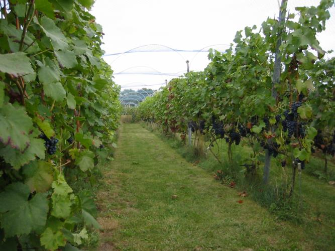

| **BegroeidTerreindeel** | **Attribuutwaarde**     | **Opmerkingen** |
|-------------------------|-------------------------|-----------------|
| fysiekVoorkomen         | fruitteelt: wijngaarden |                 |
| relatieveHoogteligging  |                         |                 |

#### klein fruit

**Definitie**

Terreindeel begroeid met heesters voor zachtfruit zoals bessen of frambozen.

**Verplicht?**

Ja, verplichte inhoud BGT.

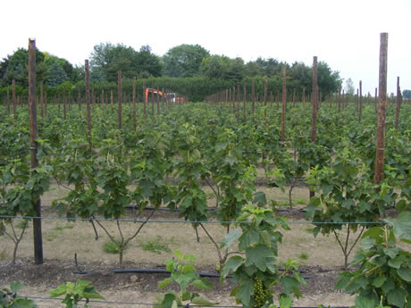

| **BegroeidTerreindeel** | **Attribuutwaarde**     | **Opmerkingen** |
|-------------------------|-------------------------|-----------------|
| fysiekVoorkomen         | fruitteelt: klein fruit |                 |
| relatieveHoogteligging  |                         |                 |

### boomteelt

**Definitie**

Grond in gebruik voor het kweken van jonge siergewassen, bomen enz. ten behoeve
van een later gebruik elders.

**Verplicht?**

Nee, optionele inhoud IMGeo.

**Voorbeeld**

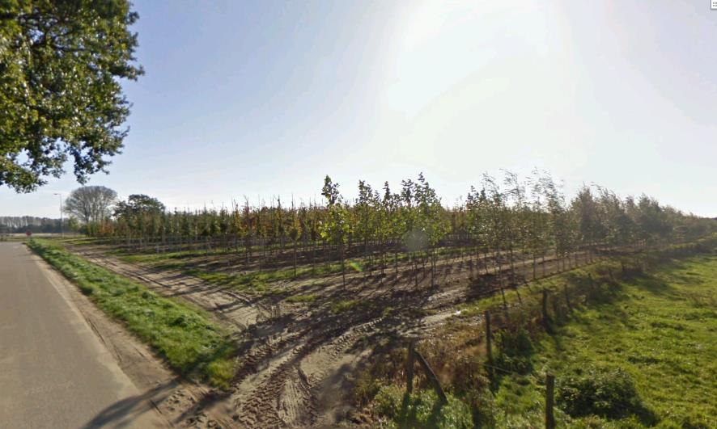

| **BegroeidTerreindeel** | **Attribuutwaarde** | **Opmerkingen** |
|-------------------------|---------------------|-----------------|
| fysiekVoorkomen         | boomteelt           |                 |
| relatieveHoogteligging  |  0                  |                 |

### bouwland

**Definitie**

Terreindeel in gebruik als akker, met gewassen die in een teelt roulatieschema
zijn opgenomen. Kan tijdelijk zonder gewas zijn of braak liggen.

**Verplicht?**

Nee, optionele inhoud IMGeo.

**Voorbeeld**

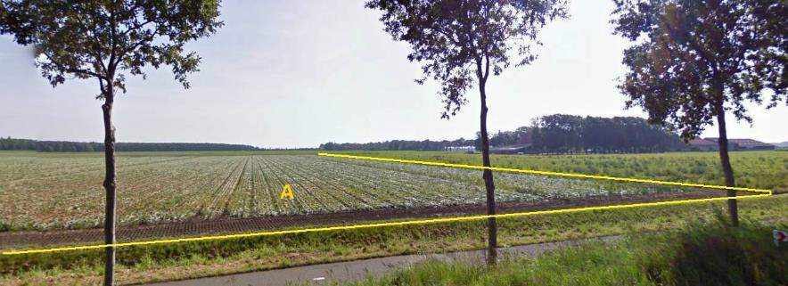

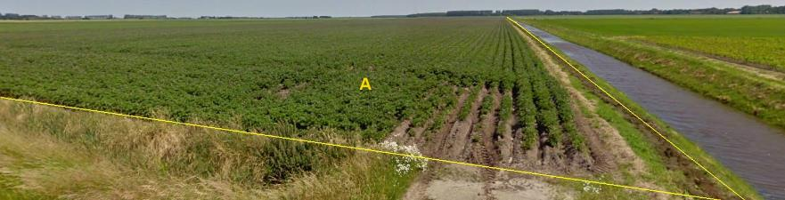

A:

| **BegroeidTerreindeel** | **Attribuutwaarde** | **Opmerkingen** |
|-------------------------|---------------------|-----------------|
| fysiekVoorkomen         | bouwland            |                 |
| relatieveHoogteligging  |  0                  |                 |

#### akkerbouw

**Definitie**

Terreindeel in gebruik als akker, voor de teelt van akkerbouwgewassen.

**Verplicht?**

Ja, verplichte inhoud BGT.

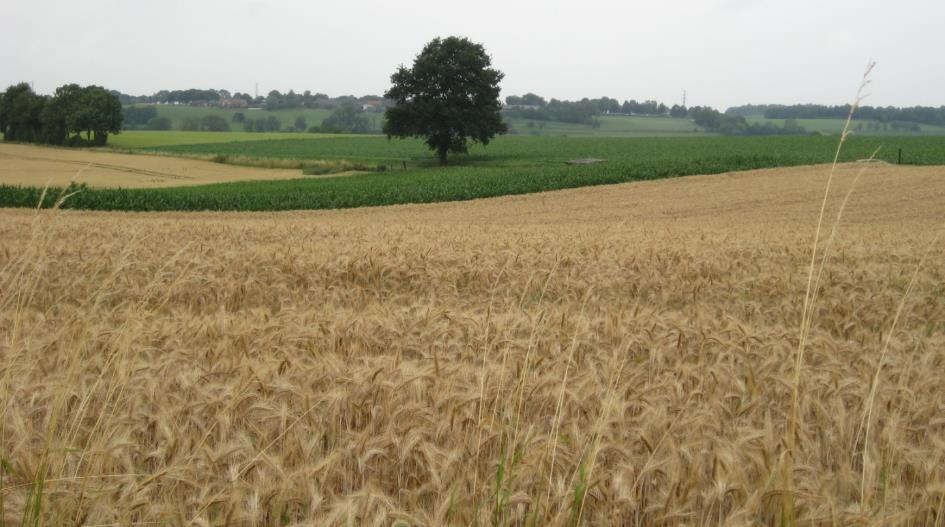

| **BegroeidTerreindeel** | **Attribuutwaarde** | **Opmerkingen** |
|-------------------------|---------------------|-----------------|
| fysiekVoorkomen         | bouwland: akkerbouw |                 |
| relatieveHoogteligging  |                     |                 |

#### braakliggend

**Definitie**

Terrein in gebruik als akker, maar tijdelijk niet beteeld met een landbouwgewas.

**Verplicht?**

Ja, verplichte inhoud BGT.

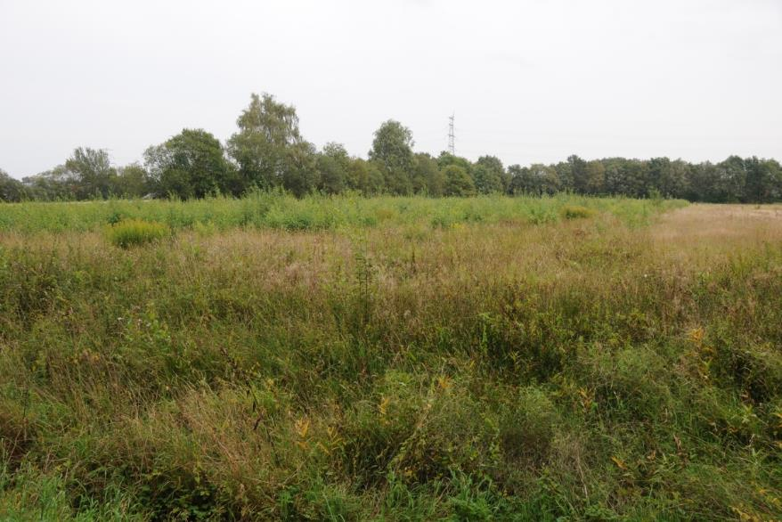

| **BegroeidTerreindeel** | **Attribuutwaarde**    | **Opmerkingen** |
|-------------------------|------------------------|-----------------|
| fysiekVoorkomen         | bouwland: braakliggend |                 |
| relatieveHoogteligging  |                        |                 |

#### vollegrondsteelt

**Definitie**

Terreindeel in gebruik als akker, voor de teelt van tuinbouwgewassen.

**Verplicht?**

Ja, verplichte inhoud BGT.

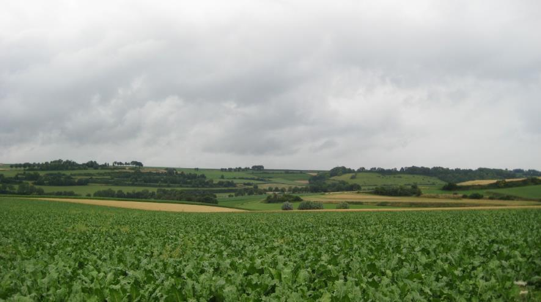

| **BegroeidTerreindeel** | **Attribuutwaarde**        | **Opmerkingen** |
|-------------------------|----------------------------|-----------------|
| fysiekVoorkomen         | bouwland: vollegrondsteelt |                 |
| relatieveHoogteligging  |                            |                 |

#### bollenteelt

**Definitie**

Terreindeel in gebruik als akker, voor de teelt van bloembollen.

**Verplicht?**

Ja, verplichte inhoud BGT.

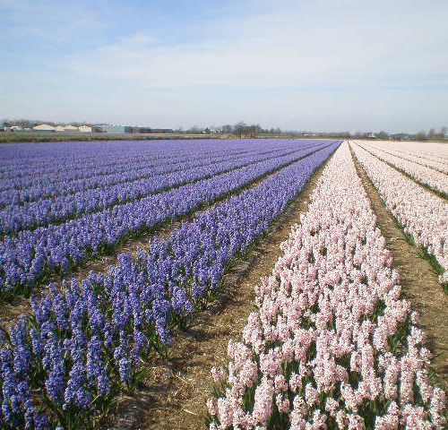

| **BegroeidTerreindeel** | **Attribuutwaarde**   | **Opmerkingen** |
|-------------------------|-----------------------|-----------------|
| fysiekVoorkomen         | bouwland: bollenteelt |                 |
| relatieveHoogteligging  |                       |                 |

### grasland agrarisch

**Definitie**

Terreindeel met een vegetatie bestaande uit grassen en of grasachtigen, en met
de in graslanden voorkomende kruiden, zijnde cultuurgrasland dat in gebruik is
voor de veeteelt, bijvoorbeeld als weiland of als hooiland.

**Verplicht?**

Nee, optionele inhoud IMGeo.

**Voorbeeld**

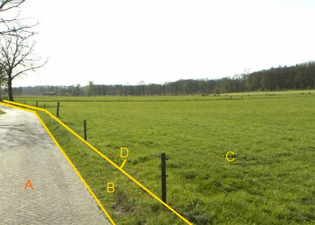

C:

| **BegroeidTerreindeel** | **Attribuutwaarde** | **Opmerkingen** |
|-------------------------|---------------------|-----------------|
| fysiekVoorkomen         | Grasland agrarisch  |                 |
| relatieveHoogteligging  |  0                  |                 |

A: wegdeel, rijbaan:lokale weg, open verharding.

B: ondersteunend wegdeel: berm, fysiek voorkomen: groenvoorziening.

D: IMGeo inhoud: scheiding, draadraster.

### groenvoorziening

**Definitie**

Terreindeel met aangelegde beplanting, meestal gras, heesters of struiken.

**Verplicht?**

Nee, optionele inhoud IMGeo.

**Voorbeeld**

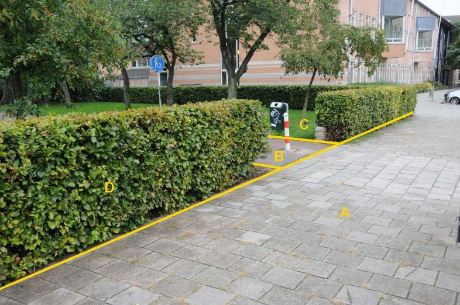

C en D (afzonderlijke objecten):

| *BegroeidTerreindeel*  | *Attribuutwaarde* | *Opmerkingen* |
|------------------------|-------------------|---------------|
| fysiekVoorkomen        | Groenvoorziening  |               |
| relatieveHoogteligging |  0                |               |

A en B: wegdeel, voetpad, open verharding.

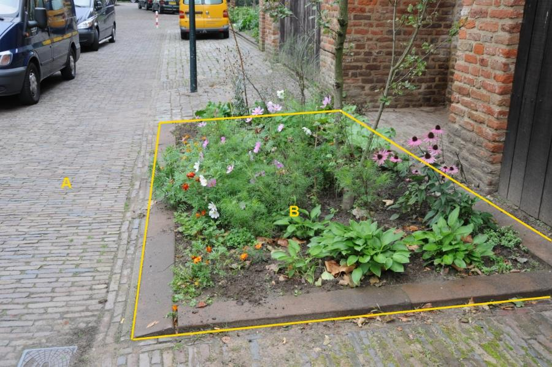

B:

| *BegroeidTerreindeel*  | *Attribuutwaarde* | *Opmerkingen*                 |
|------------------------|-------------------|-------------------------------|
| fysiekVoorkomen        | Groenvoorziening  | Plantvak opnemen want \> 5 m2 |
| relatieveHoogteligging |  0                |                               |

A: wegdeel, rijbaan: lokale weg, openverharding.

#### bosplantsoen

**Definitie**

Opgaande beplanting van houtachtige gewassen die struikvormend en/of boomvormend
zijn. De soorten zijn als bosplantsoen opgekweekt en aangeplant.De beplanting
kan open of gesloten zijn en bestaat vaak uit inheemse soorten. Onderscheidt
zich van heesters omdat de sierkenmerken niet voorop staan.

**Verplicht?**

Ja, verplichte inhoud BGT.

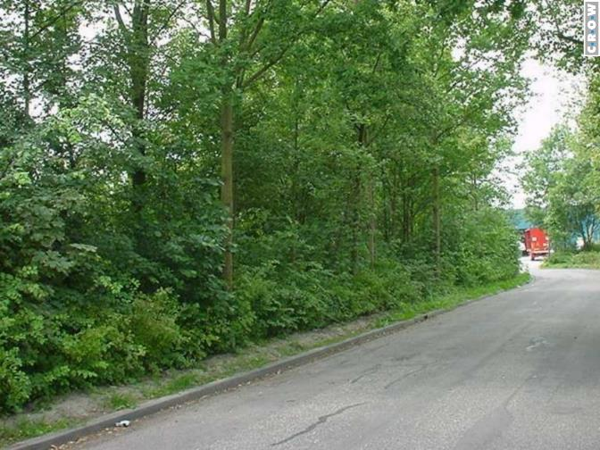

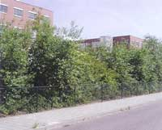

| **BegroeidTerreindeel** | **Attribuutwaarde**            | **Opmerkingen** |
|-------------------------|--------------------------------|-----------------|
| fysiekVoorkomen         | groenvoorziening: bosplantsoen |                 |
| relatieveHoogteligging  |                                |                 |

#### gras- en kruidachtigen

**Definitie**

(Grond met) een laagblijvende, aaneengesloten kruidachtige vegetatie.

**Verplicht?**

Ja, verplichte inhoud BGT.

Grasland met een talud met kruinlijngeometrie

B:

| *BegroeidTerreindeel*  | *Attribuutwaarde* | *Opmerkingen* |
|------------------------|-------------------|---------------|
| fysiekVoorkomen        | Grasland overig   |               |
| Talud                  | ja                |               |
| Kruinlijngeometrie     | ja                |               |
| relatieveHoogteligging |                   |               |

#### planten

**Definitie**

Beheerde niet nader gespecificeerde beplanting van groenvak in de openbare
ruimte.

**Verplicht?**

Ja, verplichte inhoud BGT.

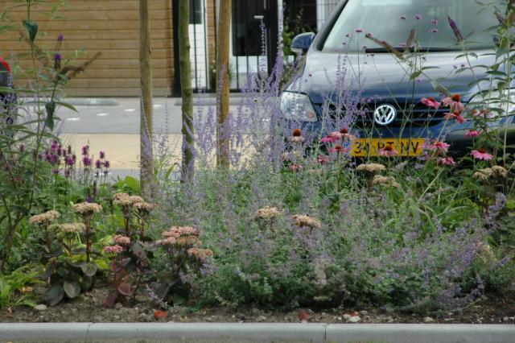

| **BegroeidTerreindeel** | **Attribuutwaarde**       | **Opmerkingen** |
|-------------------------|---------------------------|-----------------|
| fysiekVoorkomen         | groenvoorziening: planten |                 |
| relatieveHoogteligging  |                           |                 |

#### struikrozen

**Definitie**

Beheerde beplanting van groenvak in de openbare ruimte, zijnde in struikvorm
groeiende rozen.

**Verplicht?**

Ja, verplichte inhoud BGT.

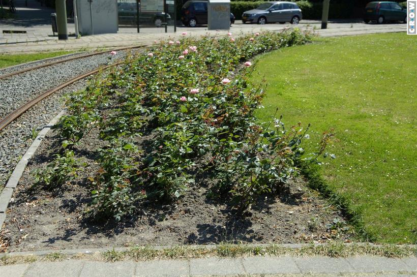

| **BegroeidTerreindeel** | **Attribuutwaarde**           | **Opmerkingen** |
|-------------------------|-------------------------------|-----------------|
| fysiekVoorkomen         | groenvoorziening: struikrozen |                 |
| relatieveHoogteligging  |                               |                 |

#### heesters

**Definitie**

Beplanting van houtige gewassen die struikvormend zijn en die al dan niet een
gesloten geheel vormen. Het accent ligt op de sierwaarde, de beplanting kan uit
één soort of uit meerdere soorten bestaan. Onder de heesters kan een houtachtige
of kruidachtige onderbegroeiing aanwezig zijn. Het oppervlak met struikachtige
gewassen is meer dan 50% van de totale oppervlakte van het vak.

**Verplicht?**

Ja, verplichte inhoud BGT.

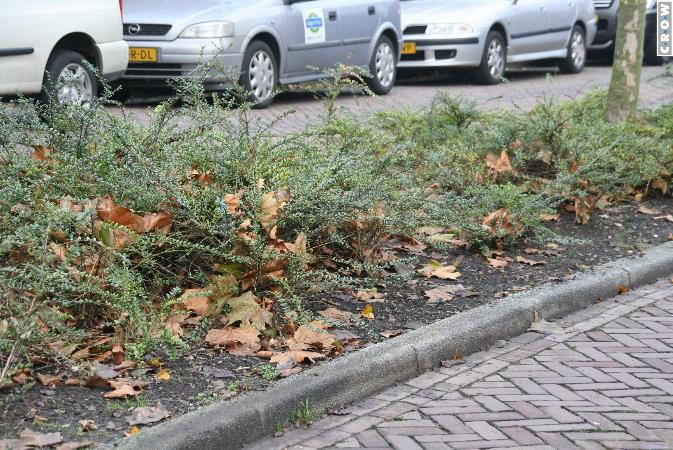

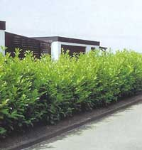

| **BegroeidTerreindeel** | **Attribuutwaarde**        | **Opmerkingen** |
|-------------------------|----------------------------|-----------------|
| fysiekVoorkomen         | groenvoorziening: heesters |                 |
| relatieveHoogteligging  |                            |                 |

#### bodembedekkers

**Definitie**

Beheerde beplanting van groenvak in de openbare ruimte, zijnde bodembedekkers.

**Verplicht?**

Ja, verplichte inhoud BGT.

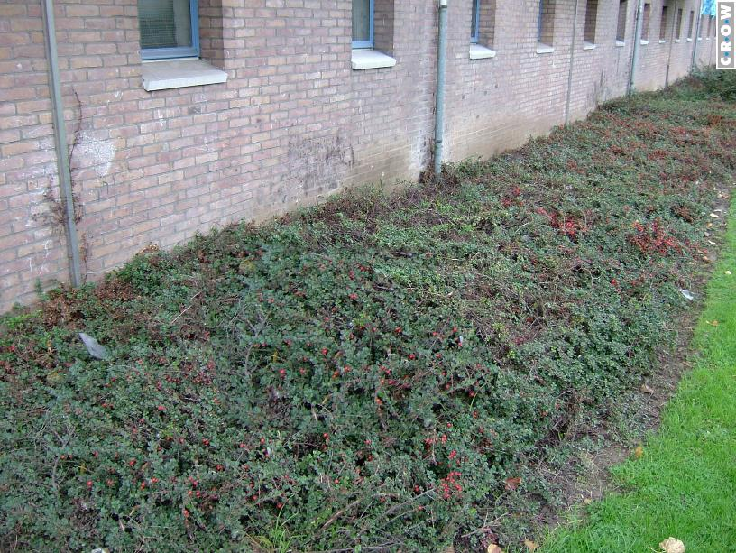

| **BegroeidTerreindeel** | **Attribuutwaarde**              | **Opmerkingen** |
|-------------------------|----------------------------------|-----------------|
| fysiekVoorkomen         | groenvoorziening: bodembedekkers |                 |
| relatieveHoogteligging  |                                  |                 |
