Bord
====

**Definitie**

Een paneel waarop informatie wordt afgebeeld.

type
----

**Definitie**

Het soort bord.

### informatiebord

**Definitie**

Een bord met daarop specifieke actuele informatie, zoals plattegronden of
vertrektijden.

**Verplicht?**

Nee, optionele inhoud IMGeo.

**Voorbeeld**

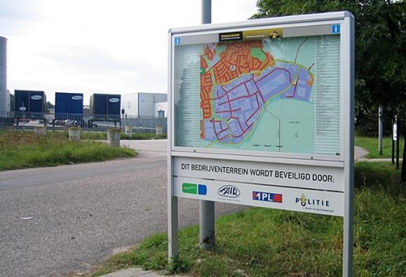

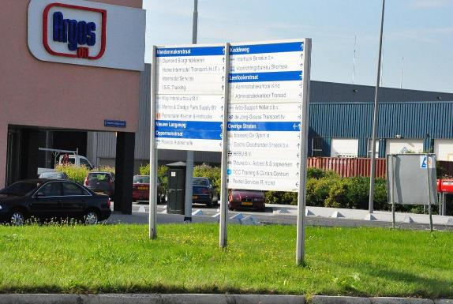

| **Bord**               | **Attribuutwaarde** | **Opmerkingen** |
|------------------------|---------------------|-----------------|
| type                   | informatiebord      |                 |
| relatieveHoogteligging |                     |                 |

### plaatsnaambord

**Definitie**

Een bord waarop een naam van een (woon)plaats of locatie is vermeld.

**Verplicht?**

Nee, optionele inhoud IMGeo.

**Voorbeeld**

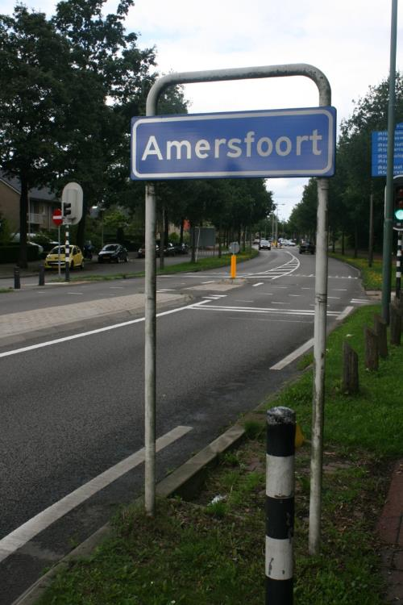

| **Bord**               | **Attribuutwaarde** | **Opmerkingen** |
|------------------------|---------------------|-----------------|
| type                   | plaatsnaambord      |                 |
| relatieveHoogteligging |                     |                 |

### straatnaambord

**Definitie**

Bord waarop de door de gemeente vastgestelde naam van de straat is vermeld. Bord
kan zich op een paal of aan de gevel bevinden.

**Verplicht?**

Nee, optionele inhoud IMGeo.

**Voorbeeld**

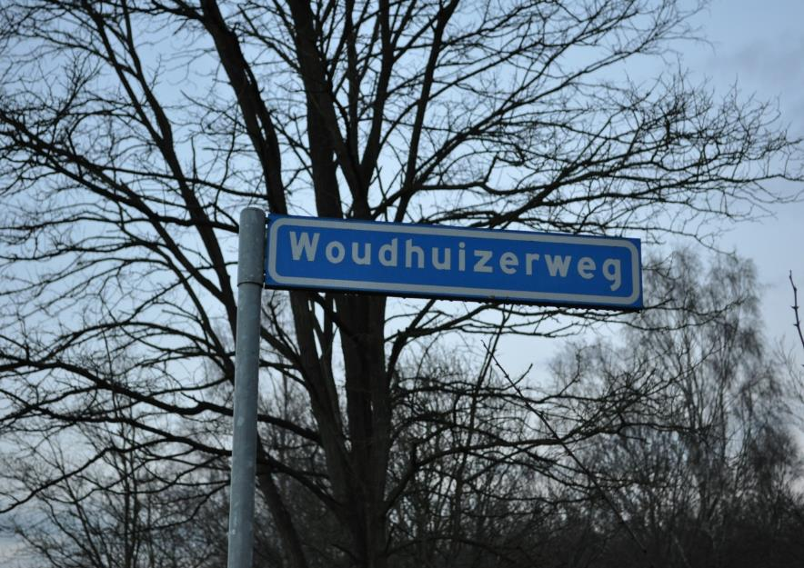

| **Bord**               | **Attribuutwaarde** | **Opmerkingen** |
|------------------------|---------------------|-----------------|
| type                   | straatnaambord      |                 |
| relatieveHoogteligging |                     |                 |

### verkeersbord

**Definitie**

Bord waarop een verkeersteken is aangebracht en waarvan de uitvoering wettelijk
is voorgeschreven volgens het 'Reglement verkeersregels en verkeerstekens 1990
(RVV 1990)'.

**Verplicht?**

Nee, optionele inhoud IMGeo.

**Voorbeeld**

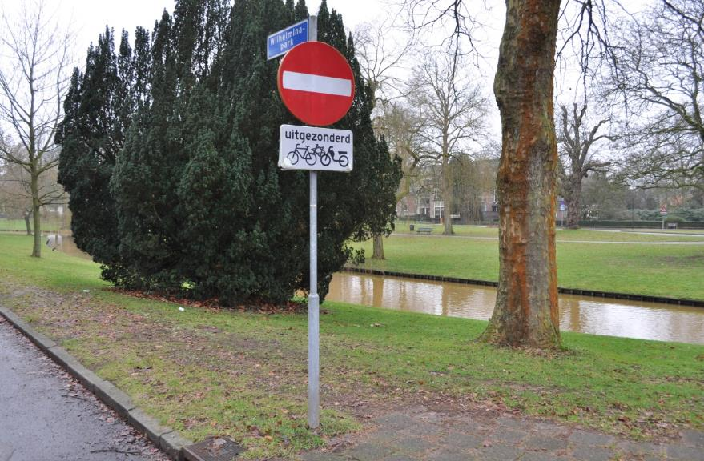

| **Bord**               | **Attribuutwaarde** | **Opmerkingen** |
|------------------------|---------------------|-----------------|
| type                   | verkeersbord        |                 |
| relatieveHoogteligging |                     |                 |

### scheepvaartbord

**Definitie**

Bord waarop een scheepvaartteken is aangebracht en waarvan de uitvoering als
richtlijn is voorgeschreven volgens 'Richtlijnen Scheepvaarttekens (RST 2008)'.

**Verplicht?**

Nee, optionele inhoud IMGeo.

**Voorbeeld**

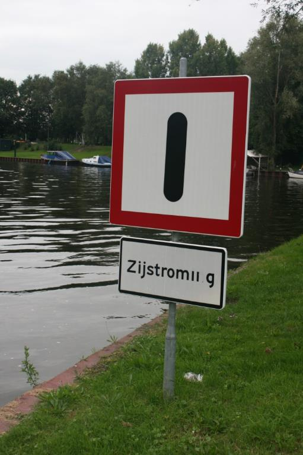

| **Bord**               | **Attribuutwaarde** | **Opmerkingen** |
|------------------------|---------------------|-----------------|
| type                   | scheepvaartbord     |                 |
| relatieveHoogteligging |                     |                 |

### verklikker transportleiding

**Definitie**

Bovengrondse voorziening om een ondergrondse transportleiding te markeren.

**Verplicht?**

Nee, optionele inhoud IMGeo.

**Voorbeeld**

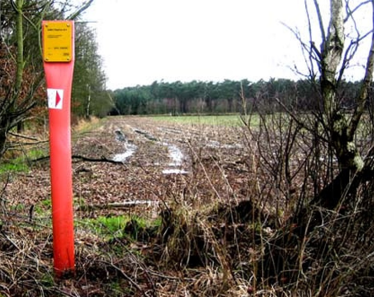

| **Bord**               | **Attribuutwaarde**         | **Opmerkingen** |
|------------------------|-----------------------------|-----------------|
| type                   | verklikker transportleiding |                 |
| relatieveHoogteligging |                             |                 |

### reclamebord

**Definitie**

Vrijstaand bord/zuil waarop rondom of aan één of meer zijden affiches kunnen
worden (of zijn) geplakt.

**Verplicht?**

Nee, optionele inhoud IMGeo.

**Voorbeeld**

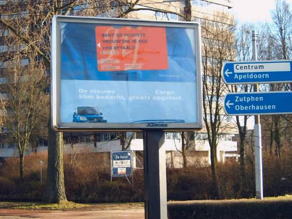

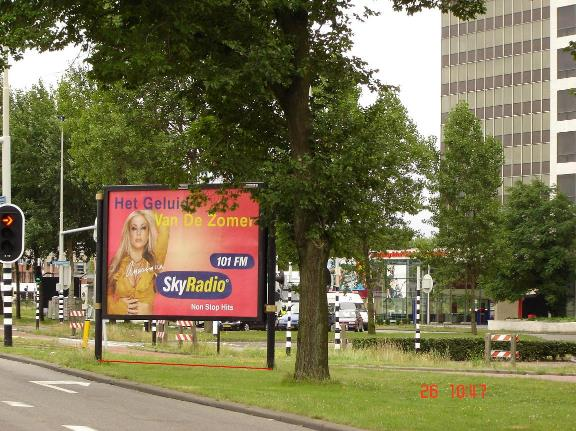

| **Bord**               | **Attribuutwaarde** | **Opmerkingen** |
|------------------------|---------------------|-----------------|
| type                   | reclamebord         |                 |
| relatieveHoogteligging |                     |                 |

### wegwijzer

**Definitie**

Constructie voorzien van een of meer panelen met informatie ten behoeve van de
bewegwijzering.

**Verplicht?**

Nee, optionele inhoud IMGeo.

**Voorbeeld**

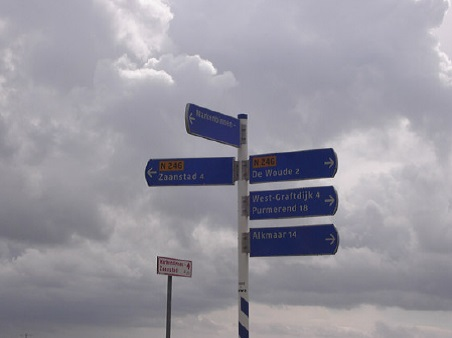

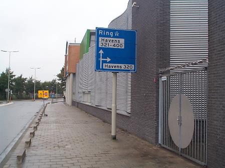

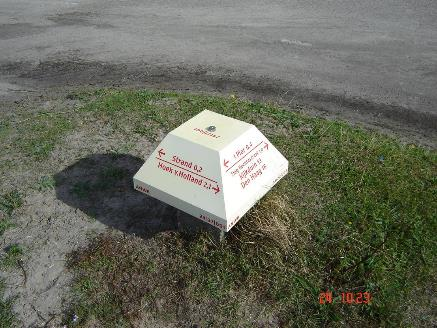

| **Bord**               | **Attribuutwaarde** | **Opmerkingen** |
|------------------------|---------------------|-----------------|
| type                   | wegwijzer           |                 |
| relatieveHoogteligging |                     |                 |

### waarschuwingshek

**Definitie**

Constructie in de vorm van een hek, voorzien van rode en witte blokken of
chevrons, die het verkeer attendeert op een gevarenpunt.

**Verplicht?**

Nee, optionele inhoud IMGeo.

**Voorbeeld**

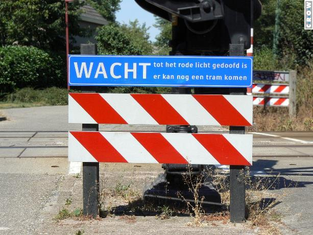

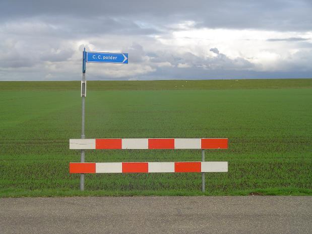

| **Bord**               | **Attribuutwaarde** | **Opmerkingen** |
|------------------------|---------------------|-----------------|
| type                   | waarschuwingshek    |                 |
| relatieveHoogteligging |                     |                 |

### dynamische snelheidsindicator

**Definitie**

Een snelheidsinformatiebord dat in "real time" de snelheid van de weggebruikers
aanduidt.

**Verplicht?**

Nee, optionele inhoud IMGeo.

**Voorbeeld**

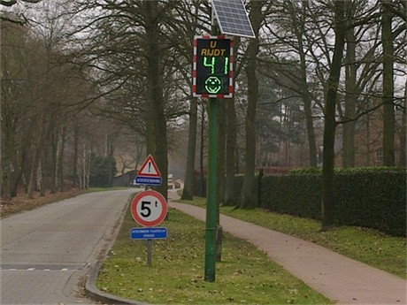

| **Bord**               | **Attribuutwaarde**           | **Opmerkingen** |
|------------------------|-------------------------------|-----------------|
| type                   | dynamische snelheidsindicator |                 |
| relatieveHoogteligging |                               |                 |
