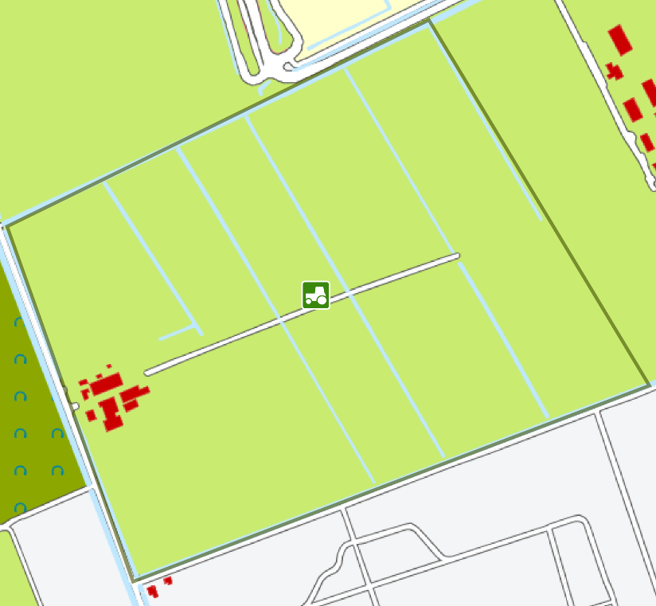
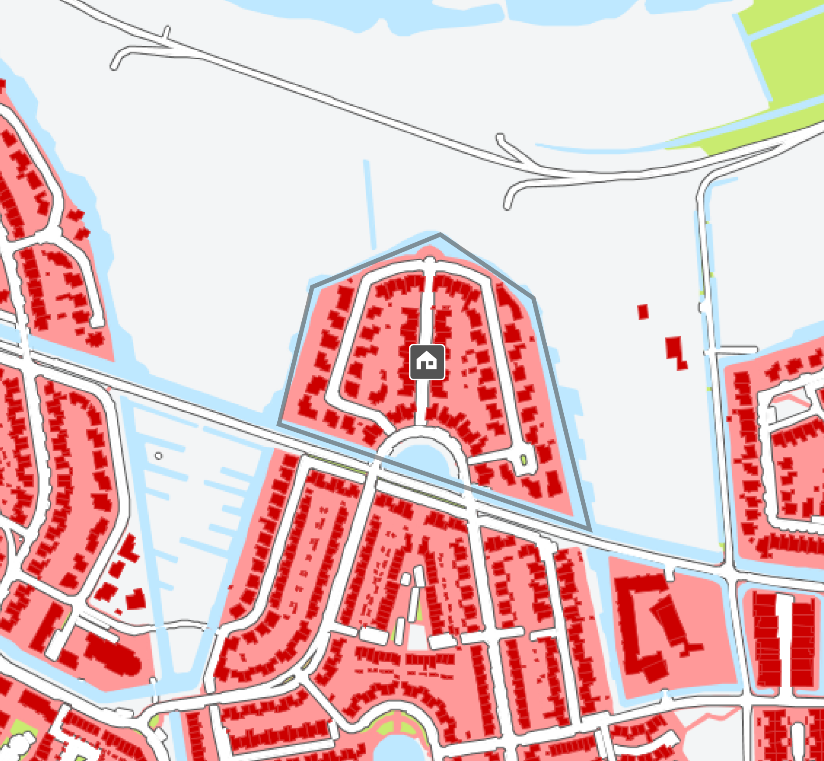
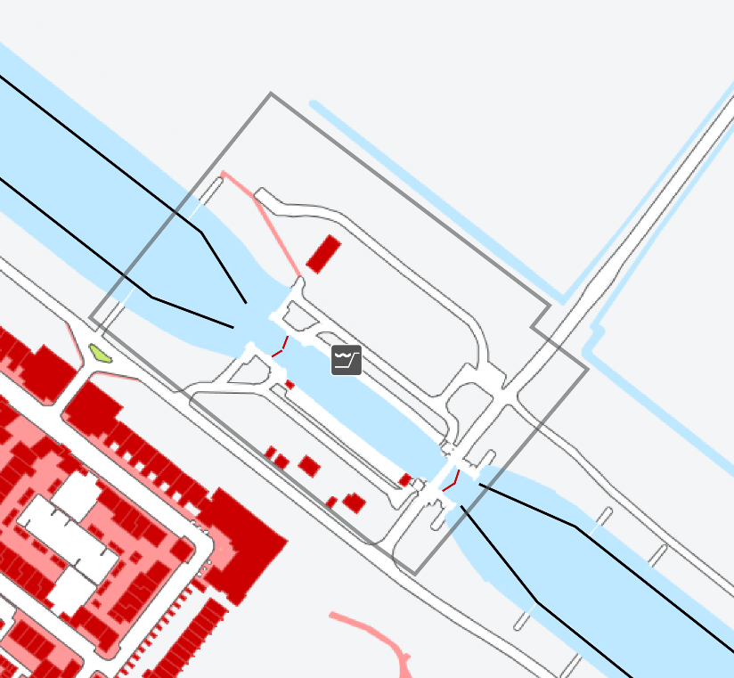
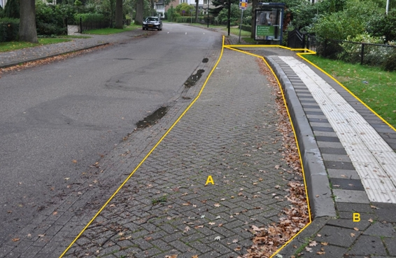

Functioneel gebied
==================

**Definitie**

Begrensd en benoemd gebied dat door een functionele eenheid beschreven wordt.

inwinningsregels
----------------

### IMGeo

Bron: [Gegevenscatalogus IMGeo
2.2](https://docs.geostandaarden.nl/imgeo/catalogus/imgeo/#functioneel-gebied)

>   In IMGeo kunnen functionele gebieden worden opgenomen als vlakobject. De
>   functionele gebieden zijn inrichtend en mogen overlappen met elkaar en met
>   andere vlakobjecten van alle soorten. De functionele gebieden hoeven niet
>   samen een landsdekkend geheel zonder gaten te vormen. Ze bevatten geen
>   plaatsbepalingspunten.

type
----

**Definitie**

Specificatie van het soort Functioneel Gebied.

### kering

**Definitie**

Een waterkerende en / of scheidende, kunstmatige of natuurlijke hoogte of
hooggelegen gronden inclusief de daarin aanwezige waterkerende elementen.

**Verplicht?**

Ja, verplichte inhoud BGT.

**Voorbeeld**

Een kaartje wordt nog toegevoegd waarop dit functioneel gebied is afgebeeld op
de topografie.

| **Functioneel gebied** | **Attribuutwaarde** | **Opmerkingen** |
|------------------------|---------------------|-----------------|
| type                   | kering              |                 |

### bedrijvigheid

**Definitie**

Gebied waarop panden of overige gebouwen staan, en / of niet bebouwde
oppervlakte , voornamelijk gebruikt voor economische activiteiten en non-profit
activiteiten.

**Verplicht?**

Nee, optionele inhoud IMGeo.

**Voorbeeld**

| **Functioneel gebied** | **Attribuutwaarde** | **Opmerkingen** |
|------------------------|---------------------|-----------------|
| type                   | bedrijvigheid       |                 |

### natuur en landschap

**Definitie**

Gebied dat wegens natuurschoon en/of natuurlijke historie in stand wordt
gehouden.

**Verplicht?**

Nee, optionele inhoud IMGeo.

**Voorbeeld**

Een kaartje wordt nog toegevoegd waarop dit functioneel gebied is afgebeeld op
de topografie.

| **Functioneel gebied** | **Attribuutwaarde** | **Opmerkingen** |
|------------------------|---------------------|-----------------|
| type                   | Natuur en landschap |                 |

### landbouw

**Definitie**

Gebied primair in gebruik voor land- en tuinbouwproductie.

**Verplicht?**

Nee, optionele inhoud IMGeo.

**Voorbeeld**

| **Functioneel gebied** | **Attribuutwaarde** | **Opmerkingen** |
|------------------------|---------------------|-----------------|
| type                   | Landbouw            |                 |

### bewoning

**Definitie**

Gebied waarop panden of overige bouwwerken staan die voornamelijk gebruikt
worden voor bewoning, inclusief erven en tuinen die bij de panden behoren.

**Verplicht?**

Nee, optionele inhoud IMGeo.

**Voorbeeld**

| **Functioneel gebied** | **Attribuutwaarde** | **Opmerkingen** |
|------------------------|---------------------|-----------------|
| type                   | Bewoning            |                 |

### infrastructuur verkeer en vervoer

**Definitie**

Gebied primair in gebruik voor verkeer en vervoer, waaronder verstaan
spoorwegen, wegdelen, vliegverkeersbanen, parkeerterreinen, bermen en de
ondersteunende objecten als kunstwerken.

**Verplicht?**

Nee, optionele inhoud IMGeo.

**Voorbeeld**

Een kaartje wordt nog toegevoegd waarop dit functioneel gebied is afgebeeld op
de topografie.

| **Functioneel gebied** | **Attribuutwaarde**               | **Opmerkingen** |
|------------------------|-----------------------------------|-----------------|
| type                   | infrastructuur verkeer en vervoer |                 |

### infrastructuur waterstaatswerken

**Definitie**

Gebied grenzend aan oppervlaktewater, primair in gebruik voor de
oppervlaktewaterhuishouding (waterafvoer, wateraanvoer en waterconservering).

**Verplicht?**

Nee, optionele inhoud IMGeo.

**Voorbeeld**

| **Functioneel gebied** | **Attribuutwaarde** | **Opmerkingen** |
|------------------------|---------------------|-----------------|
| type                   | waterstaatswerken   |                 |

### waterbergingsgebied

**Definitie**

Terrein met als functie het tijdelijk of langdurig bergen van
(regen)wateroverschotten uit de omgeving.

**Verplicht?**

Nee, optionele inhoud IMGeo.

HTML niet gevonden:: example/html/functioneelgebied-waterbergingsgebied.html

### maatschappelijke en/of publieksvoorziening

**Definitie**

Bebouwd of landelijk gebied, niet zijnde woon- of bedrijventerrein, in gebruik
voor maatschappelijke- en publieksdoeleinden (omvat overheids- en particuliere
terreinen).

**Verplicht?**

Nee, optionele inhoud IMGeo.

**Voorbeeld**

Een kaartje wordt nog toegevoegd waarop dit functioneel gebied is afgebeeld op
de topografie.

### recreatie

**Definitie**

Gebied in gebruik voor openlucht recreatie.

**Verplicht?**

Nee, optionele inhoud IMGeo.

**Voorbeeld**

Een kaartje wordt nog toegevoegd waarop dit functioneel gebied is afgebeeld op
de topografie.

| **Functioneel gebied** | **Attribuutwaarde** | **Opmerkingen** |
|------------------------|---------------------|-----------------|
| type                   | recreatie           |                 |

### begraafplaats

**Definitie**

Een besloten gebied waar lichamen van overleden personen worden begraven. Ook
worden op begraafplaatsen urnen as van gecremeerde lichamen bewaard.

**Verplicht?**

Nee, optionele inhoud IMGeo.

**Voorbeeld**

Een kaartje wordt nog toegevoegd waarop dit functioneel gebied is afgebeeld op
de topografie.

| **Functioneel gebied** | **Attribuutwaarde** | **Opmerkingen** |
|------------------------|---------------------|-----------------|
| type                   | begraafplaats       |                 |

### functioneel beheer

**Definitie**

Gebied waar een specifiek beheer voor benodigd is, louter bepaald vanuit
beheersoogpunt.

**Verplicht?**

Nee, optionele inhoud IMGeo.

**Voorbeeld**

Een kaartje wordt nog toegevoegd waarop dit functioneel gebied is afgebeeld op
de topografie.

| **Functioneel gebied** | **Attribuutwaarde** | **Opmerkingen** |
|------------------------|---------------------|-----------------|
| type                   | Functioneel beheer  |                 |

### recreatie: speeltuin

**Definitie**

Geheel van begroeiing, verharding, opstallen en speelwerktuigen, bedoeld als
speelplaats voor kinderen.

**Verplicht?**

Nee, optionele inhoud IMGeo.

**Voorbeeld**

Een kaartje wordt nog toegevoegd waarop dit functioneel gebied is afgebeeld op
de topografie.

### recreatie: park

**Definitie**

Landschappelijk ingericht terrein, begroeid met houtachtige en kruidachtige
vegetatie, verharding, objecten, waterpartijen en dergelijke, bedoeld als
(grootschalige) recreatieve voorziening.

**Verplicht?**

Nee, optionele inhoud IMGeo.

**Voorbeeld**

Een kaartje wordt nog toegevoegd waarop dit functioneel gebied is afgebeeld op
de topografie.

| **Functioneel gebied** | **Attribuutwaarde** | **Opmerkingen** |
|------------------------|---------------------|-----------------|
| type                   | park                |                 |

### recreatie: sportterrein

**Definitie**

Terrein, mogelijk met groenvoorziening, verharding en bebouwing, bestemd voor
sportbeoefening.

**Verplicht?**

Nee, optionele inhoud IMGeo.

**Voorbeeld**

Een kaartje wordt nog toegevoegd waarop dit functioneel gebied is afgebeeld op
de topografie.

### recreatie: camping

**Definitie**

Geheel van verharding, begroeiing en opstallen, in gebruik als terrein waar
tijdelijk tenten en/of caravans kunnen worden geplaatst ten behoeve van
recreatie.

**Verplicht?**

Nee, optionele inhoud IMGeo.

**Voorbeeld**

Een kaartje wordt nog toegevoegd waarop dit functioneel gebied is afgebeeld op
de topografie.

| **Functioneel gebied** | **Attribuutwaarde** | **Opmerkingen** |
|------------------------|---------------------|-----------------|
| Type                   | camping             |                 |

### recreatie: bungalowpark

**Definitie**

Geheel van verharding, begroeiing, overige opstallen en gebouwen, bedoeld als
vakantie-/weekendhuisjes die niet permanent bewoond worden.

**Verplicht?**

Nee, optionele inhoud IMGeo.

**Voorbeeld**

Een kaartje wordt nog toegevoegd waarop dit functioneel gebied is afgebeeld op
de topografie.

| **Functioneel gebied** | **Attribuutwaarde** | **Opmerkingen** |
|------------------------|---------------------|-----------------|
| Type                   | bungalowpark        |                 |

### bushalte

**Definitie**

Halteplaats voor bussen van het openbaar vervoer.

**Verplicht?**

Nee, optionele inhoud IMGeo.

**Voorbeeld**

Het gebied binnen de gele lijnen, bestaande uit de fysieke objecten wegdelen A
en B en een abri, kan als functioneel gebied type bushalte worden
geclassificeerd.

Een kaartje wordt nog toegevoegd waarop dit functioneel gebied is afgebeeld op
de topografie.

| **Functioneel gebied** | **Attribuutwaarde** | **Opmerkingen** |
|------------------------|---------------------|-----------------|
| Type                   | bushalte            |                 |

### carpoolplaats

**Definitie**

Parkeerplaats die qua ligging en ontsluiting geschikt is voor carpooling.

**Verplicht?**

Nee, optionele inhoud IMGeo.

HTML niet gevonden:: example/html/functioneelgebied-carpoolplaats.html

### benzinestation

**Definitie**

Geheel van installaties, verharding en opstallen waar brandstoffen ten behoeve
van verbrandingsmotoren worden verkocht.

**Verplicht?**

Nee, optionele inhoud IMGeo.

**Voorbeeld**

Een kaartje wordt nog toegevoegd waarop dit functioneel gebied is afgebeeld op
de topografie.

| **Functioneel gebied** | **Attribuutwaarde** | **Opmerkingen** |
|------------------------|---------------------|-----------------|
| Type                   | benzinestation      |                 |

### verzorgingsplaats

**Definitie**

Langs de weg gelegen parkeergelegenheid, met inbegrip van de daarbij behorende
verharde en onverharde banen en een of meer voorzieningen ten behoeve van
reizigers en/of voertuigen.

**Verplicht?**

Nee, optionele inhoud IMGeo.

**Voorbeeld**

Een kaartje wordt nog toegevoegd waarop dit functioneel gebied is afgebeeld op
de topografie.

| **Functioneel gebied** | **Attribuutwaarde** | **Opmerkingen** |
|------------------------|---------------------|-----------------|
| Type                   | verzorgingsplaats   |                 |

### functioneel beheer: hondenuitlaatplaats

**Definitie**

Een uitlaatplaats waar uw hond zijn behoefte kan/ mag doen waarbij geen
opruimplicht bestaat.

**Verplicht?**

Nee, optionele inhoud IMGeo.

### recreatie: volkstuin

**Definitie**

Terreingedeelte in gebruik als volkstuinen, inclusief bebouwing, verharding en
dergelijke.

**Verplicht?**

Nee, optionele inhoud IMGeo.

**Voorbeeld**

Een kaartje wordt nog toegevoegd waarop dit functioneel gebied is afgebeeld op
de topografie
