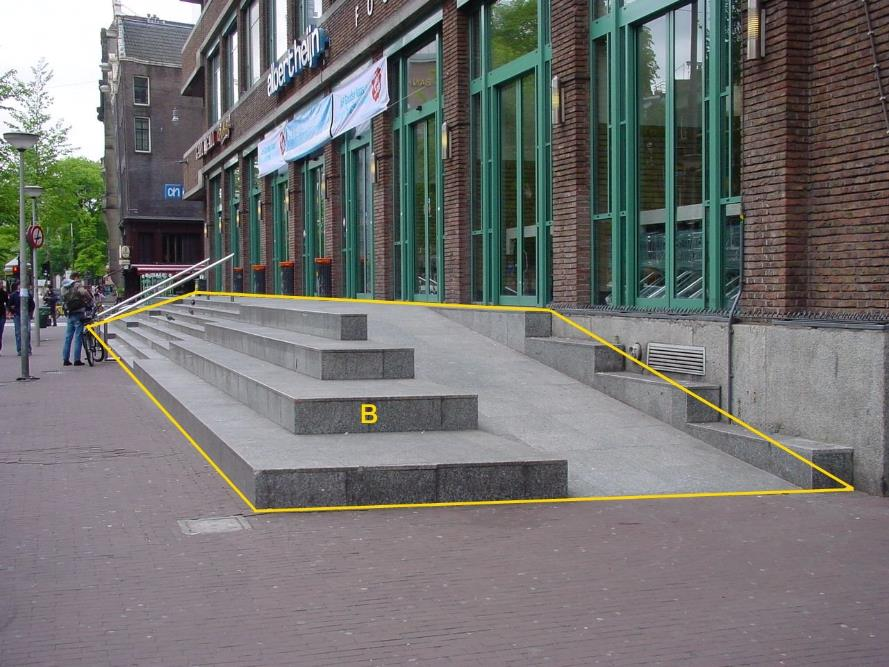
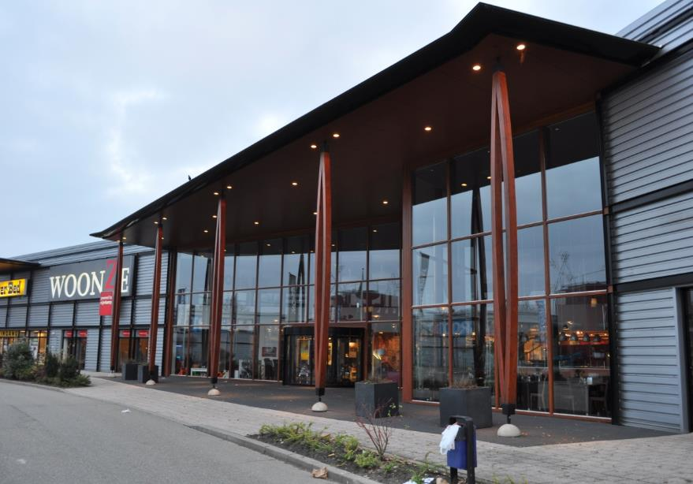
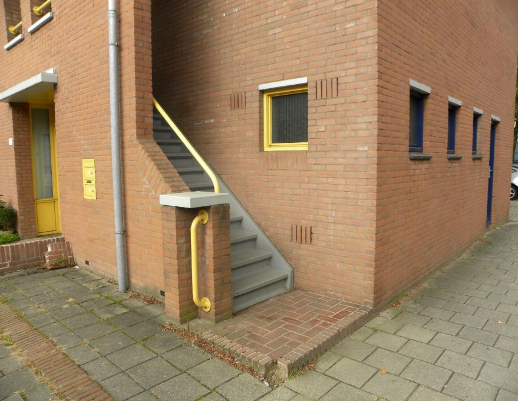

Gebouw-installatie
=================

**Definitie**

Een component aan de buitenzijde van een gebouw, die het aanzicht van het gebouw
mede bepaalt.

inwinningsregels
----------------

### IMGeo

Bron: [Gegevenscatalogus IMGeo
2.2](https://docs.geostandaarden.nl/imgeo/catalogus/imgeo/#gebouwinstallatie-1)

>   Gebouwinstallaties zijn aan het pand verbonden toegangstrappen, luifels en
>   bordessen.

type
----

**Definitie**

Specificatie van het soort gebouwinstallatie.

### bordes

**Definitie**

Een verhard oppervlak, eventueel verhoogd en/of uitgevoerd met treden, grenzend
aan een pand en primair bedoeld voor gebruik door voetgangers.

**Verplicht?**

Nee, optionele inhoud IMGeo.

**Voorbeeld**

B:

| **GebouwInstallatie**  | **Attribuutwaarde** | **Opmerkingen** |
|------------------------|---------------------|-----------------|
| type                   | bordes              |                 |
| relatieveHoogteligging |                     |                 |

### luifel

**Definitie**

Afdak aangebracht aan de gevel van een pand, eventueel rustend op kolommen.

**Verplicht?**

Nee, optionele inhoud IMGeo.

**Voorbeeld**

| **GebouwInstallatie**  | **Attribuutwaarde** | **Opmerkingen** |
|------------------------|---------------------|-----------------|
| type                   | luifel              |                 |
| relatieveHoogteligging |  1                  |                 |

### toegangstrap

**Definitie**

Niet afsluitbare trap (of trappenhuis) die toegang biedt aan een gebouw.

**Verplicht?**

Nee, optionele inhoud IMGeo.

**Voorbeeld**

| **GebouwInstallatie**  | **Attribuutwaarde** | **Opmerkingen** |
|------------------------|---------------------|-----------------|
| type                   | toegangstrap        |                 |
| relatieveHoogteligging |  1                  |                 |
