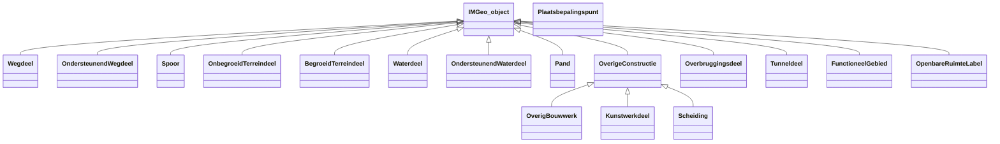
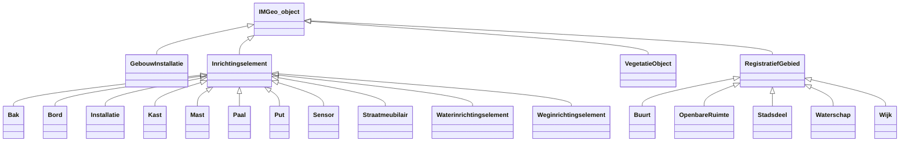

# IMGeo-object

**Definitie**

De gemeenschappelijke eigenschappen van een grootschalig topografisch object, al
dan niet uit de basisregistratie.

```mermaid
classDiagram
   IMGeo_object <|-- Wegdeel
   IMGeo_object <|-- OndersteunendWegdeel
   IMGeo_object <|-- Spoor
   IMGeo_object <|-- OnbegroeidTerreindeel
   IMGeo_object <|-- BegroeidTerreindeel
   IMGeo_object <|-- Waterdeel
   IMGeo_object <|-- OndersteunendWaterdeel
   IMGeo_object <|-- Pand
   IMGeo_object <|-- OverigeConstructie
   OverigeConstructie <|-- OverigBouwwerk
   IMGeo_object <|-- Overbruggingsdeel
   IMGeo_object <|-- Tunneldeel
   OverigeConstructie <|-- Kunstwerkdeel
   OverigeConstructie <|-- Scheiding
   IMGeo_object <|-- FunctioneelGebied
   IMGeo_object <|-- OpenbareRuimteLabel
   class Plaatsbepalingspunt
```

```mermaid
classDiagram
 IMGeo_object <|-- GebouwInstallatie
   IMGeo_object <|-- Inrichtingselement
   Inrichtingselement <|-- Bak
   Inrichtingselement <|-- Bord
   Inrichtingselement <|-- Installatie
   Inrichtingselement <|-- Kast
   Inrichtingselement <|-- Mast
   Inrichtingselement <|-- Paal
   Inrichtingselement <|-- Put
   Inrichtingselement <|-- Sensor
   Inrichtingselement <|-- Straatmeubilair
   Inrichtingselement <|-- Waterinrichtingselement
   Inrichtingselement <|-- Weginrichtingselement
   IMGeo_object <|-- VegetatieObject
   IMGeo_object <|-- RegistratiefGebied
   RegistratiefGebied <|-- Buurt
   RegistratiefGebied <|-- OpenbareRuimte
   RegistratiefGebied <|-- Stadsdeel
   RegistratiefGebied <|-- Waterschap
   RegistratiefGebied <|-- Wijk
```
