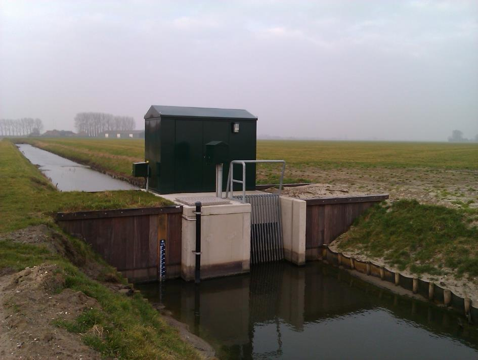
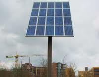

Installatie
===========

**Definitie**

Samenhangend systeem dat een bepaald doel dient.

type
----

**Definitie**

Het soort installatie.

### pomp

**Definitie**

Werktuig dat door middel van een verschil in druk vloeistoffen of gassen
verplaatst.

**Verplicht?**

Nee, optionele inhoud IMGeo.

**Voorbeeld**

| **Installatie**        | **Attribuutwaarde** | **Opmerkingen** |
|------------------------|---------------------|-----------------|
| type                   | pomp                |                 |
| relatieveHoogteligging |                     |                 |

### zonnepaneel

**Definitie**

Een zonnepaneel is een paneel dat zonne-energie omzet in elektriciteit.

**Verplicht?**

Nee, optionele inhoud IMGeo.

**Voorbeeld**

| **Installatie**        | **Attribuutwaarde** | **Opmerkingen** |
|------------------------|---------------------|-----------------|
| type                   | zonnepaneel         |                 |
| relatieveHoogteligging |  1                  |                 |
