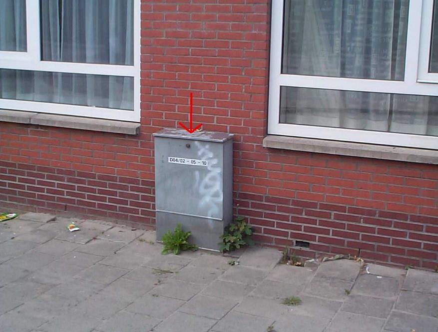
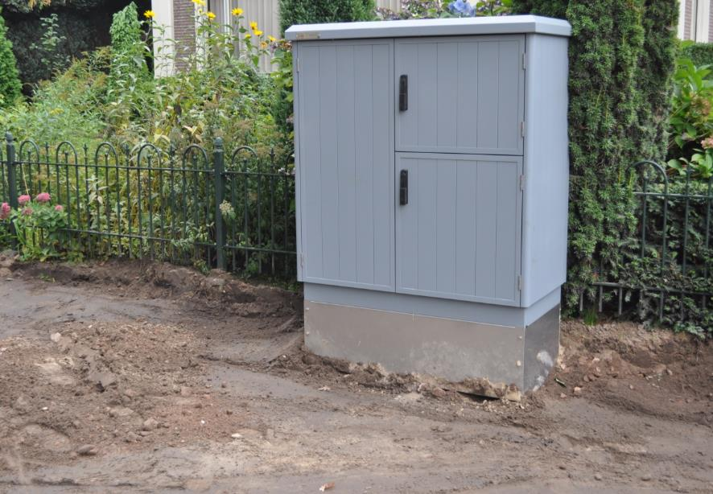
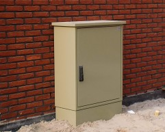
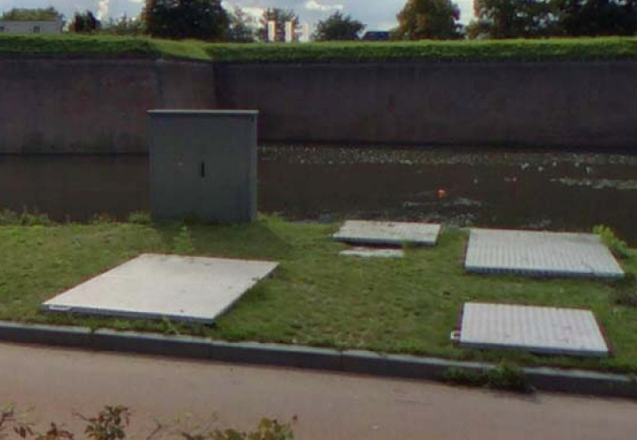
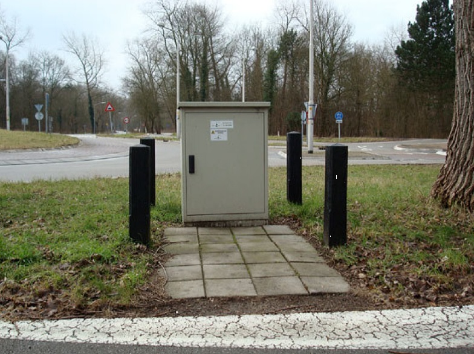
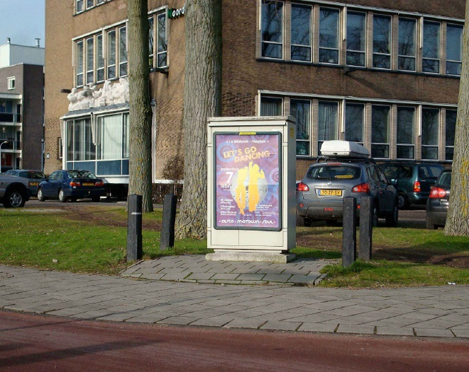
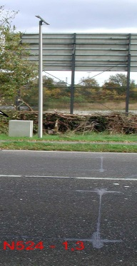
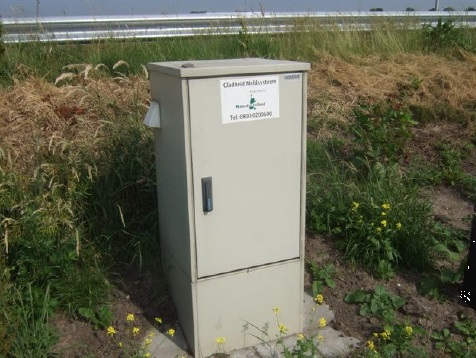

Kast
====

**Definitie**

Object met een permanent karakter dat dient om iets in te bergen en te
beschermen.

type
----

**Definitie**

Het soort kast.

### CAI-kast

**Definitie**

Kast ten behoeve van de regeling van radio- en televisiesignalen.

**Verplicht?**

Nee, optionele inhoud IMGeo.

**Voorbeeld**

| **Kast**               | **Attribuutwaarde** | **Opmerkingen** |
|------------------------|---------------------|-----------------|
| type                   | CAI-kast            |                 |
| relatieveHoogteligging |                     |                 |

### elektrakast

**Definitie**

Kast ten behoeve van de regeling van het transport van elektriciteit.

**Verplicht?**

Nee, optionele inhoud IMGeo.

**Voorbeeld**

| **Kast**               | **Attribuutwaarde** | **Opmerkingen** |
|------------------------|---------------------|-----------------|
| type                   | elektrakast         |                 |
| relatieveHoogteligging |                     |                 |

### gaskast

**Definitie**

Kast ten behoeve van de regeling van het transport van gas.

**Verplicht?**

Nee, optionele inhoud IMGeo.

**Voorbeeld**

Een afbeelding van een gaskast kunt u sturen
aan: [imgeo\@geonovum.nl](mailto:info@geonovum.nl)

| **Kast**               | **Attribuutwaarde** | **Opmerkingen** |
|------------------------|---------------------|-----------------|
| type                   | gaskast             |                 |
| relatieveHoogteligging |                     |                 |

### telecom kast

**Definitie**

Kast ten behoeve van de regeling van telecommunicatie.

**Verplicht?**

Nee, optionele inhoud IMGeo.

**Voorbeeld**

| **Kast**               | **Attribuutwaarde** | **Opmerkingen** |
|------------------------|---------------------|-----------------|
| type                   | telecom kast        |                 |
| relatieveHoogteligging |                     |                 |

### rioolkast

**Definitie**

Kast ten behoeve van de regeling van het transport van rioolwater.

**Verplicht?**

Nee, optionele inhoud IMGeo.

**Voorbeeld**

| **Kast**               | **Attribuutwaarde** | **Opmerkingen** |
|------------------------|---------------------|-----------------|
| type                   | rioolkast           |                 |
| relatieveHoogteligging |                     |                 |

### openbare verlichtingkast

**Definitie**

Kast ten behoeve van de regeling van de openbare verlichting.

**Verplicht?**

Nee, optionele inhoud IMGeo.

**Voorbeeld**

| **Kast**               | **Attribuutwaarde**      | **Opmerkingen** |
|------------------------|--------------------------|-----------------|
| type                   | openbare verlichtingkast |                 |
| relatieveHoogteligging |                          |                 |

### verkeersregelinstallatiekast

**Definitie**

Kast ten behoeve van de regeling van het verkeer.

**Verplicht?**

Nee, optionele inhoud IMGeo.

**Voorbeeld**

| **Kast**               | **Attribuutwaarde**          | **Opmerkingen** |
|------------------------|------------------------------|-----------------|
| type                   | verkeersregelinstallatiekast |                 |
| relatieveHoogteligging |                              |                 |

### telkast

**Definitie**

Kast ten behoeve van het meten van permanente verkeertellingen.

**Verplicht?**

Nee, optionele inhoud IMGeo.

**Voorbeeld**

| **Kast**               | **Attribuutwaarde** | **Opmerkingen** |
|------------------------|---------------------|-----------------|
| type                   | telkast             |                 |
| relatieveHoogteligging |                     |                 |

### GMS kast

**Definitie**

Kast ten behoeve van het meten van weers- en wegdekomstandigheden.

**Verplicht?**

Nee, optionele inhoud IMGeo.

**Voorbeeld**

| **Kast**               | **Attribuutwaarde** | **Opmerkingen** |
|------------------------|---------------------|-----------------|
| type                   | GMS kast            |                 |
| relatieveHoogteligging |                     |                 |
