Kunstwerkdeel
=============

**Definitie**

Onderdeel van een civiel-technisch werk voor de infrastructuur van wegen, water,
spoorbanen, waterkeringen en/of leidingen.

inwinningsregels
----------------

### BGT

Bron: [Gegevenscatalogus BGT
1.2](https://docs.geostandaarden.nl/imgeo/catalogus/bgt/#objectafbakening-kunstwerkdeel)

>   **Regels voor opname**

>   Een kunstwerkdeel wordt opgenomen met de buitenste begrenzing die is bepaald
>   door karakteristieke punten.

>   Als de breedte van het kunstwerkdeel \<30cm is, wordt het object als lijn
>   vastgelegd.

>   **Aandachtspunten**

>   Kunstwerkdelen worden getypeerd naar het geheel waarvan zij deel uitmaken.

>   De aanduiding voor het kunstwerkdeel in de BGT heeft betrekking op die delen
>   van het kunstwerk die nog niet als een ander object of objecttype tot de
>   BGT- inhoud behoren.

>   Het kunstwerkdeel erft het attribuut relatieve hoogteligging van het object
>   waarop het staat of ligt.

>   Hoogspanningsmast

>   Alleen masten van het type hoogspanningsmast zijn onderdeel van de BGT. De
>   voet van de mast wordt als multipunt of multivlak vastgelegd.

>   Als er geen afzonderlijke afmeting van de mastvoeten beschikbaar is, wordt
>   elk hoekpunt van de omtrek om de mastvoeten als multipunt van de
>   hoogspanningsmast geclassificeerd.

>   Als er afzonderlijke afmetingen van de mastvoeten bekend zijn, wordt elke
>   mastvoet als multivlak van de hoogspanningsmast geclassificeerd wanneer de
>   afmetingen van de mastvoet (rechthoekzijde of middellijn) ≥ 0,30 m bedraagt.

>   **Gemaaldelen, sluisdeur, stuw**

>   Bij een gemaal worden de eventueel aanwezige bakken waar het water door
>   wordt geleid als gemaaldeel opgenomen in de BGT. De eventuele overige
>   objecten zoals muren, kademuren, panden en overbruggingen vormen als zodanig
>   inhoud van de BGT. Nadere typeringen van gemaal wordt beschouwd als
>   beheerinformatie en niet opgenomen in de BGT.

>   Bij een sluis behoren alleen de sluisdeuren, in gesloten stand, tot
>   BGT-inhoud. De eventuele overige objecten zoals muren, kademuren, panden en
>   overbruggingen vormen als zodanig inhoud van de BGT. Nadere typeringen van
>   sluis wordt beschouwd als beheerinformatie en niet opgenomen in de BGT.

>   Bij een stuw behoort uitsluitend de klep of schuif waarover het water kan
>   stromen tot BGT-inhoud. De eventueel aanwezige bakken waar het water door
>   wordt geleid, worden als stuwdeel opgenomen in de BGT. Eventuele overige
>   objecten zoals muren, kademuren, panden en overbruggingen vormen als zodanig
>   inhoud van de BGT.

### IMGeo

Bron: [Gegevenscatalogus IMGeo
2.2](https://docs.geostandaarden.nl/imgeo/catalogus/imgeo/#kunstwerkdeel-0)

>   IMGeo voegt enkele optionele kunstwerken toe. Dit zijn allemaal
>   vlakobjecten, met uitzondering duiker: deze heeft vlak- of lijngeometrie. De
>   relatieve hoogte van een duiker bedraagt altijd \< 0. Het waterdeel in de
>   duiker wordt niet afgebeeld.

type
----

**Definitie**

Specificatie van het soort kunstwerk.

### hoogspanningsmast

**Definitie**

Metalen mast of stellage ter ondersteuning van geleidedraden voor het transport
van elektriciteit met een hoog voltage.

**Verplicht?**

Ja, verplichte inhoud BGT.

**Voorbeeld**

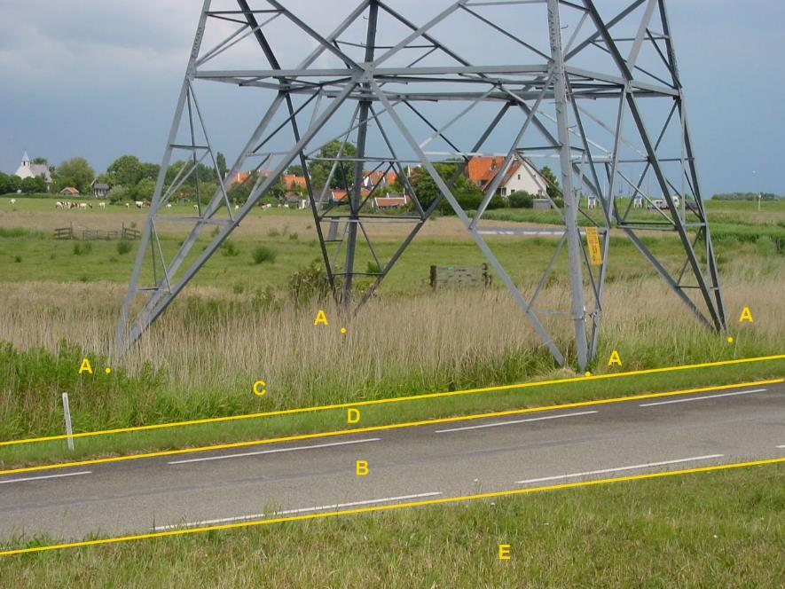

Wanneer er geen afzonderlijke afmeting van de mastvoeten beschikbaar is, wordt
elk hoekpunt van de omtrek om de mastvoeten als multipunt van de
hoogspanningsmast geclassificeerd.

A:

| **Kunstwerkdeel**      | **Attribuutwaarde** | **Opmerkingen** |
|------------------------|---------------------|-----------------|
| Type                   | hoogspanningsmast   |  multipunt      |
| relatieveHoogteligging |  0                  |                 |

B: wegdeel. Rijbaan: lokale weg, gesloten verharding

C: begroeid terreindeel, grasland overig

D en E: ondersteunend wegdeel: berm, fysiek voorkomen: groenvoorziening.

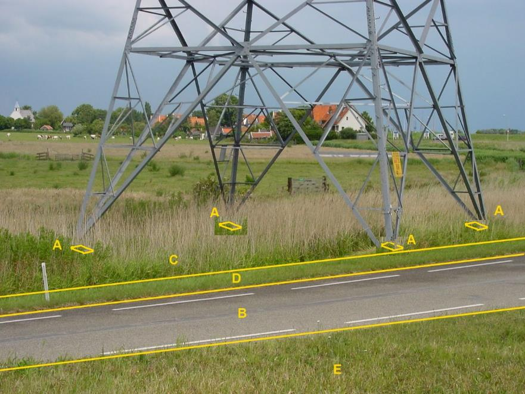

Wanneer een hoogspanningsmast op meerdere plaatsen op het maaiveld steunt en er
zijn afzonderlijke afmetingen van elke mastvoet bekend dan wordt de geometrie
van elke mastvoet afzonderlijk geclassificeerd als multivlak-geometrie van de
mast.

A:

| **Kunstwerkdeel**      | **Attribuutwaarde** | **Opmerkingen** |
|------------------------|---------------------|-----------------|
| Type                   | hoogspanningsmast   | multivlak       |
| relatieveHoogteligging |  0                  |                 |

B: wegdeel. Rijbaan: lokale weg, gesloten verharding

C en E: begroeid terreindeel, grasland overig

D: ondersteunend wegdeel: berm, fysiek voorkomen: groenvoorziening.

### gemaal

**Definitie**

Een kunstwerk in principe bedoeld om water van een laag peil naar een hoog peil
te brengen.

**Verplicht?**

Ja, verplichte inhoud BGT.

**Voorbeeld**

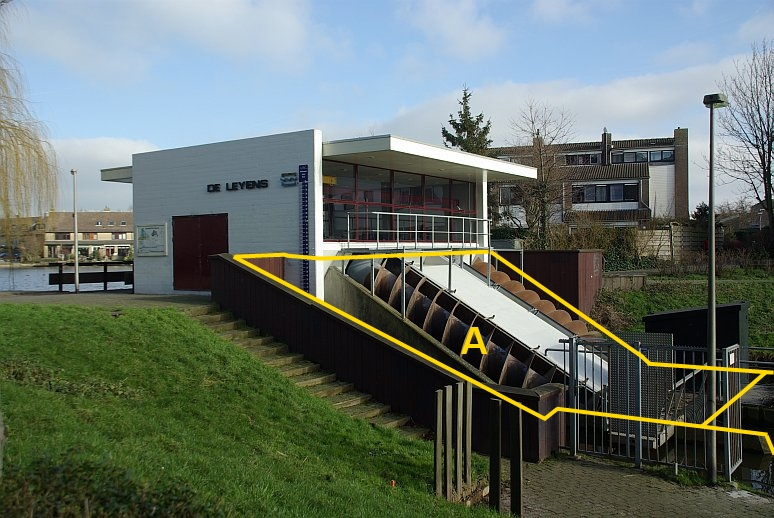

Het gebouw bij het gemaal is een BAG-pand en vormt met de maaiveldgeometrie
BGT-inhoud.

A:

| **Kunstwerkdeel**      | **Attribuutwaarde** | **Opmerkingen** |
|------------------------|---------------------|-----------------|
| type                   | gemaal              |                 |
| relatieveHoogteligging |  0                  |                 |

### perron

**Definitie**

Verhoogde constructie langs een spoorrail of tramrail voor het in- en uitstappen
van passagiers of voor het laden en lossen van goederen.

**Verplicht?**

Ja, verplichte inhoud BGT.

**Voorbeeld**

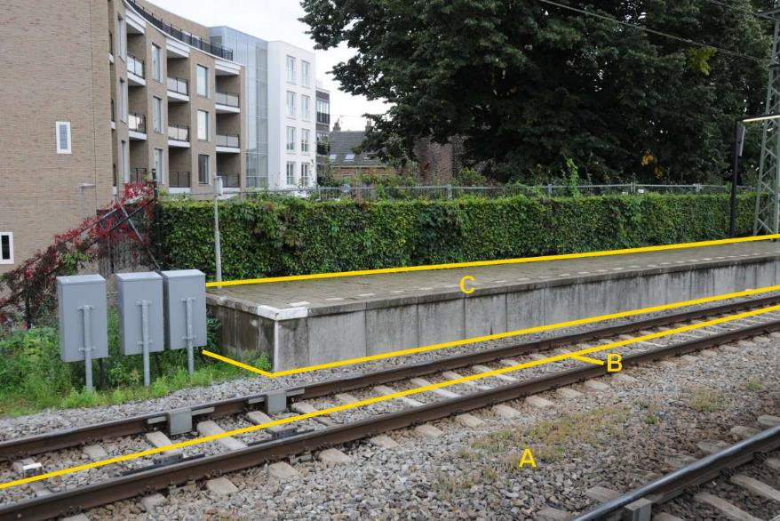

C:

| **overigKunstwerkdeel** | **Attribuutwaarde** | **Opmerkingen** |
|-------------------------|---------------------|-----------------|
| type                    | perron              |                 |
| relatieveHoogteligging  |  0                  |                 |

A: wegdeel, spoorbaan.

B: spoor, trein.

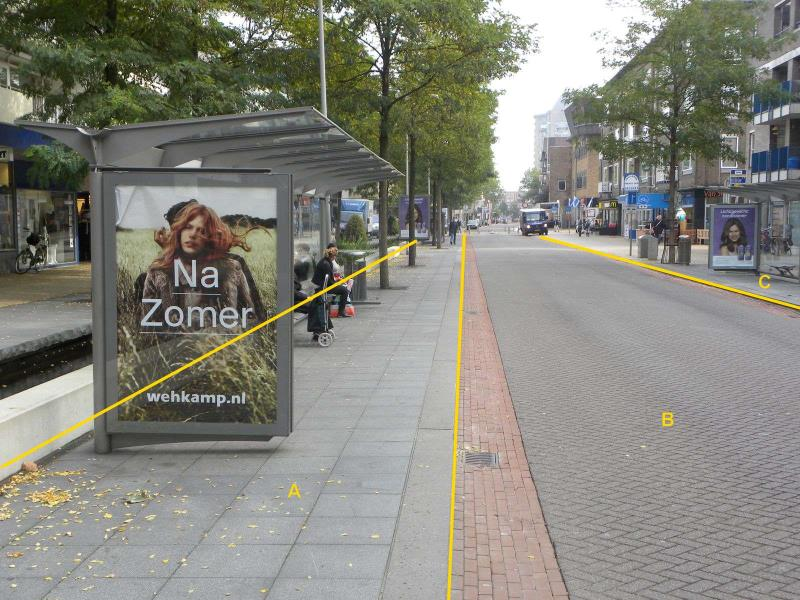

DSCN2122

Dit is geen perron.

Perrons worden alleen opgenomen als ze langs een spoor van trein of sneltram
liggen.

A is voor de BGT een wegdeel, in IMGeo kan het tevens worden geclassificeerd
als: Functioneel gebied, niet BGT, bushalte.

A:

| *Wegdeel*              | *Attribuutwaarde* | *Opmerkingen* |
|------------------------|-------------------|---------------|
| functieWeg             | Voetpad           |               |
| fysiek voorkomen       | Open verharding   |               |
| relatieveHoogteligging | 0                 |               |

### sluis

**Definitie**

Een kunstmatige, beweegbare waterkering die de verbinding tussen twee wateren
kan afsluiten of openstellen en daartoe van deuren of schuiven is voorzien.

**Verplicht?**

Ja, verplichte inhoud BGT.

**Voorbeeld**

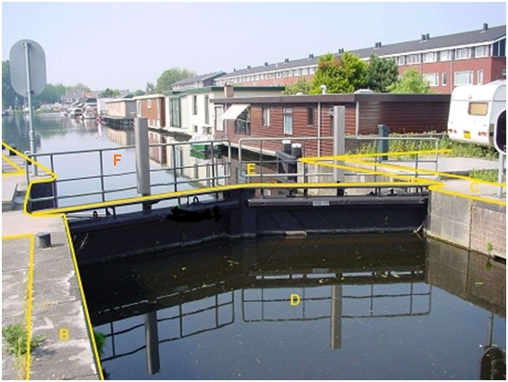

De waterloop wordt door de sluis E opgeknipt in twee waterdelen D en F.

Overige objecten behoren als afzonderlijke typen tot BGT-inhoud, zoals o.a. de
kademuren als type scheiding.

E:

| **overigKunstwerkdeel** | **Attribuutwaarde** | **Opmerkingen** |
|-------------------------|---------------------|-----------------|
| type                    | sluis               |                 |
| relatieveHoogteligging  |  0                  |                 |

### strekdam

**Definitie**

Constructie in het water ter verdediging van de kust/oever.

**Verplicht?**

Ja, verplichte inhoud BGT.

**Voorbeeld**

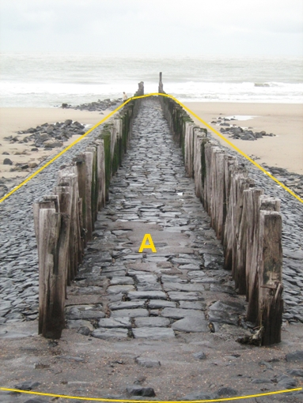

A:

| **overigKunstwerkdeel** | **Attribuutwaarde** | **Opmerkingen** |
|-------------------------|---------------------|-----------------|
| type                    | strekdam            |                 |
| relatieveHoogteligging  |  0                  |                 |

### steiger

**Definitie**

Vaste (niet drijvende) waterbouwkundige constructie voor het aanleggen van
schepen en bedoeld om deze schepen vanaf de wal te laden en te lossen.

**Verplicht?**

Ja, verplichte inhoud BGT.

**Voorbeeld**

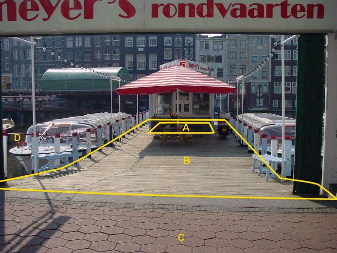

DSC01139

B:

| **Kunstwerkdeel**      | **Attribuutwaarde** | **Opmerkingen** |
|------------------------|---------------------|-----------------|
| type                   | steiger             |                 |
| relatieveHoogteligging | 1                   |                 |

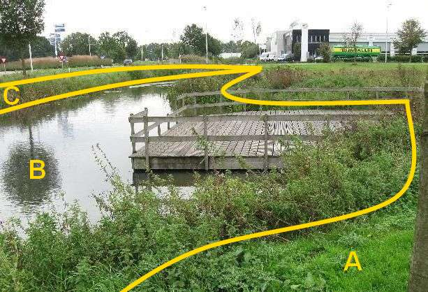

jd19

Drijvende steigers zijn geen BGT inhoud.

### stuw

**Definitie**

Een constructie met een vaste drempel of een beweegbare klep, die dient om de
waterstand boven- en benedenstrooms te regelen.

**Verplicht?**

Ja, verplichte inhoud BGT.

**Voorbeeld**

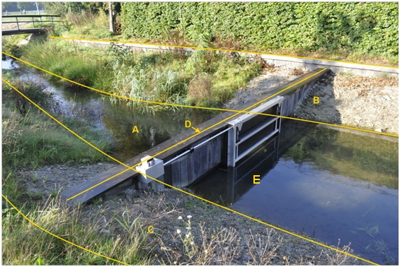

De waterloop wordt door de stuw D opgeknipt in twee waterdelen A en E.

D:

| **Kunstwerkdeel**      | **Attribuutwaarde** | **Opmerkingen**                      |
|------------------------|---------------------|--------------------------------------|
| Type                   | Stuw                |  Breedte \< 0.30 m dus lijngeometrie |
| relatieveHoogteligging |  0                  |                                      |

B en C: ondersteunend waterdeel, oever/slootkant.

### keermuur

**Definitie**

Een keermuur of keerwand is een stijf, grond- of waterkerend kunstwerk dat door
een groot gewicht en een brede voet een grote standzekerheid kan bereiken. Een
keermuur is meestal van gewapend beton, maar er kan ook ander materiaal gebruikt
worden.

**Verplicht?**

Nee, optionele inhoud IMGeo.

**Voorbeeld**

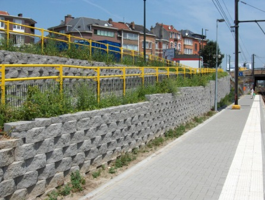

| **Kunstwerkdeel**      | **Attribuutwaarde** | **Opmerkingen** |
|------------------------|---------------------|-----------------|
| type                   | keermuur            |                 |
| relatieveHoogteligging |                     |                 |

### overkluizing

**Definitie**

Een overkluizing is een civieltechnisch kunstwerk waarmee een weg een andere
weg, een plein of een waterloop (kruiselings) overwelft. In het geval van een
waterweg is er onder het bouwwerk (vaak) geen scheepvaart mogelijk, maar ligt
het wateroppervlak nog wel vrij. Een overkluizing is te vergelijken met een
brug, alleen bestaat de brug in dit geval vaak niet uit een wegdek maar uit een
opstal. Anders gesteld: het maakt meestal geen deel uit van een weg.

**Verplicht?**

Nee, optionele inhoud IMGeo.

**Voorbeeld**

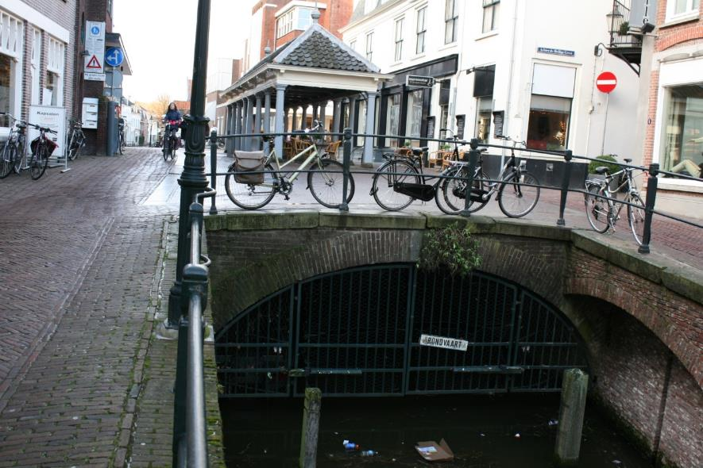

| **Kunstwerkdeel**      | **Attribuutwaarde** | **Opmerkingen** |
|------------------------|---------------------|-----------------|
| type                   | overkluizing        |                 |
| relatieveHoogteligging |  -1                 |                 |

### duiker

**Definitie**

Kunstwerk voor de waterhuishouding, bestaande uit een gesloten kokervormige
constructie met een in- en uitstroomopening, niet de gehele waterbreedte
beslaand en aangebracht onder een weg of spoorweg of in een dam. (bron: CROW)

**Verplicht?**

Nee, optionele inhoud IMGeo.

**Voorbeeld**

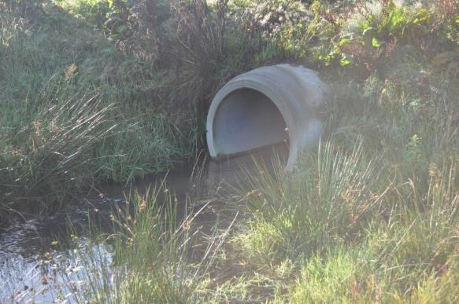

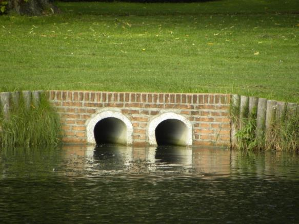

| **Kunstwerkdeel**      | **Attribuutwaarde** | **Opmerkingen** |
|------------------------|---------------------|-----------------|
| type                   | duiker              |                 |
| relatieveHoogteligging |  -1                 |                 |

### faunavoorziening

**Definitie**

Voorziening bij een weg of spoorweg, niet zijnde een ecoduct, om de uit dat werk
voortvloeiende negatieve gevolgen voor de fauna zoveel mogelijk te voorkomen of
te beperken.

**Verplicht?**

Nee, optionele inhoud IMGeo.

**Voorbeeld**

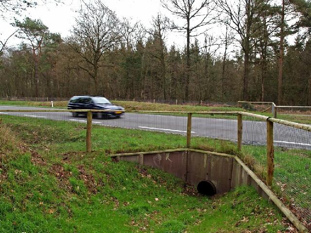

| **Kunstwerkdeel**      | **Attribuutwaarde** | **Opmerkingen** |
|------------------------|---------------------|-----------------|
| type                   | faunavoorziening    |                 |
| relatieveHoogteligging |  -1                 |                 |

### vispassage

**Definitie**

Een kunstmatige passage ten behoeve van de vistrek bij kunstwerken in wateren.

**Verplicht?**

Nee, optionele inhoud IMGeo.

**Voorbeeld**

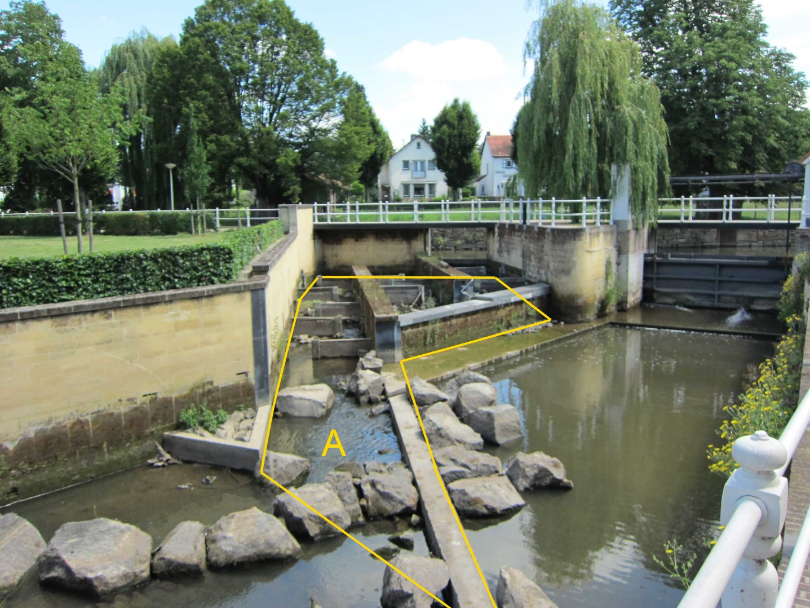

Vispassage

| **Kunstwerkdeel**      | **Attribuutwaarde** | **Opmerkingen** |
|------------------------|---------------------|-----------------|
| type                   | vispassage          |                 |
| relatieveHoogteligging |  0                  |                 |

### bodemval

**Definitie**

Sprong in de bodem van een waterloop.

**Verplicht?**

Nee, optionele inhoud IMGeo.

**Voorbeeld**

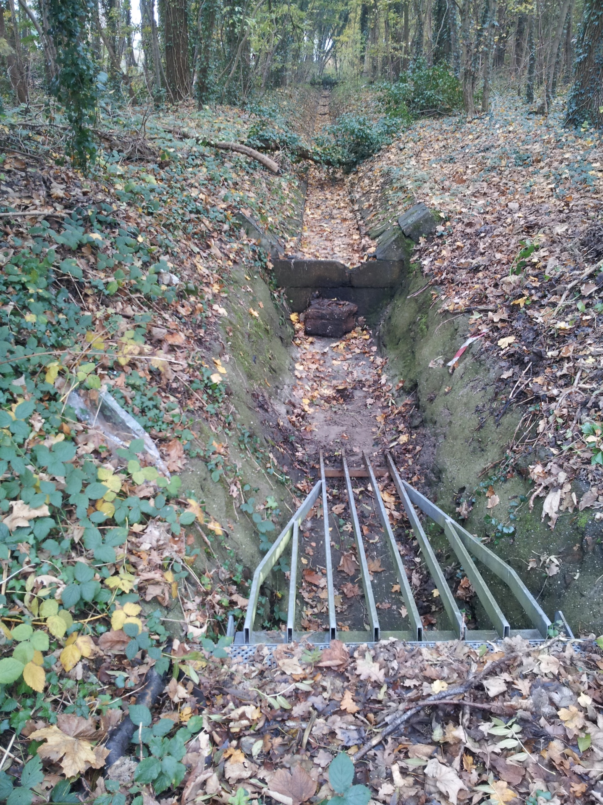

bodemval

| **Kunstwerkdeel**      | **Attribuutwaarde** | **Opmerkingen** |
|------------------------|---------------------|-----------------|
| type                   | bodemval            |                 |
| relatieveHoogteligging |  0                  |                 |

### coupure

**Definitie**

Een onderbreking in een waterkering voor de doorvoer van een weg of spoorweg,
die bij extreme waterstanden afsluitbaar is.

**Verplicht?**

Nee, optionele inhoud IMGeo.

**Voorbeeld**

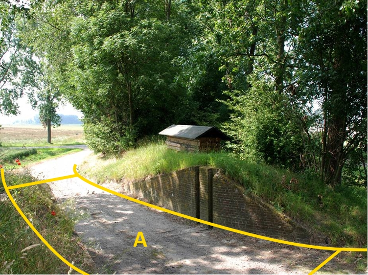

Coupure

| **Kunstwerkdeel**      | **Attribuutwaarde** | **Opmerkingen**                                                                                                                                                                                                                |
|------------------------|---------------------|--------------------------------------------------------------------------------------------------------------------------------------------------------------------------------------------------------------------------------|
| type                   | coupure             |                                                                                                                                                                                                                                |
| relatieveHoogteligging |  0                  |  Een coupure is als IMGeo-object een uitbreiding van de BGT-populatie. Daardoor is dit object geen onderdeel van de topolgische structuur en treedt er geeen conflict op met het onderliggende BGT-object Wegdeel op niveau 0. |

### ponton

**Definitie**

Drijvende, dichte bak, waarover soms een dek is gelegd.

**Verplicht?**

Nee, optionele inhoud IMGeo.

**Voorbeeld**

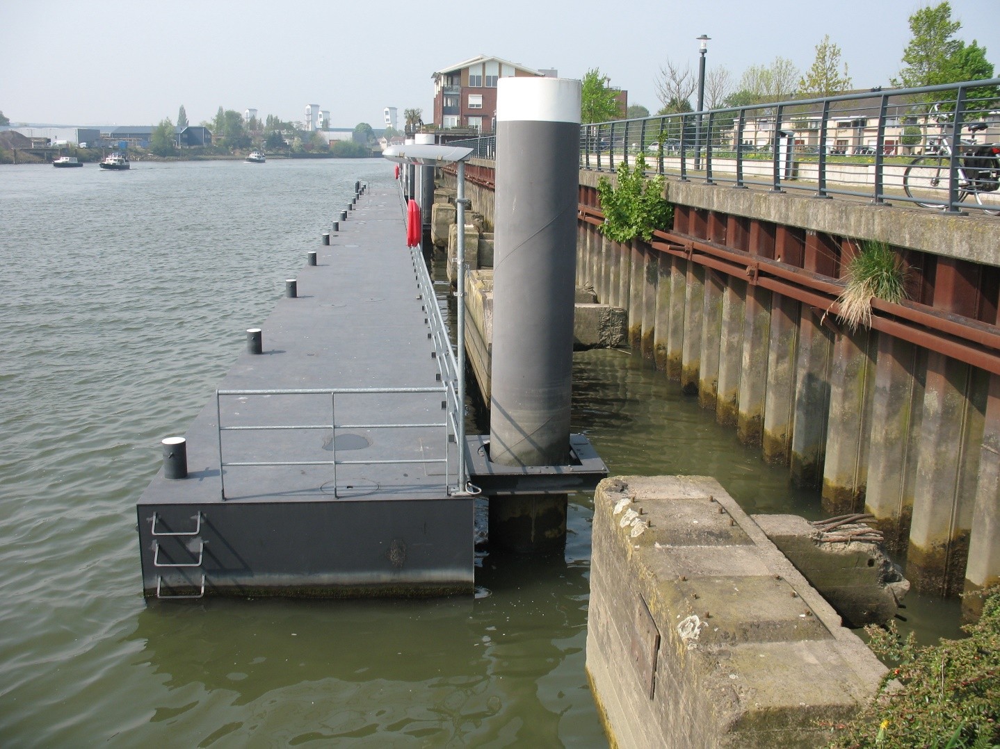

Kunstwerkdeel ponton

| **Kunstwerkdeel**      | **Attribuutwaarde** | **Opmerkingen** |
|------------------------|---------------------|-----------------|
| type                   | ponton              |                 |
| relatieveHoogteligging |  0                  |                 |

### voorde

**Definitie**

Een doorwaadbare, doorgaans verharde, plaats in de waterloop, die dient voor de
oversteek van die waterloop.

**Verplicht?**

Nee, optionele inhoud IMGeo.

**Voorbeeld**

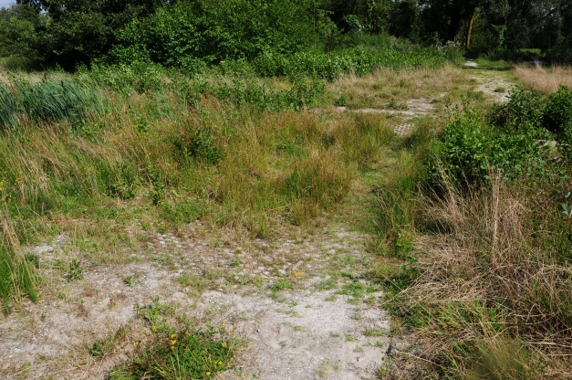

Kunstwerkdeel voorde

| **Kunstwerkdeel**      | **Attribuutwaarde** | **Opmerkingen** |
|------------------------|---------------------|-----------------|
| type                   | voorde              |                 |
| relatieveHoogteligging |  0                  |                 |
