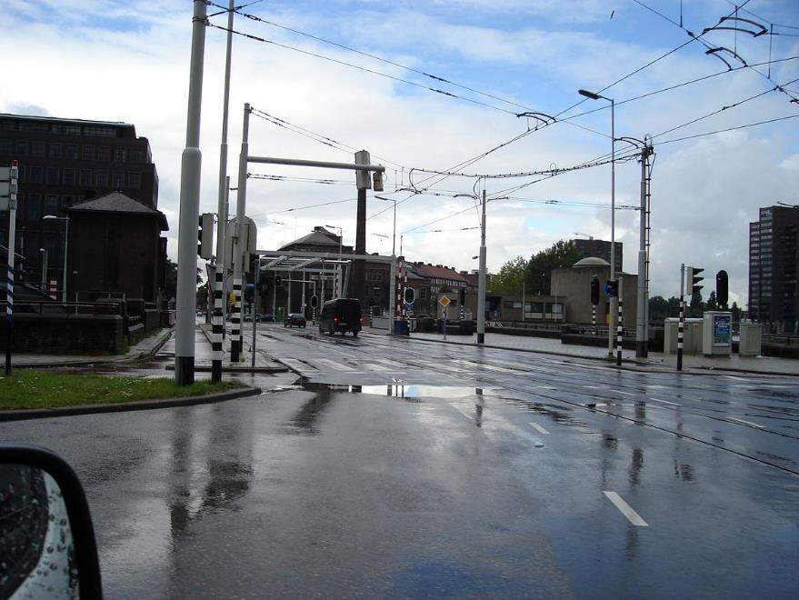
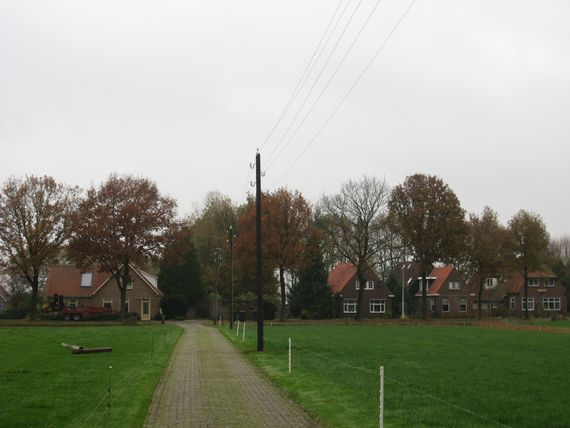
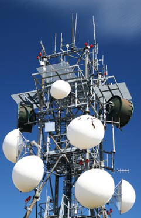
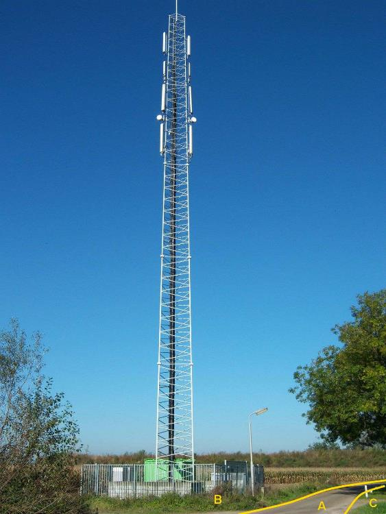
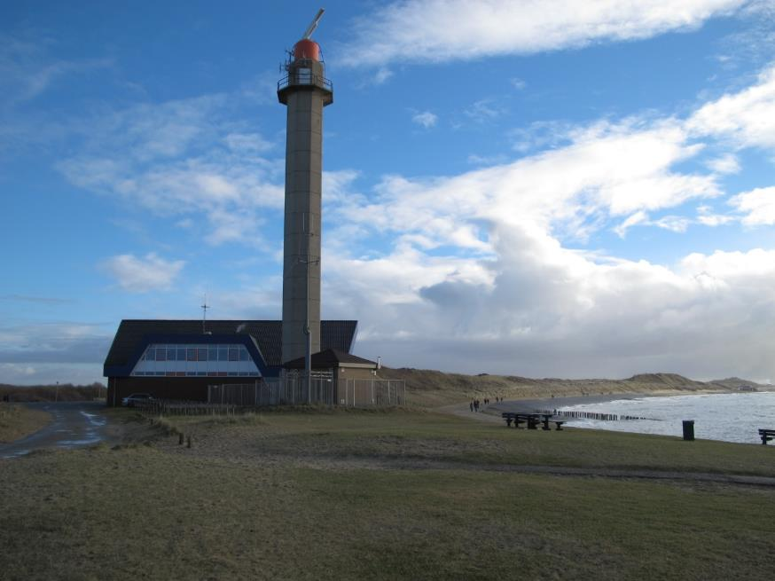

Mast
====

**Definitie**

Hoge draagconstructie.

type
----

**Definitie**

Het soort mast.

### bovenleidingmast

**Definitie**

Mast die een onderdeel vormt van de bovenleidingdraagconstructie.

**Verplicht?**

Nee, optionele inhoud IMGeo.

**Voorbeeld**

| **Mast**               | **Attribuutwaarde** | **Opmerkingen** |
|------------------------|---------------------|-----------------|
| type                   | bovenleidingmast    |                 |
| relatieveHoogteligging |                     |                 |

### laagspanningsmast

**Definitie**

Houten of metalen mast waaraan kabels voor het transport van elektrische energie
met een spannning lager dan 500 V zijn bevestigd.

**Verplicht?**

Nee, optionele inhoud IMGeo.

**Voorbeeld**

| **Mast**               | **Attribuutwaarde** | **Opmerkingen** |
|------------------------|---------------------|-----------------|
| type                   | laagspanningsmast   |                 |
| relatieveHoogteligging |                     |                 |

### straalzender

**Definitie**

Zender voor radio, televisie en telecommunicatie signalen die in smalle
stralenbundels uitzendt.

**Verplicht?**

Nee, optionele inhoud IMGeo.

**Voorbeeld**

| **Mast**               | **Attribuutwaarde** | **Opmerkingen** |
|------------------------|---------------------|-----------------|
| type                   | straalzender        |                 |
| relatieveHoogteligging |                     |                 |

### zendmast

**Definitie**

Mast bestemd voor het uitzenden van radio, televisie of telecommunicatie
signalen.

**Verplicht?**

Nee, optionele inhoud IMGeo.

**Voorbeeld**

| **Mast**               | **Attribuutwaarde** | **Opmerkingen** |
|------------------------|---------------------|-----------------|
| type                   | zendmast            |                 |
| relatieveHoogteligging |                     |                 |

### radarmast

**Definitie**

Vaste of neerklapbare constructie waarop de radarantenne bevestigd is.

**Verplicht?**

Nee, optionele inhoud IMGeo.

**Voorbeeld**

| **Mast**               | **Attribuutwaarde** | **Opmerkingen** |
|------------------------|---------------------|-----------------|
| type                   | radarmast           |                 |
| relatieveHoogteligging |                     |                 |
