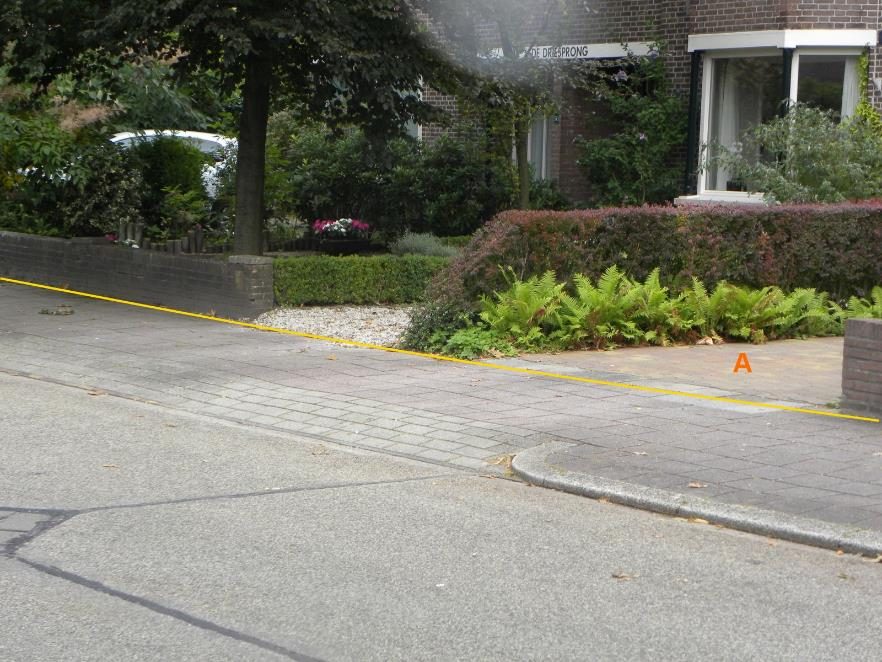
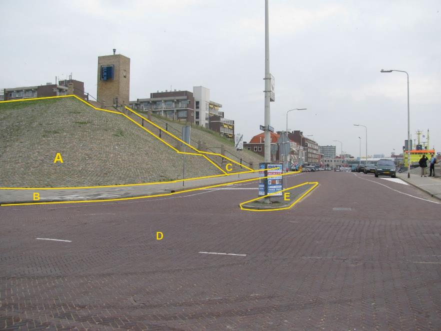
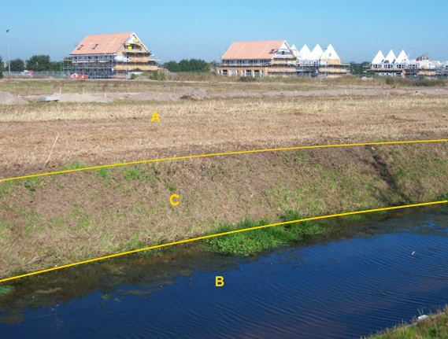
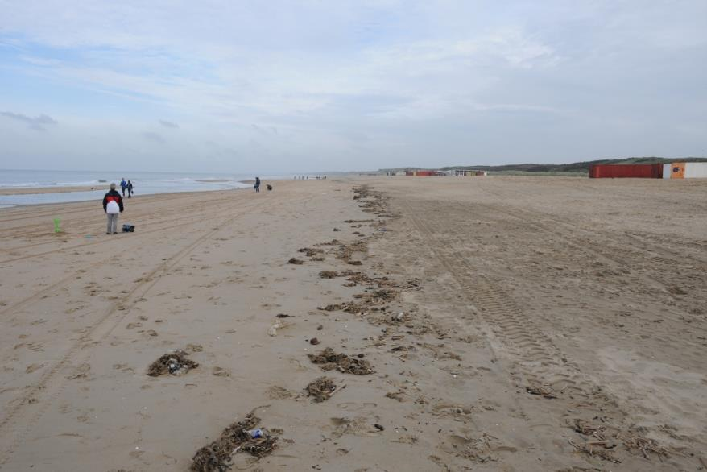
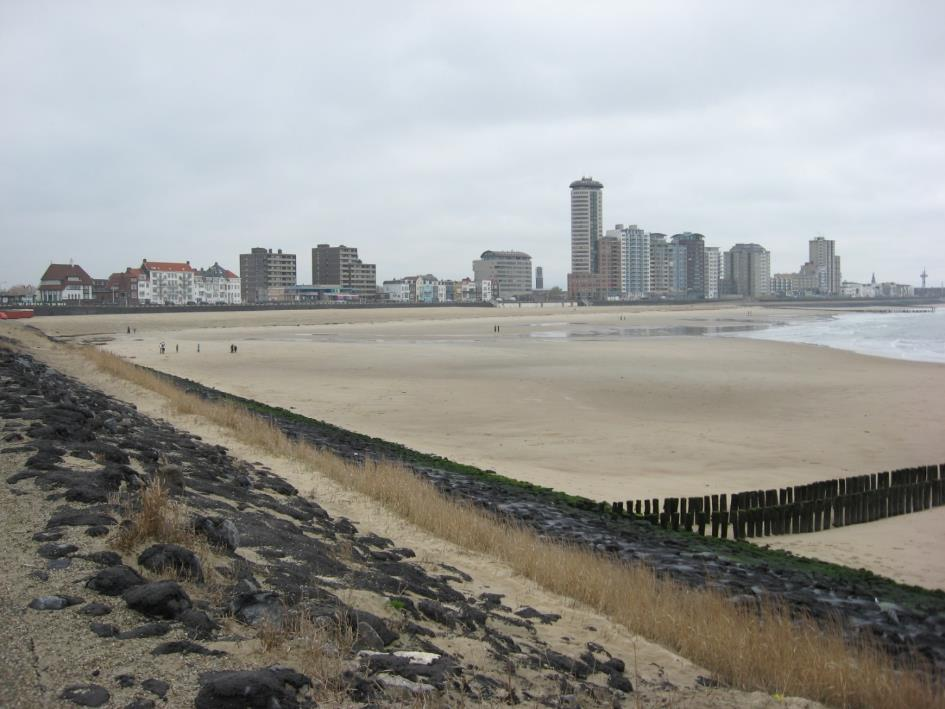
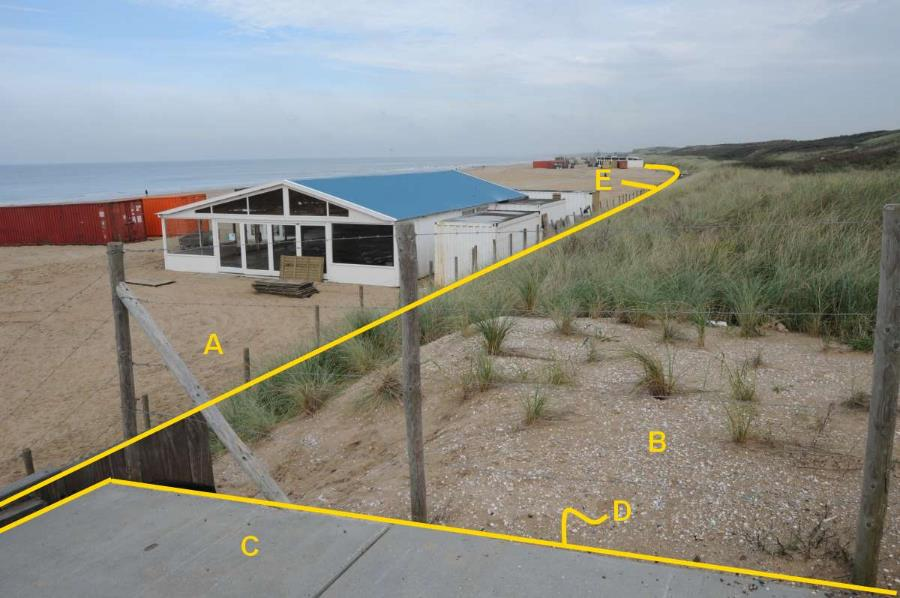
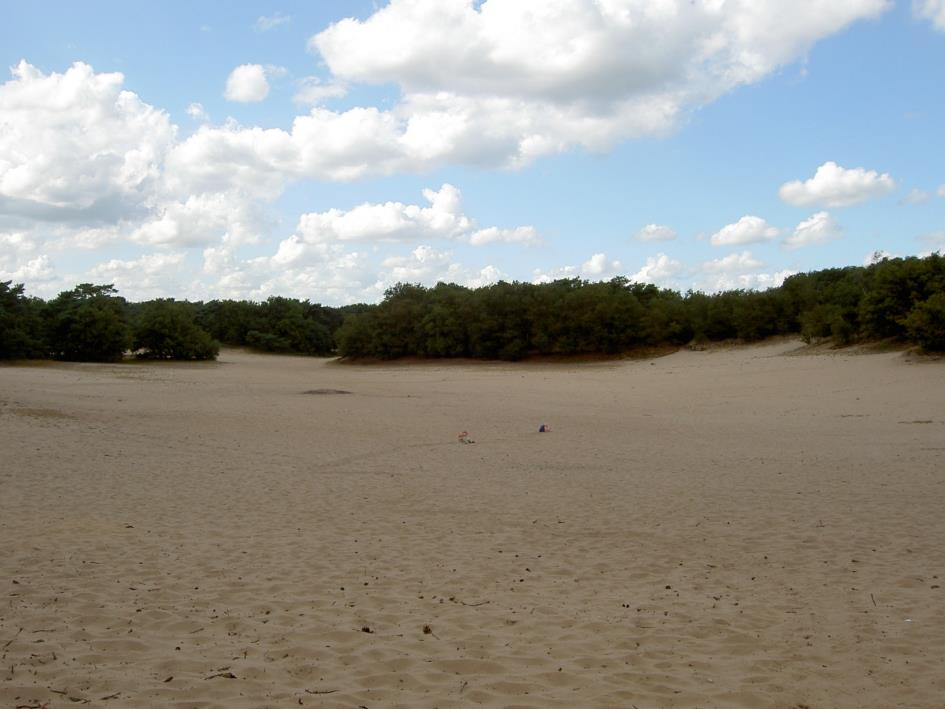

Onbegroeid terreindeel
=====================

**Definitie**

Kleinste functioneel onafhankelijk stukje van een terrein, dat er binnen het
objecttype Terrein van NEN 3610 wordt onderscheiden, zonder aaneengesloten
vegetatie.

inwinningsregels
----------------

### BGT

Bron: [Gegevenscatalogus BGT
1.2](https://docs.geostandaarden.nl/imgeo/catalogus/bgt/#objectafbakening-onbegroeidterreindeel)

>   **Indeling**

>   Om de onbegroeide terreindelen in te delen is het fysieke voorkomen
>   bepalend.

>   **Regels voor opname**

>   Uitsparingen voor stedelijk groen in onbegroeid terrein van het type
>   gesloten, open of half verhard worden niet apart ingewonnen indien \<5m2.
>   Het onbegroeide terreindeel wordt dan geacht door te lopen. Als deze
>   uitsparingen groter zijn dan 5m2 worden deze opgenomen als begroeid
>   terreindeel.

>   Het attribuut fysiek voorkomen geldt voor het gehele onbegroeide
>   terreindeel. Een overgang van fysiek voorkomen is dus altijd ook een grens
>   tussen twee onbegroeide terreindelen. Het gaat hierbij over het voorkomen
>   waarmee het onbegroeide terreindeel overwegend is bedekt. Voor minimale
>   stukjes met andere verharding hoeft geen apart onbegroeid terreindeel te
>   worden gevormd.

>   De kruinlijn moet bij het onbegroeid terreindeel worden opgenomen indien de
>   helling een verhouding heeft van verticaal:horizontaal van 1:4 of steiler en
>   het hoogteverschil \>1m bedraagt. Een van de zijden van het onbegroeid
>   terreindeel valt altijd samen met de kruinlijn, zijnde bovenkant talud. De
>   coördinaten van de kruinlijn zijn identiek met die van de objectbegrenzing
>   ter plaatse. Het gedeelte van een object dat op het talud ligt is altijd een
>   apart begrensd vlak ten opzichte van het deel van het object dat niet op het
>   talud ligt.

>   Als er meer dan een objecttype op een talud ligt, bevat alleen het hoogst
>   gelegen object een kruinlijngeometrie. De coördinaten van de kruinlijn zijn
>   identiek aan de coördinaten van de objectbegrenzing die samenvalt met de
>   kruinlijn.

>   **Aandachtspunten**

>   Aaneengesloten voor- en achtertuinen van panden worden als één onbegroeid
>   terreindeel opgenomen met het type ‘erf’. Voor de BGT worden er binnen een
>   erf geen tussenliggende scheidingen opgenomen. Eventueel kunnen ze als IMGeo
>   inhoud worden vastgelegd.

>   Braakliggende grond in stedelijk gebied is een onbegroeid terreindeel met
>   een fysiek voorkomen ‘onverhard’.

### IMGeo

Bron: [Gegevenscatalogus IMGeo
2.2](https://docs.geostandaarden.nl/imgeo/catalogus/imgeo/#onbegroeidterreindeel-0)

>   Om de onbegroeide terreindelen in te delen is het fysieke voorkomen
>   bepalend. Indien noodzakelijk wordt het BGT attribuut kruinlijngeometrie
>   opgenomen.

>   Uitsparingen voor stedelijk groen in onbegroeid terrein \< 5 m2 kunnen IMGeo
>   inhoud zijn. Men mag deze delen zo afbakenen als voor beheer gewenst is.

fysiekvoorkomen
---------------

**Definitie**

Classificatie van het soort terrein, ingedeeld naar de uiterlijke
verschijningsvorm.

### erf

**Definitie**

Terreindeel dat bij een pand of overig bouwwerk hoort, dat niet nader wordt
ingewonnen en dat bestaat uit een mengvorm van begroeiing, verharding, en/of
water.

**Verplicht?**

Ja, verplichte inhoud BGT.

**Voorbeeld**

A:

| **OnbegroeidTerreindeel** | **Attribuutwaarde** | **Opmerkingen** |
|---------------------------|---------------------|-----------------|
| fysiekVoorkomen           | erf                 |                 |
| relatieveHoogteligging    |  0                  |                 |

### gesloten verharding

**Definitie**

Verharding bestaande uit een materiaal dat niet verwijderbaar is zonder
definitieve destructie, zoals bijvoorbeeld bitumen, cement of kunststof.

**Verplicht?**

Ja, verplichte inhoud BGT.

**Voorbeeld**

Zie wegdeel, gesloten verharding.

A:

| **OnbegroeidTerreindeel** | **Attribuutwaarde** | **Opmerkingen** |
|---------------------------|---------------------|-----------------|
| fysiekVoorkomen           | gesloten verharding |                 |
| relatieveHoogteligging    |  0                  |                 |

#### asfalt

**Definitie**

Gesloten verharding bestaande uit asfaltbeton of andere met bitumen gebonden
materialen.

**Verplicht?**

Nee, optionele inhoud IMGeo.

**Voorbeeld**

Zie wegdeel, asfalt.

#### cementbeton

**Definitie**

Gesloten verharding bestaande uit gewapend of ongewapend beton.

**Verplicht?**

Nee, optionele inhoud IMGeo.

**Voorbeeld**

Zie wegdeel, cementbeton.

#### kunststof

**Definitie**

Synthetisch vervaardigd materiaal dat als verharding dient, zoals kunstgras of
kunststof toplagen op atletiekbanen.

**Verplicht?**

Nee, optionele inhoud IMGeo.

**Voorbeeld**

### open verharding

**Definitie**

Verharding gevormd door in verband aangebrachte elementen van beperkte
afmetingen, zoals bijvoorbeeld klinkers en tegels.

**Verplicht?**

Ja, verplichte inhoud BGT.

**Voorbeeld**

A:

| **OnbegroeidTerreindeel** | **Attribuutwaarde** | **Opmerkingen** |
|---------------------------|---------------------|-----------------|
| fysiekVoorkomen           | open verharding     |                 |
| Talud                     | ja                  |                 |
| kruinlijngeometrie        |  ja                 |                 |
| relatieveHoogteligging    |  0                  |                 |

B: Wegdeel, Voetpad, Open verharding.

C: Wegdeel, Voetpad op trap, Gesloten verharding.

D: Wegdeel, Rijbaan: Lokale weg, Open verharding.

E: Ondersteunend wegdeel± Verkeerseiland, fysiek voorkomen: open verharding.

#### betonstraatstenen

**Definitie**

Verharding gemaakt van betonstraatstenen. Straatsteen die als goedkope
vervanging van de gebakken klinkers is ontwikkeld.

**Verplicht?**

Nee, optionele inhoud IMGeo.

**Voorbeeld**

Zie wegdeel, betonstraatstenen.

#### gebakken klinkers

**Definitie**

Verharding gemaakt van straatbakstenen. Gebakken klinkers worden voornamelijk
geproduceerd uit grondstof van eigen bodem – de beddingen van onze rivieren.

**Verplicht?**

Nee, optionele inhoud IMGeo.

**Voorbeeld**

Zie wegdeel, gebakken klinkers.

#### tegels

**Definitie**

Bestrating van tegels, een platte vaak vierkante betonnen steen; veelal gebruikt
voor trottoirbestrating.

**Verplicht?**

Nee, optionele inhoud IMGeo.

**Voorbeeld**

Zie wegdeel, tegels.

#### sierbestrating

**Definitie**

Bestrating, uitgevoerd in verschillende bestratingsverbanden en -materialen, of
in een sierverband, die vooral wordt toegepast uit esthetische overwegingen.

**Verplicht?**

Nee, optionele inhoud IMGeo.

**Voorbeeld**

Zie wegdeel, sierbestrating.

#### beton element

**Definitie**

Geprepareerde elementen van beton zoals, trottoirbanden, opsluitbanden en
stelconplaten.

**Verplicht?**

Nee, optionele inhoud IMGeo.

**Voorbeeld**

Zie wegdeel, sierbestrating.

### half verhard

**Definitie**

Verharding bestaande uit een door verdichting gebonden materiaal, of
onsamenhangend materiaal.

**Verplicht?**

Ja, verplichte inhoud BGT.

**Voorbeeld**

Zie wegdeel, half verhard.

| **OnbegroeidTerreindeel** | **Attribuutwaarde** | **Opmerkingen** |
|---------------------------|---------------------|-----------------|
| fysiekVoorkomen           | half verhard        |                 |
| relatieveHoogteligging    |  0                  |                 |

#### grasklinkers

**Definitie**

Elementenverharding bestaande uit elementen van beperkte afmetingen die ten
behoeve van de doorgroei van grassen en kruiden, zijn voorzien van openingen of
met tussenruimten aangebracht.

**Verplicht?**

Nee, optionele inhoud IMGeo.

**Voorbeeld**

Zie wegdeel, grasklinkers

#### schelpen

**Definitie**

Ongebonden verharding bestaande uit schelpenmateriaal

**Verplicht?**

Nee, optionele inhoud IMGeo.

**Voorbeeld**

Zie wegdeel, schelpen.

#### puin

**Definitie**

Puin is afvalmateriaal dat bestaat uit losse brokstukken, grotendeels bestaande
uit stenen en beton, van gesloopte of ingestorte gebouwen, viaducten, bruggen en
andere objecten.

**Verplicht?**

Nee, optionele inhoud IMGeo.

**Voorbeeld**

Zie wegdeel, puin.

#### grind

**Definitie**

Ongebonden verharding bestaande uit kiezelmateriaal, waarvan de stenen in
doorsnede variëren van 1 tot 5 cm.

**Verplicht?**

Nee, optionele inhoud IMGeo.

**Voorbeeld**

Zie wegdeel, grind.

#### gravel

**Definitie**

Gravel is een ondergrond van gemalen baksteen die veel wordt gebruikt bij tennis
en ook wel op atletiekbanen.

**Verplicht?**

Nee, optionele inhoud IMGeo.

**Voorbeeld**

Zie wegdeel, gravel.

### onverhard

**Definitie**

Terreindeel waar geen verharding of aaneengesloten vegetatie aanwezig is, niet
zijnde zand. Braakliggend valt hier wel onder.

**Verplicht?**

Ja, verplichte inhoud BGT.

**Voorbeeld**

A:

| **OnbegroeidTerreindeel** | **Attribuutwaarde** | **Opmerkingen** |
|---------------------------|---------------------|-----------------|
| fysiekVoorkomen           | onverhard           |                 |
| relatieveHoogteligging    |  0                  |                 |

B: waterdeel, waterloop.

C: ondersteunend waterdeel, oever/slootkant.

#### boomschors

**Definitie**

Onverhard met als deklaag boomschors.

**Verplicht?**

Nee, optionele inhoud IMGeo.

**Voorbeeld**

Zie wegdeel, boomschors.

#### zand

**Definitie**

Onverhard met als deklaag zand.

**Verplicht?**

Nee, optionele inhoud IMGeo.

**Voorbeeld**

Zie wegdeel, zand.

### zand

**Definitie**

Terreindeel dat grotendeels bedekt is met zand.

**Verplicht?**

Ja, verplichte inhoud BGT.

**Voorbeeld**

| **OnbegroeidTerreindeel** | **Attribuutwaarde** | **Opmerkingen** |
|---------------------------|---------------------|-----------------|
| fysiekVoorkomen           | zand                |                 |
| relatieveHoogteligging    |  0                  |                 |

Dit terreindeel is aan de zeezijde begrensd door de UNCLOS-lijn en aan de andere
zijde door de teenlijn van het begroeide terreindeel Duin.

#### strand en strandwal

**Definitie**

Onbegroeide zandige kustvlakte op de overgang van zee met land. Staat onder
invloed van het zeewater en de wind.

**Verplicht?**

Nee, optionele inhoud IMGeo.

**Voorbeeld**

| **OnbegroeidTerreindeel** | **Attribuutwaarde**       | **Opmerkingen** |
|---------------------------|---------------------------|-----------------|
| fysiekVoorkomen           | zand: strand en strandwal |                 |
| relatieveHoogteligging    |                           |                 |

dsc_2475

dsc_2475

A:

| **OnbegroeidTerreindeel** | **Attribuutwaarde**       | **Opmerkingen** |
|---------------------------|---------------------------|-----------------|
| fysiekVoorkomen           | zand: strand en strandwal |                 |
| relatieveHoogteligging    |                           |                 |

#### zandverstuiving

**Definitie**

Een gebied met zandige bodem waarvan delen van het gebied zonder vegetatie zijn,
door invloed van wind.

**Verplicht?**

Nee, optionele inhoud IMGeo.

**Voorbeeld**

| **OnbegroeidTerreindeel** | **Attribuutwaarde**   | **Opmerkingen** |
|---------------------------|-----------------------|-----------------|
| fysiekVoorkomen           | zand: zandverstuiving |                 |
| relatieveHoogteligging    |                       |                 |
