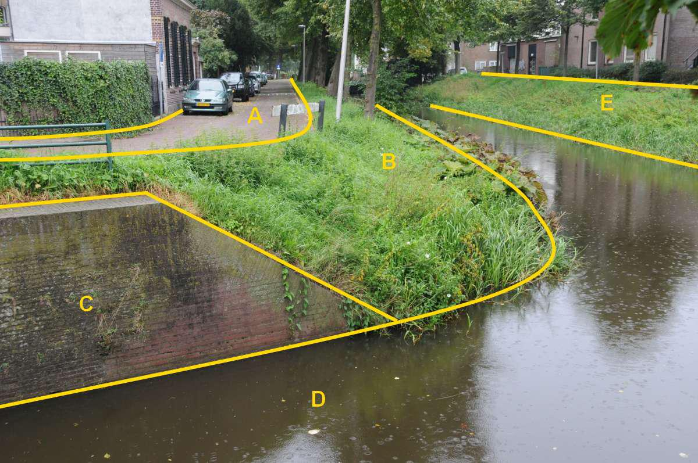
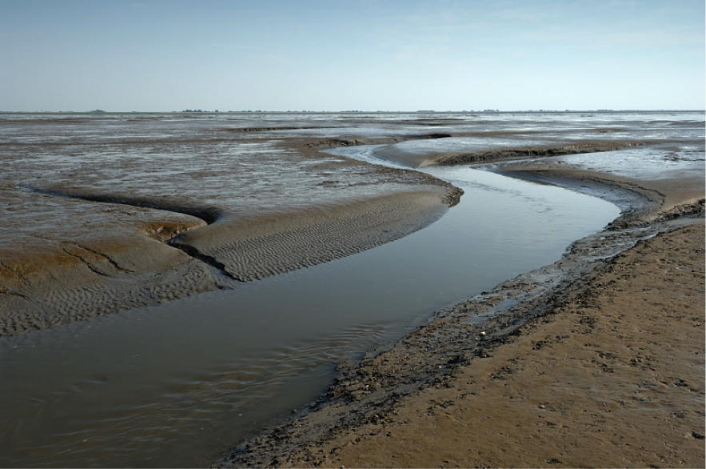

Ondersteunend waterdeel
======================

**Definitie**

Object dat in het kader van de waterhuishouding periodiek gedeeltelijk of geheel
met water is bedekt.

inwinningsregels
----------------

### BGT

Bron: [Gegevenscatalogus BGT 1.2](https://docs.geostandaarden.nl/imgeo/catalogus/bgt/#objectafbakening-waterdeel-ondersteunendwaterdeel)

>   De volgende paragrafen beschrijven op welke wijze land en water zijn
>   gescheiden in de BGT.
>
>   **Algemeen**
>
>   De BGT kent vier typen waterdeel: zee; waterloop; watervlakte; greppel,
>   droge sloot.
>
>   En twee typen ondersteunend waterdeel: oever, slootkant; slik.
>
>   De kruinlijngeometrie wordt bij het ondersteunend waterdeel niet opgenomen.
>   Impliciet is de – niet-waterbegrenzing – van een oever altijd de hoogste
>   kant.
>
>   Voor de begrenzing van land en zee maakt de BGT onderscheid in de begrenzing
>   langs de Noordzee enerzijds en die langs de Waddenzee en de Zuidwestelijke
>   delta in Zeeland en Zuid-Holland anderzijds.
>
>   Onder waterlopen vallen rivieren, kanalen, beken, sloten en grachten.
>
>   Watervlakten zijn meren, plassen, vennen en vijvers. Ook havens vallen in de
>   regel hieronder.
>
>   Greppels en droge sloten hebben een functie in de waterhuishouding.
>
>   Oevers en slootkanten zijn de delen die enerzijds begrensd worden door de
>   waterlijn en anderzijds door een kant insteek.
>
>   Slikken zijn bij laagwater droogvallende delen. Zij komen uitsluitend voor
>   in de Waddenzee en in de Zuidwestelijke delta.
>
>   In het algemeen geldt dat zichtbare topografie altijd als begrenzing
>   voorkomt, in de beschreven situaties aangevuld met niet of niet-altijd
>   zichtbare topografische begrenzingen.
>
>   **Noordzee**
>
>   Voor de begrenzing van terrein en water langs de Noordzee gebruikt de BGT de
>   UNCLOS-basislijn. Deze basislijn valt onder verantwoording van de Dienst der
>   Hydrografie van het ministerie van Defensie. Deze dienst voert deze taak uit
>   op basis van het Zeerechtverdrag van de Verenigde Naties uit 1982 "United
>   Nations Convention on the Law of the Sea (UNCLOS)". Dit verdrag regelt de
>   rechten die staten hebben op zee en de manier waarop buurstaten deze rechten
>   begrenzen. Centraal in dit verdrag staat de basislijn, die het verloop van
>   de kust definieert.
>
>   De Nederlandse basislijn is een combinatie van normale basislijnen en rechte
>   (‘getrokken’) basislijnen. In tegenstelling tot de normale basislijn, zijn
>   de rechte basislijnen onveranderlijk en bij Nederlandse wet vastgesteld. De
>   rechte basislijnen vormen de af­sluiting van zeegaten, en daarmee de
>   begrenzing tussen de territoriale zee en de binnenwateren.
>
>   Sluit de basislijn een waterdeel af zoals onder meer van de Westerschelde,
>   Nieuwe Waterweg en Waddenzee, dan vormt de basislijn de begrenzing van dat
>   waterdeel met de Noordzee.
>
>   **Actualiteit**
>
>   Een of enkele keren per jaar publiceert de Dienst der Hydrografie een nieuwe
>   UNCLOS-basislijn. De dienst maakt gebruikers attent op deze wijzigingen,
>   onder meer via de [eigen
>   website](https://www.defensie.nl/onderwerpen/hydrografie/) en via een
>   mailing per e-mail.
>
>   **Strand**
>
>   Langs de Noordzee bezit het onbegroeid terreindeel grenzend aan de basislijn
>   het fysiek voorkomen ‘zand’.
>
>   Aan de ‘landzijde’ wordt het strand altijd begrensd door zichtbare
>   topografie, zoals de overgang naar de duinen bestaande uit een hek of
>   duinvoet. In het geval een kunstmatige aangelegde waterkering aanwezig is,
>   zoals bij de Hondsbossche Zeewering, bestaat de begrenzing uit kademuur of
>   walbescherming.
>
>   **Waddenzee en Zuidwestelijke delta**
>
>   In deze wateren is altijd een kunstmatig aangelegde waterkering aanwezig in
>   de vorm van een kademuur of walbescherming. Deze vormen altijd een
>   begrenzing voor de BGT.
>
>   Daarnaast worden in deze wateren peilingen verricht voor het Lowest
>   Astronomical Tide (LAT). Als de ligging daarvan beschikbaar is voor de BGT
>   vormt het de scheiding tussen het waterdeel en het ondersteunend waterdeel
>   type slik. Ontbreekt het LAT dan vormt de kunstmatige waterkering de
>   scheiding tussen terrein en water.
>
>   **Rivieren**
>
>   In de BGT komt bij rivieren of een begrenzing voor in de vorm van een
>   kademuur of walbescherming, of een oever. Van nature komt er een variabel
>   peil voor. In de grote, bevaarbare rivieren hanteert Rijkswaterstaat hier
>   een peil met de naam Overeengekomen Lage Rivierwaterstand (OLR). Als een
>   presentatie van dit peil beschikbaar is, vormt het voor de BGT de begrenzing
>   van waterdeel met ondersteunend waterdeel type oever. Bij het ontbreken van
>   het OLR vormt het laagste streefpeil, eveneens onder verantwoording van
>   Rijkswaterstaat, deze begrenzing. Is de ligging van een peil niet
>   beschikbaar voor de BGT dan vormt de kunstmatige waterkering de scheiding
>   tussen terrein en water.

>   **Meren**

>   Bij meren komen kunstmatig aangelegde waterkeringen voor in de vorm van een
>   kademuur of walbescherming, soms is er sprake van een oever. Als een
>   kunstmatige waterkering aanwezig is in de vorm van een kademuur of
>   walbescherming vormt dit de begrenzing van terrein en water. Bij het
>   ontbreken daarvan vormt het object begrensd door waterlijn en de bovenzijde
>   van een herkenbare insteek een ondersteunend waterdeel type oever/slootkant.

>   In meren wordt een streefpeil beheerd door bemalen en/of spuien. Als de
>   ligging van een peil bekend is en de horizontale afstand tussen een
>   herkenbare insteek bedraagt 1m of meer dan ontstaat in de BGT een
>   ondersteunend waterdeel van het type oever. Waar sprake is van meerdere
>   streefpeilen, wordt uitgegaan van het laagste niveau of ondergrenspeil.

>   **Overige waterlopen en -vlakken**

>   Hier geldt onderstaand stroomdiagram. Als kant water de begrenzing van
>   objecten vormt, geldt dat dit een presentatie is van het laagst mogelijke
>   streefpeil ter plaatse. Als de horizontale afstand tussen waterlijn en de
>   bovenkant van een herkenbare insteek 1m of meer bedraagt dan ontstaat in de
>   BGT een ondersteunend waterdeel van het type oever/slootkant.

>   Stroomdiagram waterlopen

type
----

**Definitie**

Specificatie van het soort Water.

### oever, slootkant

**Definitie**

De strook land die in direct contact staat met water, inclusief het gebied
tussen de hoogwaterlijn en laagwaterlijn.

**Verplicht?**

Ja, verplichte inhoud BGT.

**Voorbeeld**

OndersteunendWaterdeel, oever, slootkant

OndersteunendWaterdeel, oever, slootkant

OndersteunendWaterdeel, oever, slootkant

OndersteunendWaterdeel, oever, slootkant

>   B en E:

| **OndersteunendWaterdeel** | **Attribuutwaarde** | **Opmerkingen** |
|----------------------------|---------------------|-----------------|
| type                       | oever, slootkant    |                 |
| relatieveHoogteligging     | 0                   |                 |

>   A: wegdeel, rijbaan: lokale weg, open verharding C: scheiding, kademuur. D:
>   waterdeel, waterloop.

### slik

**Definitie**

Buitendijks aangeslibde, onbegroeide grond die bij vrijwel elk hoogwater
onderloopt.

**Verplicht?**

Ja, verplichte inhoud BGT.

**Voorbeeld**

OndersteunendWaterdeel, slik

OndersteunendWaterdeel, slik

OndersteunendWaterdeel, slik

| **OndersteunendWaterdeel** | **Attribuutwaarde** | **Opmerkingen** |
|----------------------------|---------------------|-----------------|
| type                       | slik                |                 |
| relatieveHoogteligging     | 0                   |                 |
