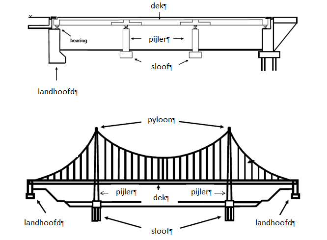
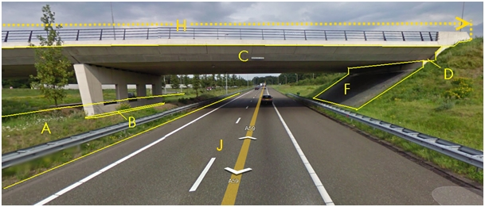
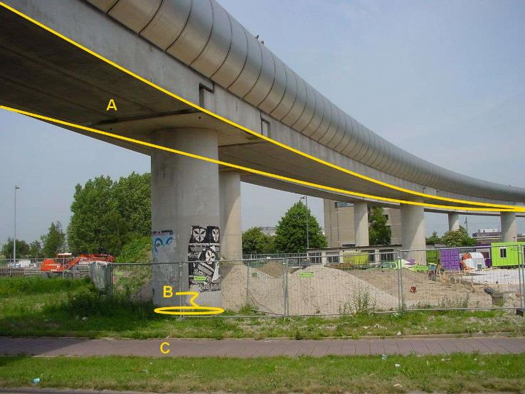
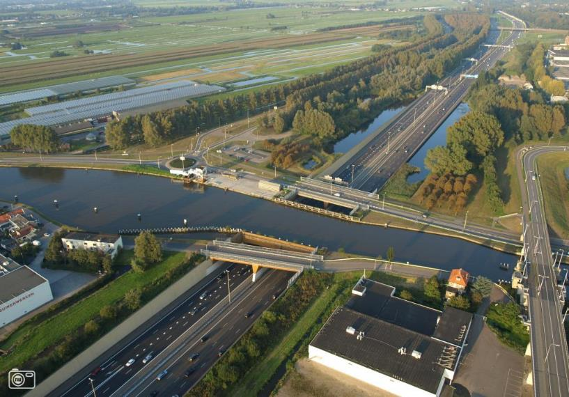
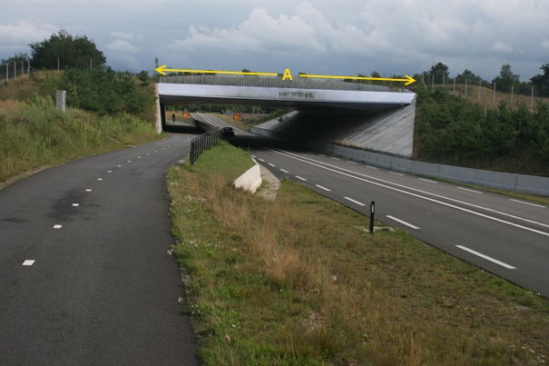

Overbruggingsdeel
=================

**Definitie**

Onderdeel van een beweegbare of vaste verbinding tussen twee punten, die door
water, een weg of anderszins gescheiden zijn, dat essentieel is voor de
constructie.

inwinningsregels
----------------

### BGT

Bron: [Gegevenscatalogus BGT
1.2](https://docs.geostandaarden.nl/imgeo/catalogus/bgt/#objectafbakening-overbruggingsdeel)

>   **Regels voor opname**

>   Er is sprake van een overbrugging wanneer een van de onderdelen bestaat uit
>   een afzonderlijk dek dat op een bak en/of pijlers rust. Dit in tegenstelling
>   tot een tunnel, die uit een gesloten kokerconstructie met een in- en uitgang
>   bestaat.

>   Delen van overbruggingen worden in de BGT niet verder getypeerd. Zo worden
>   zowel het brugdek als de pijler van een overbrugging in de BGT aangeduid als
>   overbruggingsdeel.

>   Eén van de in onderstaande tabel vermelde situaties zal voorkomen om een
>   overbrugging in delen te kunnen opknippen.

| **Rij-ijzer of voeg** | **Object met hoogste hiërarchie** | **Uitwerking** |
|-----------------------|-----------------------------------|----------------|
| Aanwezig              | n.v.t.                            | A              |
| Niet aanwezig         | Onder overbrugging                | B              |
| Niet aanwezig         | Op overbrugging                   | C              |

>   Een schematische visualisatie van deze situaties staat in paragraaf 2.9.2
>   van het BGT IMGeo Objectenhandboek.

>   Indien een rij-ijzer of voeg zichtbaar is in het brugdek worden daarmee de
>   overbrugging en de op de overbrugging gelegen objecten afgebakend volgens
>   uitwerking A.

>   Indien er geen rij-ijzer of voeg zichtbaar is, dan is de uitwerking
>   afhankelijk van de hiërarchie van de objecten ter plekke van de
>   overbrugging. Van belang is het object met de hoogste hiërarchie op de
>   overbrugging en het object met de hoogste hiërarchie onder de overbrugging.
>   Voor de hiërarchie geldt de volgorde van het objecttype uit hoofdstuk 8 van
>   deze gegevenscatalogus (wegen, onbegroeid terrein, begroeid terrein etc.).
>   Is het objecttype gelijk dan geldt de volgorde van de attributen en
>   domeinwaarden uit hoofdstuk 9. Als algemene regel geldt dat een waterdeel
>   altijd niveau nul heeft. Water heeft in deze uitwerking de hoogste
>   hiërarchie.

>   Ligt het object met de hoogste hiërarchie onder de overbrugging dan is de
>   uitwerking volgens B. Ligt het object met de hoogste hiërarchie op de
>   overbrugging dan is de uitwerking volgens C.

>   Voorbeelden zonder rij-ijzer of voeg in de overbrugging zijn:

>   Op de overbrugging loopt een weg (rijbaan lokale weg) met een fietspad.
>   Eronder loopt een weg (rijbaan autoweg). De uitwerking is dan volgens B,
>   omdat de functie van de weg onder de overbrugging eerder in de tabel met
>   functies van wegen staat.

>   Op de overbrugging loopt een weg (rijbaan lokale weg, gesloten verharding)
>   met een fietspad. Er onder loopt een weg (rijbaan lokale weg, open
>   verharding). De uitwerking is dan volgens C, omdat de functie van de wegen
>   gelijk is, maar de weg op de overbrugging staat eerder in de tabel met
>   fysiek voorkomen van wegen.

>   **Niveau-aanduiding**

>   Voor het toekennen van de niveau-aanduiding geldt de algemene regel dat een
>   waterdeel onder of op een overbrugging (aquaduct) altijd niveau 0 heeft.

>   Verder geldt het attribuut relatieve hoogteligging voor elk afzonderlijk
>   overbruggingsdeel, niet voor de gehele overbrugging.

>   Wegdelen krijgen dezelfde relatieve hoogte aanduiding als het
>   overbruggingsdeel waarop zij liggen. Hierbij geldt één uitzondering: in de
>   hierboven onder C beschreven situatie, heeft het op het brugdeel gelegen
>   wegdeel niveau 0. Het brugdeel waarop dat wegdeel ligt, heeft één niveau
>   lager: -1.Dit is vanwege het feit dat er geen overlappende objecten mogen
>   voorkomen op niveau 0.

>   Het object dat onder deze overbrugging ligt, wordt onder meer opgeknipt door
>   de projectie van de bovenliggende begrenzing van het wegdeel. Dit is vanwege
>   de regel dat er een aaneengesloten oppervlakte op niveau 0 in de BGT moet
>   voorkomen.

>   Pijlers van een overbrugging krijgen de niveauaanduiding van het object
>   waarop zij staan en zullen dus een lagere waarde hebben voor dit attribuut
>   dan het brugdek dat op de pijlers ligt. Het wegdeel dat daarop kan
>   voorkomen, heeft dezelfde waarde voor de relatieve hoogteligging als het
>   brugdek.

>   In het BGT Objectenhandboek zijn voornoemde uitwerkingen A, B en C
>   schematisch gevisualiseerd.

### IMGeo

Bron: [Gegevenscatalogus IMGeo
2.2](https://docs.geostandaarden.nl/imgeo/catalogus/imgeo/#overbruggingsdeel-0)

>   In IMGeo kunnen bij het overbruggingsdeel ook kenmerken van de gehele
>   overbrugging worden opgenomen. Het overbruggingsdeel (CityGML
>   BridgeConstructionElement) zelf kan nader worden geclassificeerd als
>   bijvoorbeeld landhoofd of pijler, door dit in te vullen in het attribuut
>   typeOverbruggingsdeel.

>   Voor het nader classificeren van de gehele overbrugging wordt het attribuut
>   hoortBijTypeOverbrugging gebruikt, om aan te geven of het object een brug,
>   aquaduct, viaduct enz. is. Daarnaast kan het attribuut
>   overbruggingIsBeweegbaar worden gebruikt .

type overbruggingsdeel
----------------------

**Definitie**

Het soort onderdeel van de brugconstructie.

### dek

**Definitie**

Direct door het verkeer belaste deel van de bovenbouw van de brug.

**Verplicht?**

Nee, optionele inhoud IMGeo.

**Voorbeeld**

C:

| **Overbruggingsdeel**  | **Attribuutwaarde** | **Opmerkingen** |
|------------------------|---------------------|-----------------|
| type overbruggingsdeel | dek                 |                 |
| relatieveHoogteligging |   1                 |                 |

### landhoofd

**Definitie**

Ondersteuningsconstructie ter plaatse van een overgang van de aardebaan naar een
kunstwerk.

**Verplicht?**

Nee, optionele inhoud IMGeo.

**Voorbeeld**

D :

| **Overbruggingsdeel**  | **Attribuutwaarde** | **Opmerkingen** |
|------------------------|---------------------|-----------------|
| Type overbruggingsdeel | landhoofd           |                 |
| relatieveHoogteligging |   0                 |                 |

### pijler

**Definitie**

Ondersteuningsconstructie van bruggen en soortgelijke kunstwerken.

**Verplicht?**

Nee, optionele inhoud IMGeo.

**Voorbeeld**

DSC01153

B:

| **Overbruggingsdeel**  | *Attribuutwaarde* | *Opmerkingen* |
|------------------------|-------------------|---------------|
| Type overbruggingsdeel | pijler            |               |
| relatieveHoogteligging | 0                 |               |

### sloof

**Definitie**

Deel van de pijler voor de overdracht van krachten naar de ondergrond of de
fundering.

**Verplicht?**

Nee, optionele inhoud IMGeo.

**Voorbeeld**

B:

| **Overbruggingsdeel**  | **Attribuutwaarde** | **Opmerkingen** |
|------------------------|---------------------|-----------------|
| type overbruggingsdeel | sloof               |                 |
| relatieveHoogteligging |   0                 |                 |

### pyloon

**Definitie**

Boven de bovenbouw uitstekende draagconstructie voor tuien (kabels).

**Verplicht?**

Nee, optionele inhoud IMGeo.

**Voorbeeld**

| **Overbruggingsdeel**  | *Attribuutwaarde* | *Opmerkingen* |
|------------------------|-------------------|---------------|
| Type overbruggingsdeel | pyloon            |               |
| relatieveHoogteligging | 0                 |               |

Zie afbeelding bij 3.8.6

hoort bij type overbrugging
---------------------------

**Definitie**

Aanduiding of de brug waar het overbruggingsdeel bij hoort al dan niet
beweegbaar is.

### brug

**Definitie**

Kunstwerk over een watervlakte of waterloop, bestaande uit een brugdek gesteund
door pijlers en/of landhoofden.

**Verplicht?**

Nee, optionele inhoud IMGeo.

**Voorbeeld**

A:

| **Overbruggingsdeel**  | **Attribuutwaarde** | **Opmerkingen** |
|------------------------|---------------------|-----------------|
| Type overbrugging      | brug                |                 |
| Type overbruggingsdeel | dek                 |                 |
| Beweegbaar             | nee                 |                 |
| relatieveHoogteligging |  1                  |                 |

B en C:

| **Overbruggingsdeel**  | **Attribuutwaarde** | **Opmerkingen** |
|------------------------|---------------------|-----------------|
| Type overbrugging      | brug                |                 |
| Type overbruggingsdeel | pijler              |                 |
| Beweegbaar             | nee                 |                 |
| relatieveHoogteligging |  0                  |                 |

### aquaduct

**Definitie**

Kunstwerk waarmee een watergang door een bakvormige constructie over een weg,
een spoorweg, een andere watergang, een leiding of een terrein wordt geleid.

**Verplicht?**

Nee, optionele inhoud IMGeo.

**Voorbeeld**

| **Overbruggingsdeel**  | **Attribuutwaarde** | **Opmerkingen** |
|------------------------|---------------------|-----------------|
| Type overbrugging      | aquaduct            |                 |
| relatieveHoogteligging |  0                  |                 |

De wegdelen en evt. andere objecten die onder (de projectie van) het aquaduct
zijn gelegen hebben een relatieve hoogteligging van: -1.

### viaduct

**Definitie**

Kunstwerk over een weg, spoorweg of terreinverdieping, bestaande uit een dek
gesteund door pijlers en/of landhoofden.

**Verplicht?**

Nee, optionele inhoud IMGeo.

**Voorbeeld**

H:

| **Overbruggingsdeel**  | **Attribuutwaarde** | **Opmerkingen** |
|------------------------|---------------------|-----------------|
| Type overbrugging      | viaduct             |                 |
| relatieveHoogteligging |  1                  |                 |

### ecoduct

**Definitie**

Wildwissel in de vorm van een viaduct voor passages van dieren over een weg of
spoorweg.

**Verplicht?**

Nee, optionele inhoud IMGeo.

**Voorbeeld**

A:

| **Overbruggingsdeel**  | **Attribuutwaarde** | **Opmerkingen** |
|------------------------|---------------------|-----------------|
| Type overbrugging      | ecoduct             |                 |
| relatieveHoogteligging |  1                  |                 |

### fly-over

**Definitie**

Kunstwerk in de vorm van een viaduct dat deel uitmaakt van een verkeersbaan en
waarmee een verkeersstroom over twee of meer ongelijkvloerse verkeersstromen
wordt geleid.

**Verplicht?**

Nee, optionele inhoud IMGeo.

**Voorbeeld**

DSC01153

A:

| **Overbruggingsdeel**  | *Attribuutwaarde* | *Opmerkingen* |
|------------------------|-------------------|---------------|
| Type overbrugging      | fly-over          |               |
| relatieveHoogteligging | 1                 |               |
