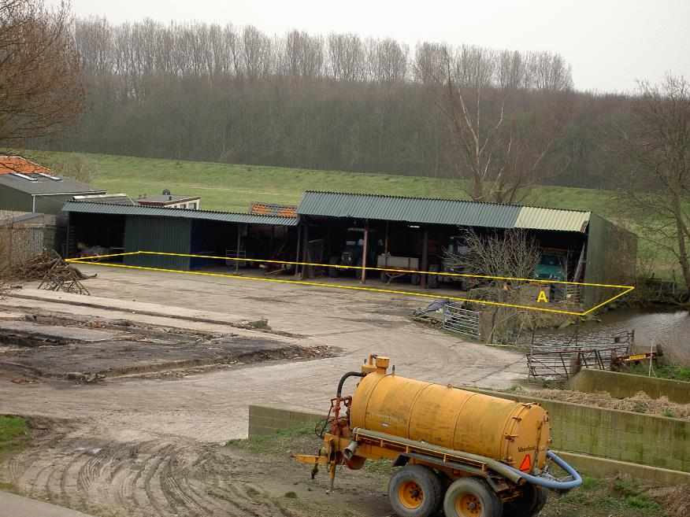
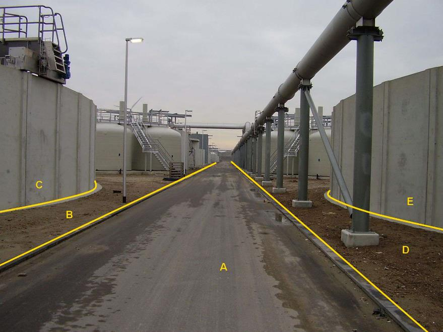
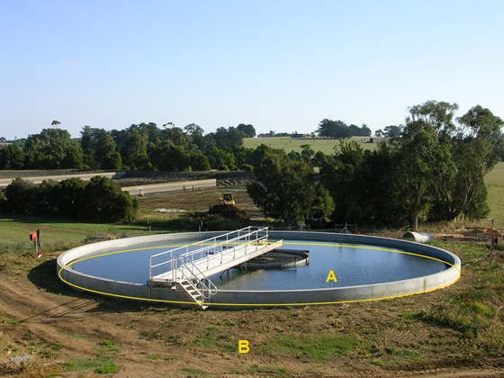
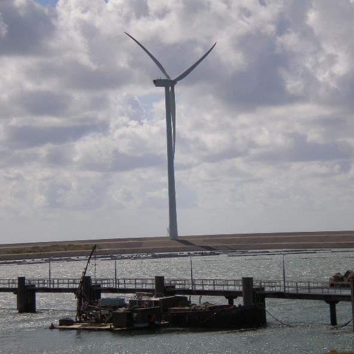
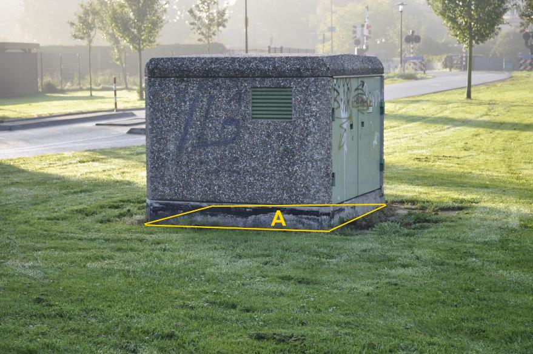
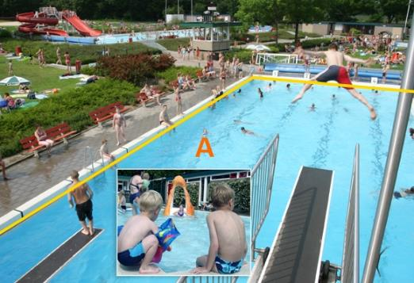
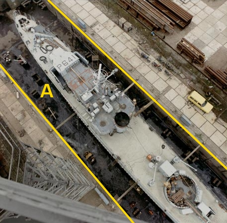
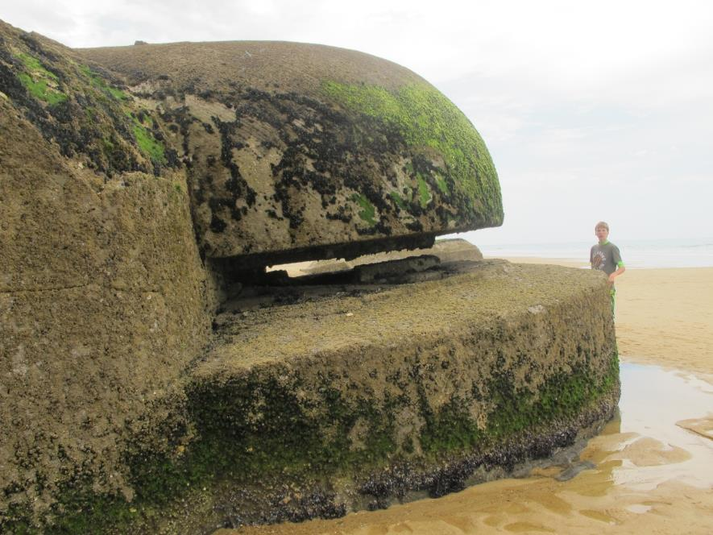

Overig bouwwerk
==============

**Definitie**

Met de aarde verbonden duurzaam bouwwerk, dat niet valt onder de definities van
een pand of kunstwerk.

inwinningsregels
----------------

### BGT

Bron: [Gegevenscatalogus BGT
1.2](https://docs.geostandaarden.nl/imgeo/catalogus/bgt/#objectafbakening-overigbouwwerk)

>   **Regels voor opname**

>   De geometrie is waar het grondvlak van het overig bouwwerk de ondergrond
>   raakt.

>   **Aandachtspunten**

>   Bassins en bezinkbakken bij zuiveringsinstallaties zijn geen waterdelen,
>   maar worden geclassificeerd als overig bouwwerk.

>   Zwembaden worden als type bassin vastgelegd.

>   Alleen bovengrondse opslagtanks worden opgenomen.

>   Bij overkappingen wordt de grondvlakgeometrie van de pilaren (footprint)
>   waarop de overkapping rust geregistreerd wanneer de afmetingen
>   (rechthoekzijde of middellijn) ≥ 0,30 m bedraagt.

>   Het afdak van de overkapping is eventueel IMGeo inhoud.

### IMGeo

Bron: [Gegevenscatalogus IMGeo
2.2](https://docs.geostandaarden.nl/imgeo/catalogus/imgeo/#overig-bouwwerk)

>   Bunkers, voedersilo’s en schuren zijn geen BGT inhoud, maar kunnen wel in
>   IMGeo als overig bouwwerk worden opgenomen.

type
----

**Definitie**

Specificatie van het soort overig bouwwerk.

### overkapping

**Definitie**

Een afzonderlijk staande overdekking rustend op kolommen.

**Verplicht?**

Ja, verplichte inhoud BGT.

**Voorbeeld**

Uitsluitend de maaiveldgeometrie van de pilaren vormt als multivlak de
BGT-inhoud van de overkapping, eventueel vormt de dakrand van het afdak inhoud
voor IMGeo op niveau +1.

| **OverigBouwwerk**     | **Attribuutwaarde** | **Opmerkingen** |
|------------------------|---------------------|-----------------|
| type                   | overkapping         |                 |
| relatieveHoogteligging |  0                  |                 |

### open loods

**Definitie**

Niet verplaatsbaar licht gebouw met een open gevel, bestemd als berg- of
werkplaats of als tijdelijk onderdak voor andere doeleinden.

**Verplicht?**

Ja, verplichte inhoud BGT.

**Voorbeeld**

A:

| **OverigBouwwerk**     | **Attribuutwaarde** | **Opmerkingen** |
|------------------------|---------------------|-----------------|
| type                   | open loods          |                 |
| relatieveHoogteligging |  0                  |                 |

Ten behoeve van de vlakvormige objectvorming is de open zijde van de loods
gesloten.

### opslagtank

**Definitie**

Opslagfaciliteit voor vloeistoffen, gassen of energie.

**Verplicht?**

Ja, verplichte inhoud BGT.

**Voorbeeld**

C en E:

| **OverigBouwwerk**     | **Attribuutwaarde** | **Opmerkingen** |
|------------------------|---------------------|-----------------|
| type                   | Opslagtank          |                 |
| relatieveHoogteligging |  0                  |                 |

A: wegdeel, rijbaan: lokale weg.

B en D: onbegroeidterreindeel, erf.

### bezinkbak

**Definitie**

Een gesloten reservoir waarin het afvalwater tijdelijk wordt opgevangen met een
slibreinigende voorziening.

**Verplicht?**

Ja, verplichte inhoud BGT.

**Voorbeeld**

A:

| **OverigBouwwerk**     | **Attribuutwaarde** | **Opmerkingen** |
|------------------------|---------------------|-----------------|
| type                   | bezinkbak           |                 |
| relatieveHoogteligging |  0                  |                 |

B: onbegroeidterreindeel, onverhard.

### windturbine

**Definitie**

Turbine waarin winddruk omgezet wordt in mechanische energie.

**Verplicht?**

Ja, verplichte inhoud BGT.

**Voorbeeld**

Uitsluitend de maaiveldgeometrie van de windmolenmast vormt BGT-inhoud.

| **OverigBouwwerk**     | **Attribuutwaarde** | **Opmerkingen** |
|------------------------|---------------------|-----------------|
| type                   | windturbine         |                 |
| relatieveHoogteligging |  0                  |                 |

### lage trafo

**Definitie**

Bouwwerk waarin transformator(en) zijn geplaatst voor elektriciteitsvoorziening.

**Verplicht?**

Ja, verplichte inhoud BGT.

**Voorbeeld**

A:

| **OverigBouwwerk**     | **Attribuutwaarde** | **Opmerkingen** |
|------------------------|---------------------|-----------------|
| type                   | lage trafo          |                 |
| relatieveHoogteligging |  0                  |                 |

### bassin

**Definitie**

Waterbak, zoals een zwembad of een dok.

**Verplicht?**

Ja, verplichte inhoud BGT.

**Voorbeeld**

2xA:

| **OverigBouwwerk**     | **Attribuutwaarde** | **Opmerkingen** |
|------------------------|---------------------|-----------------|
| type                   | bassin              |                 |
| relatieveHoogteligging |  0                  |                 |

### schuur

**Definitie**

Een vrijstaand, al of niet prefab, niet-vergunningsplichtig bouwwerk dat
gebruikt wordt om goederen in op te slaan en ook als werkruimte kan dienen.

**Verplicht?**

Nee, optionele inhoud IMGeo.

**Voorbeeld**

Een afbeelding van een schuur kunt u sturen
aan: [imgeo\@geonovum.nl](mailto:info@geonovum.nl)

| **OverigBouwwerk**     | **Attribuutwaarde** | **Opmerkingen** |
|------------------------|---------------------|-----------------|
| type                   | schuur              |                 |
| relatieveHoogteligging |                     |                 |

### bunker

**Definitie**

Een bunker is een van oorsprong militair verdedigingswerk dat een zekere mate
van bescherming biedt tegen beschietingen en bombardementen.

**Verplicht?**

Nee, optionele inhoud IMGeo.

**Voorbeeld**

| **OverigBouwwerk**     | **Attribuutwaarde** | **Opmerkingen** |
|------------------------|---------------------|-----------------|
| type                   | bunker              |                 |
| relatieveHoogteligging |                     |                 |

### voedersilo

**Definitie**

Opslagfaciliteit voor veevoer, bestaande uit een verticale container met een
opening aan de onderkant.

**Verplicht?**

Nee, optionele inhoud IMGeo.

**Voorbeeld**

Een afbeelding van een voedersilo kunt u sturen
aan: [imgeo\@geonovum.nl](mailto:info@geonovum.nl)

| **OverigBouwwerk**     | **Attribuutwaarde** | **Opmerkingen** |
|------------------------|---------------------|-----------------|
| type                   | voedersilo          |                 |
| relatieveHoogteligging |                     |                 |
