Paal
====

**Definitie**

Langwerpig stuk hout, ijzer, steen enz., dat in de grond staat.

type
----

**Definitie**

Het soort paal.

### lichtmast

**Definitie**

Mast bestemd voor het dragen van een of meer verlichtingsarmaturen.

**Verplicht?**

Nee, optionele inhoud IMGeo.

**Voorbeeld**

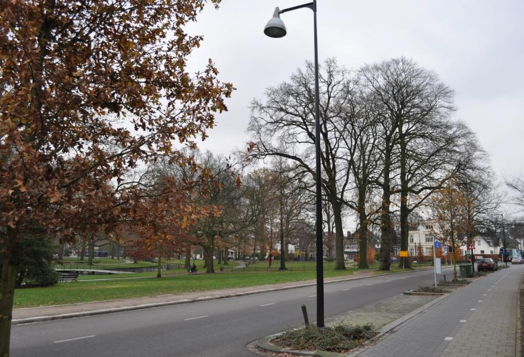

| **Paal**               | **Attribuutwaarde** | **Opmerkingen** |
|------------------------|---------------------|-----------------|
| type                   | lichtmast           |                 |
| relatieveHoogteligging |                     |                 |

### telpaal

**Definitie**

Paal waaraan de verkeersteller is bevestigd.

**Verplicht?**

Nee, optionele inhoud IMGeo.

**Voorbeeld**

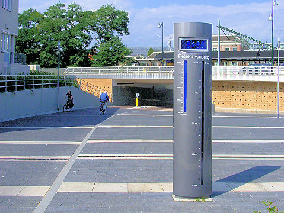

| **Paal**               | **Attribuutwaarde** | **Opmerkingen** |
|------------------------|---------------------|-----------------|
| type                   | telpaal             |                 |
| relatieveHoogteligging |                     |                 |

### portaal

**Definitie**

Geheel van twee of meer ondersteuningsconstructies die door een ligger zijn
verbonden, bedoelt voor het aanbrengen van verkeersaanduidingen.

**Verplicht?**

Nee, optionele inhoud IMGeo.

**Voorbeeld**

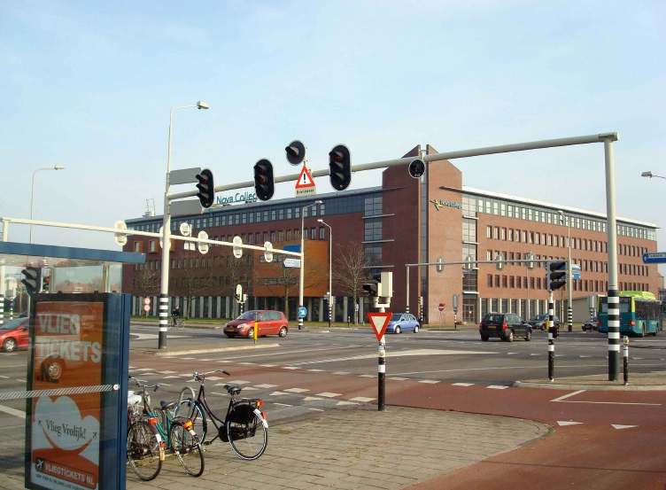

| **Paal**               | **Attribuutwaarde** | **Opmerkingen** |
|------------------------|---------------------|-----------------|
| type                   | portaal             |                 |
| relatieveHoogteligging |                     |                 |

### verkeersregelinstallatiepaal

**Definitie**

Paal met daaraan bevestigd de verkeersregelinstallatie.

**Verplicht?**

Nee, optionele inhoud IMGeo.

**Voorbeeld**

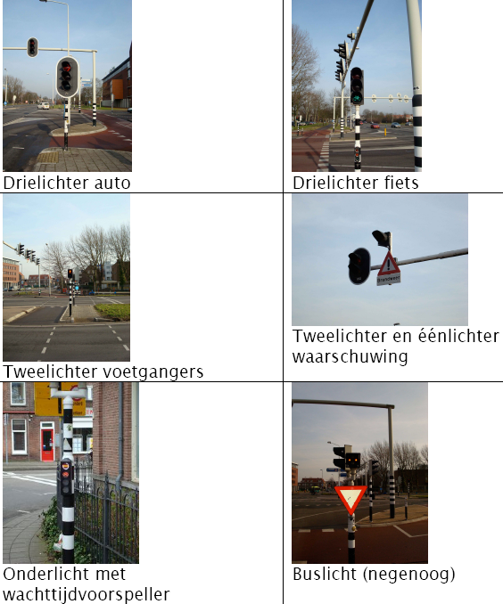

| **Paal**               | **Attribuutwaarde**          | **Opmerkingen** |
|------------------------|------------------------------|-----------------|
| type                   | verkeersregelinstallatiepaal |                 |
| relatieveHoogteligging |                              |                 |

### verkeersbordpaal

**Definitie**

Paal waaraan een of meerdere verkeersborden zijn bevestigd.

**Verplicht?**

Nee, optionele inhoud IMGeo.

**Voorbeeld**

| **Paal**               | **Attribuutwaarde** | **Opmerkingen** |
|------------------------|---------------------|-----------------|
| type                   | verkeersbordpaal    |                 |
| relatieveHoogteligging |                     |                 |

### poller

**Definitie**

Een poller of inzinkbare paal is een paal die door een elektrische of
hydraulische aandrijving uit een wegdek omhoog wordt gestuurd en die dient om
het autoverkeer te reguleren.

**Verplicht?**

Nee, optionele inhoud IMGeo.

**Voorbeeld**

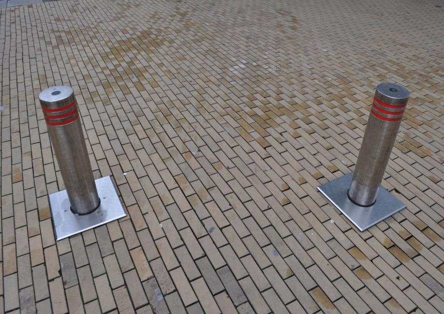

| **Paal**               | **Attribuutwaarde** | **Opmerkingen** |
|------------------------|---------------------|-----------------|
| type                   | poller              |                 |
| relatieveHoogteligging |                     |                 |

### haltepaal

**Definitie**

Paal met daarop de dienstregeling ten behoeve van het openbaar vervoer.

**Verplicht?**

Nee, optionele inhoud IMGeo.

**Voorbeeld**

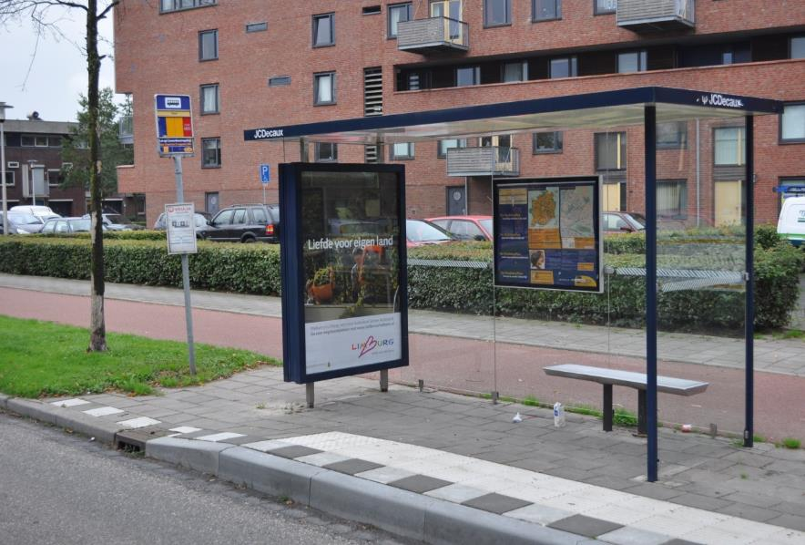

| **Paal**               | **Attribuutwaarde** | **Opmerkingen** |
|------------------------|---------------------|-----------------|
| type                   | haltepaal           |                 |
| relatieveHoogteligging |                     |                 |

### vlaggenmast

**Definitie**

Paal bedoeld om vlaggen aan te hangen.

**Verplicht?**

Nee, optionele inhoud IMGeo.

**Voorbeeld**

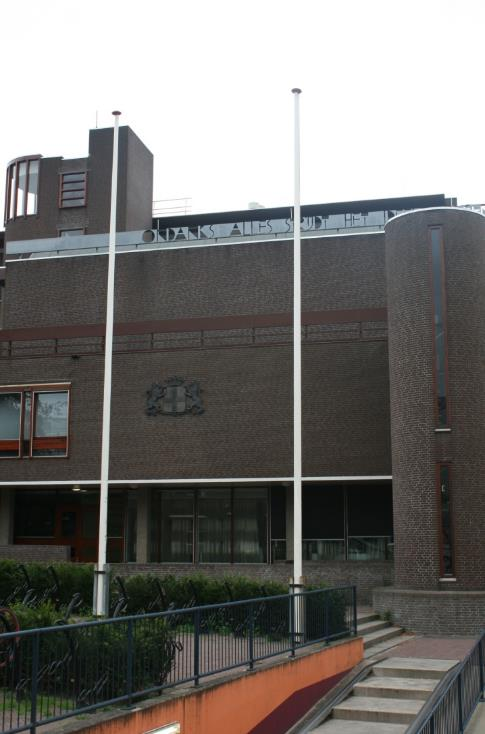

| **Paal**               | **Attribuutwaarde** | **Opmerkingen** |
|------------------------|---------------------|-----------------|
| type                   | vlaggenmast         |                 |
| relatieveHoogteligging |                     |                 |

### afsluitpaal

**Definitie**

Al dan niet verwijderbare paal in de grond om de weg of een gedeelte hiervan af
te sluiten.

**Verplicht?**

Nee, optionele inhoud IMGeo.

**Voorbeeld**

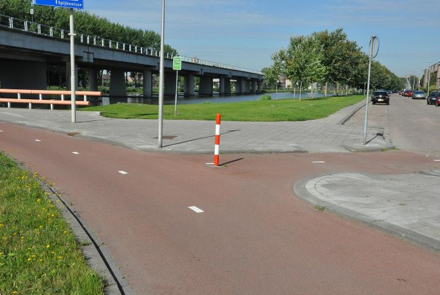

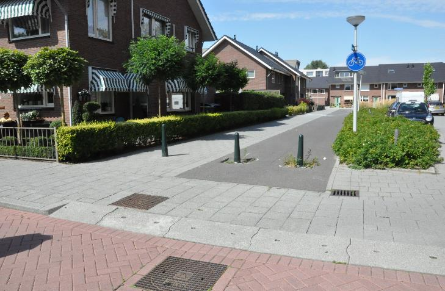

| **Paal**               | **Attribuutwaarde** | **Opmerkingen** |
|------------------------|---------------------|-----------------|
| type                   | afsluitpaal         |                 |
| relatieveHoogteligging |                     |                 |

### praatpaal

**Definitie**

Stalen of kunststof paal langs verkeerswegen welke bedoeld is telefonisch
contact te leggen met een centrale meldkamer (ANWB).

**Verplicht?**

Nee, optionele inhoud IMGeo.

**Voorbeeld**

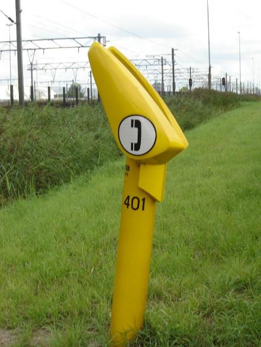

| **Paal**               | **Attribuutwaarde** | **Opmerkingen** |
|------------------------|---------------------|-----------------|
| type                   | praatpaal           |                 |
| relatieveHoogteligging |                     |                 |

### hectometerpaal

**Definitie**

Paaltje of bordje geplaatst langs de weg, waarop een hectometerwaarde (weg) of
kilometrering (vaarweg) is vermeld eventueel gevolgd door een letter.

**Verplicht?**

Nee, optionele inhoud IMGeo.

**Voorbeeld**

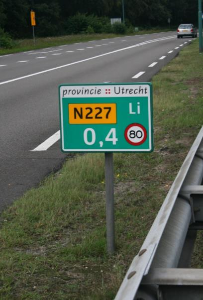

| **Paal**               | **Attribuutwaarde** | **Opmerkingen** |
|------------------------|---------------------|-----------------|
| type                   | hectometerpaal      |                 |
| relatieveHoogteligging |                     |                 |

### dijkpaal

**Definitie**

Een markant punt op de waterkering of op het strand dat dient als referentiepunt
voor afstandsaanduidingen.

**Verplicht?**

Nee, optionele inhoud IMGeo.

**Voorbeeld**

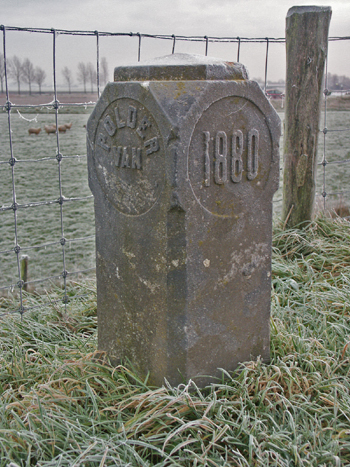

| **Paal**               | **Attribuutwaarde** | **Opmerkingen** |
|------------------------|---------------------|-----------------|
| type                   | drukknoppaal        |                 |
| relatieveHoogteligging |                     |                 |

### drukknoppaal

**Definitie**

Paal met een lengte van ongeveer 1 m, met drukknop waarmee de verkeersdeelnemer
zich meldt bij een verkeersregelinstallatie.

**Verplicht?**

Nee, optionele inhoud IMGeo.

**Voorbeeld**

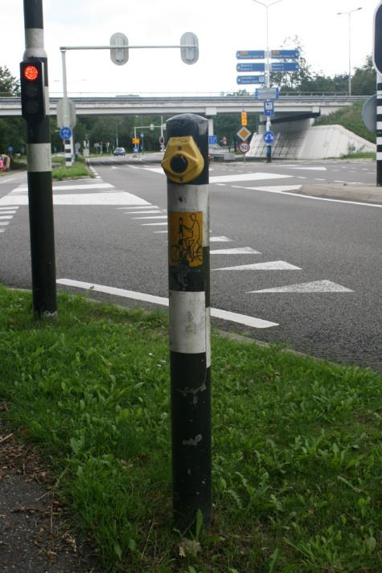

| **Paal**               | **Attribuutwaarde** | **Opmerkingen** |
|------------------------|---------------------|-----------------|
| type                   | drukknoppaal        |                 |
| relatieveHoogteligging |                     |                 |

### grensmarkering

**Definitie**

Paal ter afbakening van een grens.

**Verplicht?**

Nee, optionele inhoud IMGeo.

**Voorbeeld**

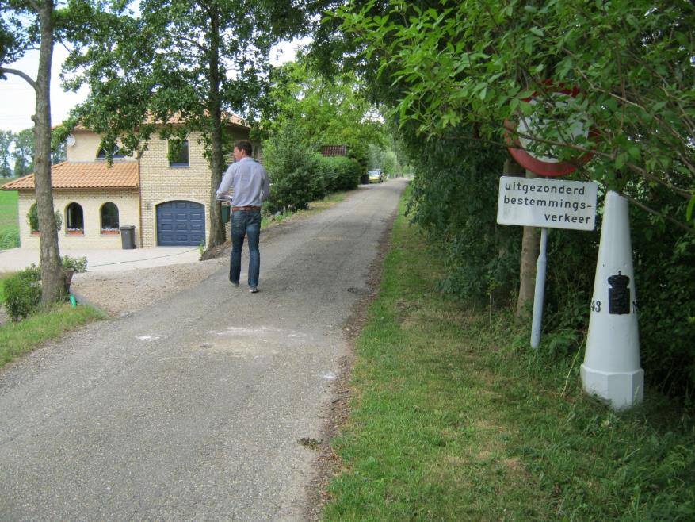

| **Paal**               | **Attribuutwaarde** | **Opmerkingen** |
|------------------------|---------------------|-----------------|
| type                   | grensmarkering      |                 |
| relatieveHoogteligging |                     |                 |

### sirene

**Definitie**

Een apparaat dat geluiden van variabele toonhoogte kan voortbrengen met als
functie waarschuwingsdoeleinden.

**Verplicht?**

Nee, optionele inhoud IMGeo.

**Voorbeeld**

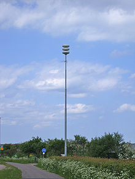

| **Paal**               | **Attribuutwaarde** | **Opmerkingen** |
|------------------------|---------------------|-----------------|
| type                   | sirene              |                 |
| relatieveHoogteligging |                     |                 |
