Pand
====

**Definitie**

Een PAND is de kleinste bij de totstandkoming functioneel en
bouwkundig-constructief zelfstandige eenheid die direct en duurzaam met de aarde
is verbonden en betreedbaar en afsluitbaar is.

inwinningsregels
----------------

### BGT

Bron: [Gegevenscatalogus BGT
1.2](https://docs.geostandaarden.nl/imgeo/catalogus/bgt/#objectafbakening-pand-panddelen)

>   **Regels voor opname**

>   De BGT bevat alleen die objecten die de bestaande situatie in de
>   werkelijkheid representeren. Uitsluitend panden die in de BAG voorkomen met
>   de volgende status maken met hun grondvlakgeometrie deel uit van de BGT: •
>   ‘Bouw gestart’; • ‘Pand in gebruik (niet ingemeten)’; • ‘Pand in gebruik’; •
>   ‘Sloopvergunning verleend’; • ‘Pand buiten gebruik’.

>   De voorwaarde is wel dat deze panden al zijn ingemeten en/of dat het gaat om
>   bestaande panden, waarvoor een bouwvergunning is verleend.

>   De grondvlakgeometrie is daar waar de ‘footprint’ van het pand de ondergrond
>   raakt (rh = 0).

>   Voor panden die in hun geheel boven water liggen, bijvoorbeeld een
>   brugwachtershuis dat aan een brug hangt, geldt dat dit pand in de BGT
>   voorkomt met een relatieve hoogte (rh) \> 0, in ieder geval ligt het hoger
>   dan het water waar het zich boven bevindt.

>   Uitstulpingen in gevels, zoals steunberen, behoren tot de pandgeometrie als
>   de afmetingen groter zijn dan 30x30cm. Als zij kleiner zijn, worden zij niet
>   opgenomen (generalisatie). Als zich op de hoeken van een gebouw
>   uitstulpingen bevinden \< 30 cm wordt de lijn die over de uiteinden van deze
>   uitstulpingen loopt, beschouwd als gevellijn voor het pand. De gevel van
>   erkers en schoorstenen, die meer dan 30 cm buiten de doorgaande gevellijn
>   van de voorgevel liggen, behoren tot de geometrie van het pand. Indien de
>   grondvlakgeometrie van een pand uit meerdere losse vlakken bestaat, worden
>   deze in één multivlak vastgelegd. Kolommen van een dak, luifel of uitbouw
>   (overbouw) van een pand behoren tot de grondvlakgeometrie als de kleinste
>   afmeting (rechthoekzijde of middellijn) op het grondvlak meer dan 30 cm
>   bedraagt.

>   **Aandachtspunten**

>   Voor veel panden is de grondvlakgeometrie overgenomen door de BAG als
>   geometrie voor de buitenomtrek van het pand omdat deze geometrieën identiek
>   zijn, met inachtneming van de in vorige paragraaf vermelde twee regels.

### IMGeo

Bron: [Gegevenscatalogus IMGeo
2.2](https://docs.geostandaarden.nl/imgeo/catalogus/imgeo/#gebouwinstallatie)

>   Gebouwinstallaties zijn aan het pand verbonden toegangstrappen, luifels en
>   bordessen.

### BAG en BGT

Ten behoeve van de BGT wordt de maaiveldgeometrie ingewonnen van alle panden die
in de BAG zijn of worden geregistreerd.

Tevens wordt maaiveldgeometrie ingewonnen van bouwwerken die in de BGT behoren
tot de objectklasse OverigBouwwerk.

De BGT verstaat onder maaiveldgeometrie de begrenzing van een pand daar waar het
de grond raakt. Een in BGT-documentatie gehanteerde term daarvoor is: geometrie
van voetafdruk, voetafdrukgeometrie of kortweg: voetafdruk.

Bij het inwinnen van de voetafdruk gelden bij panden de volgende regels:

De doorgaande gevellijn van panden wordt ingewonnen en zo nodig plaatselijk
vervangen door detaillering van:

-   Zogenaamde **beren** in een gevel behoren tot de voetafdruk als de
    afmetingen ≥ 0,30 x 0,30 m. Als zich op de hoeken van een pand beren
    bevinden \< 0,30 m wordt de lijn die over de uiteinden van deze beren loopt,
    beschouwd als onderdeel van de voetafdruk.

-   De gevel van **erkers** en **schoorstenen**, die ≥ 0,30 m buiten de
    doorgaande gevellijn van de voorgevel liggen, behoren tot de voetafdruk.

-   **Kolommen** (of pilaren) van een dak, luifel of uitbouw (overbouw) van een
    gebouw behoren tot de voetafdruk wanneer de kleinste afmeting
    (rechthoekzijde of middellijn) op maaiveldhoogte ≥ 0,30 m bedraagt.

Generalisatie van gevels vindt plaats bij:

-   **Portieken** zijn niet afzonderlijk in de voetafdruk herkenbaar als naar
    verwachting de fundering onder de portiek doorloopt en/of de gevel op de
    bovengelegen etage doorloopt.

-   **Houten woningen** waarbij de hoeken bestaan uit kruisende planken worden
    ingewonnen met de doorgaande, snijdende gevellijnen. Het uitstekende deel
    van de planken behoort niet tot de voetafdruk.

Ten behoeve van de BAG dient de geometrie van de buitenomtrek van een pand te
worden ingewonnen. Dit kan zowel boven als onder het maaiveld liggen. Panden
komen voor zonder, of met één of meer verblijfsobjecten (vbo’s).

In de regel zal de BAG geometrie identiek zijn met die van het maaiveld. Er zijn
echter ook situaties waar afwijkingen voorkomen. Dat is het geval wanneer door
de boven- en/of onderbouw enig bouwvolume ontstaat dat betreedbaar moet zijn.

Zowel voor het voorkomen van boven- als onderbouw geldt daarom dat aan twee
voorwaarden moet zijn voldaan:

1.  De horizontale afwijking ten opzichte van de situatie op maaiveld moet 1 m
    of meer bedragen.

2.  De hoogte van de over- en/of onderbouw moet minimaal één verdieping
    bedragen.

Dat impliceert dat een over­bouw die uitsluitend bestaat uit een dakconstructie
niet tot de BAG-geometrie behoort.

Inwinning van boven- en onderbouw kan plaatsvinden vanaf bouwtekening, bestek
of, alleen in het geval van overbouw, van een geschikte luchtfoto wanneer het
betreffende pand is gerealiseerd en door de gemeente is gecontroleerd of de
realisatie overeenkomstig de bouwvergunning is uitgevoerd.

#### Balkons

Bij balkons geldt dat:

1.  De doorgaande gevel prevaleert;

2.  Balkons niet als zodanig herkenbaar worden opgenomen

3.  Wanneer aangenomen kan worden dat fundering aanwezig is onder balkons ‘op
    begane grond’ (geldt ook voor portieken), de buitenste begrenzing wordt
    opgenomen.

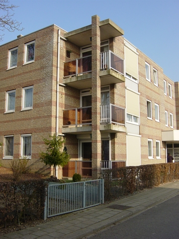

Bij de panden op bovenstaande foto’s is ter plaatse van de balkons een fundering
aanwezig. Voor de BGT-inwinning geldt dan de sprong in de bouw bij de fundering
en kolom op de linker foto als maaiveldgeometrie. Op de rechterfoto is dan het
onderste gedeelte, de buitenkant van het muurtje, de pandbegrenzing.

Twee foto’s van hetzelfde pand.

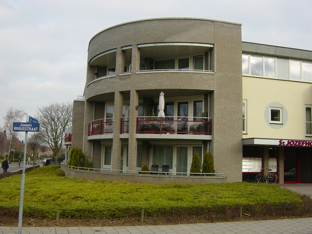

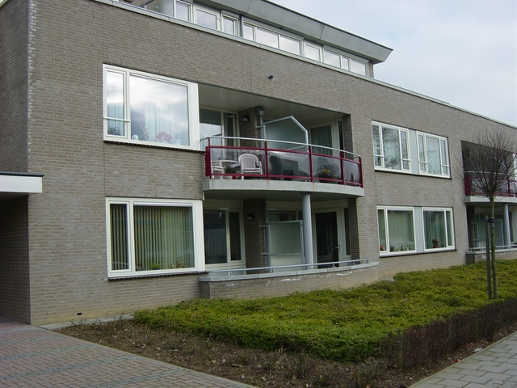

De balkons worden niet afgebeeld, omdat ze geen BAG en geen BGT-inhoud vormen.

De doorgaande (hoofd)gevel prevaleert.

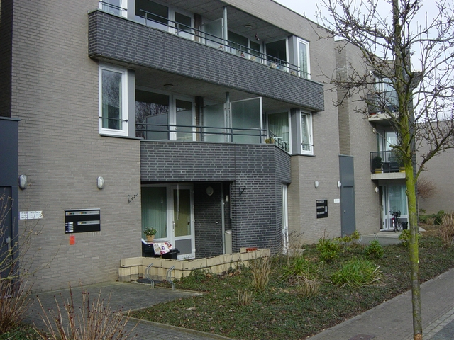

Balkons zijn geen BAG- en geen BGT-inhoud. Er bevindt zich op de rechter foto
onder het balkon van de eerste verdieping een berging. Deze wordt geregistreerd.

#### Galerijen

De buitenste begrenzing van galerijen behoort tot de BAG-geometrie.

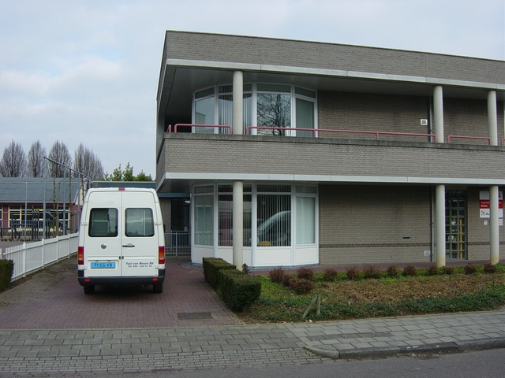

#### Erkers

Voor erkers die ‘aan de gevel’ hangen gelden de regels voor overbouw zoals
hiervoor is beschreven:

Overbouw heeft minimaal een hoogte van één verdieping èn een horizontaal
verschil ten opzichte van de gevel op maaiveld bedraagt ≥ 1 m.

De overbouw kan door overname van de informatie van een bestek of bouwtekening
of geschikte luchtfoto als BAG-inhoud worden opgenomen, wanneer het betreffende
gebouw is gerealiseerd en door de gemeente is gecontroleerd of de realisatie
overeenkomstig de bouwvergunning is uitgevoerd.

Bij fotogrammetrische inwinning is naverkenning in het terrein noodzakelijk
omdat er verschillende regels gelden voor ‘staande’ en ‘hangende’ erkers.

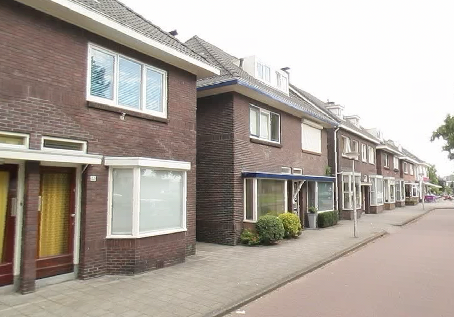

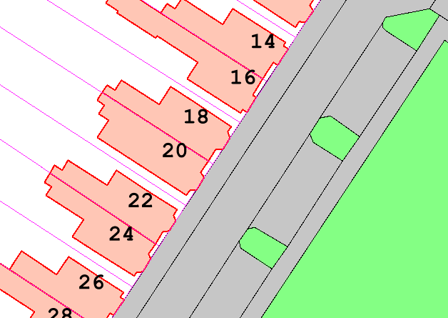

Erkers die BGT en BAG inhoud zijn.

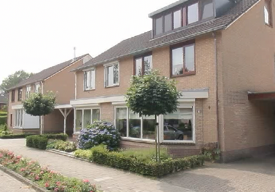

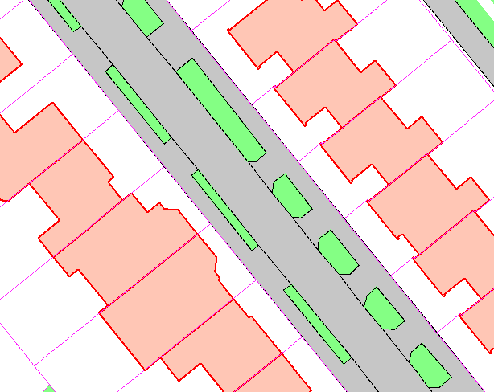

Erkers die BGT en BAG inhoud zijn.

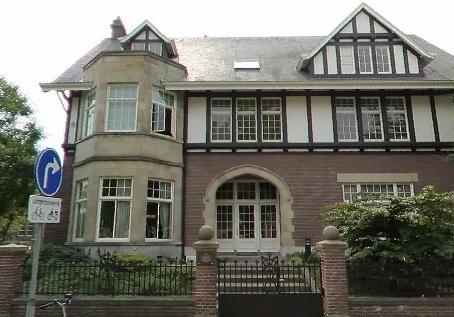

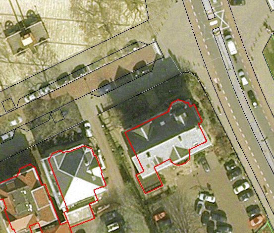

Erkers die BGT en BAG inhoud zijn.

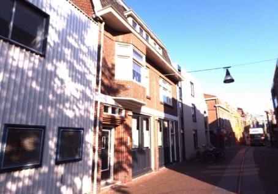

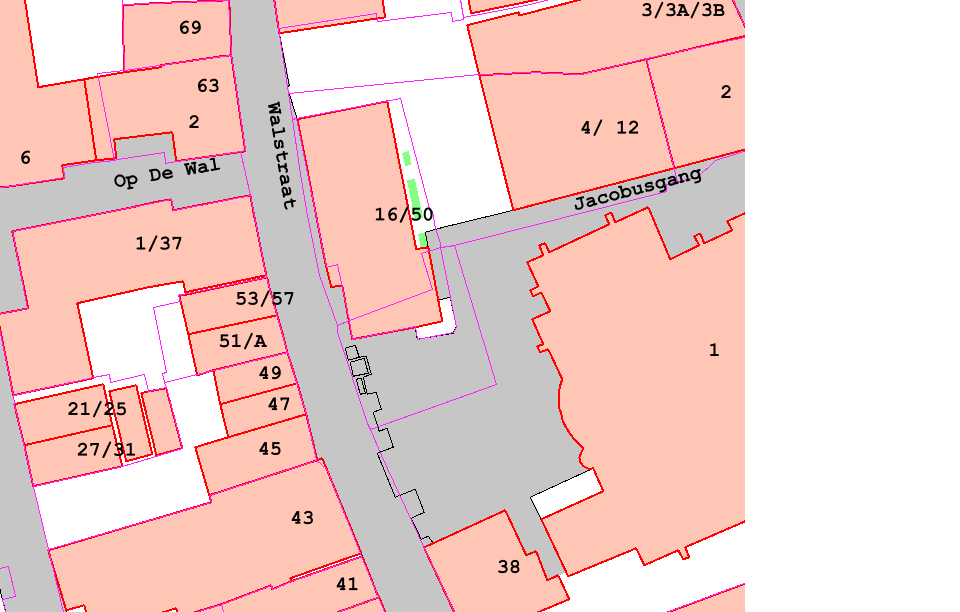

Hangende erkers die vanwege de diepte van minder dan 1 meter geen inhoud vormen
voor BAG.

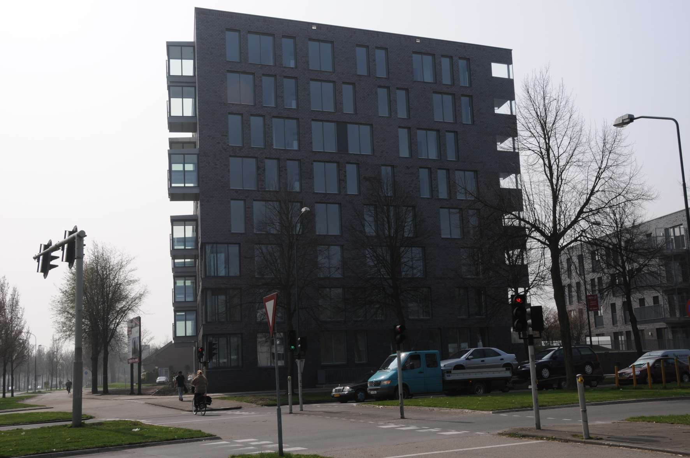

Hangende erkers die door hun afmetingen BAG-inhoud vormen.

#### Portieken

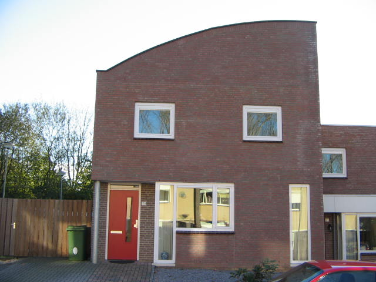

Dit pand heeft bij de voordeur is een sprong van ongeveer 1.50 x 0.60. Deze
sprong, het portiek, behoort niet afzonderlijk tot de inhoud als naar
verwachting de fundering onder de portiek doorloopt en/of de gevel op de
bovengelegen etage doorloopt.

#### Overbouw, pilaren (kolommen, pijlers)

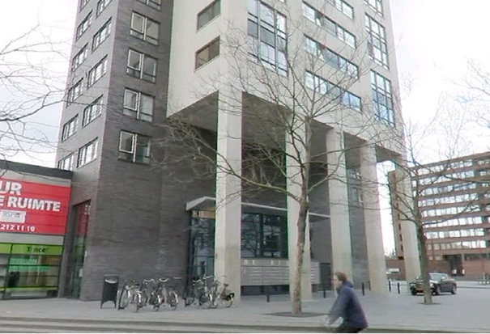

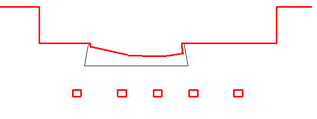

|   | Pandbegrenzing op maaiveld t.b.v. de BGT (multivlak i.v.m. de pilaren) |
|---|------------------------------------------------------------------------|
|   |                                                                        |
|   | Luifel behoort eventueel tot IMGEO-inhoud.                             |

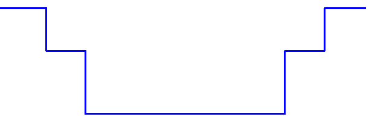

Pandbegrenzing buitenomtrek t.b.v. de BAG

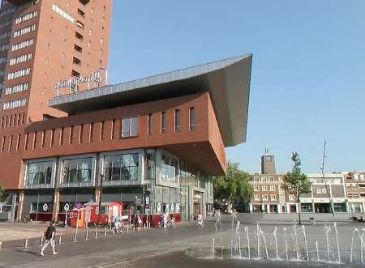

Dit is een voorbeeld van forse overbouw en luifel. Conform de regelgeving is de
overbouw deel van de BAG-buitenomtrek en de gevel op maaiveld onderdeel van de
BGT-inhoud.

De luifel kan eventueel in IMGeo worden opgenomen.

| [./media/image22.jpeg](./media/image22.jpeg) | [./media/image23.jpeg](./media/image23.jpeg) |
|----------------------------------------------|----------------------------------------------|

Deze twee voorbeelden komen regelmatig voor:

De linker foto toont een overbouw ter hoogte van een verdieping en die meer dan
1 m uitsteekt buiten de garage. Dit behoort tot de BAG.

Het rechter voorbeeld toont ook een bovenverdieping op de garage en een overbouw
van meer dan 1.00 m voor de garage. Deze loopt als “luifel” door tot voorbij de
voordeur, deze heeft een diepte van 0.60 m.

Volgens de regels is dan alleen de overbouw boven de garage onderdeel van de
BAG-geometrie, de luifel niet.

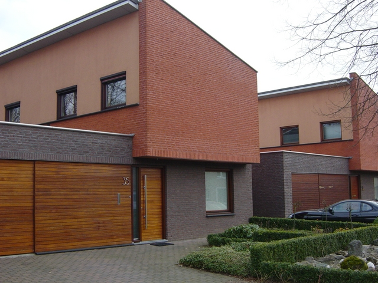

Voor het specifiek inwinnen van ten opzichte van de voetafdruk afwijkende boven-
en onderbouw moet zijn voldaan aan twee voorwaarden:

1.  minimaal één verdieping ‘hoog’, èn:

2.  horizontaal minimaal 1 meter ‘diep’.

Deze overbouw verschilt minder dan 1 meter met de gevel op maaiveld en vormt dus
geen BAG-inhoud.

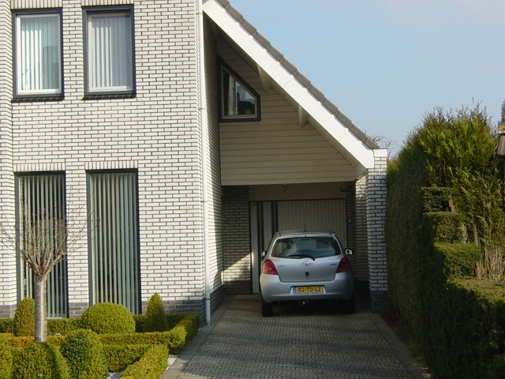

Een confrontatie tussen luchtfoto (volgende bladzijde) en BGT toont aan dat hier
een forse luifel als carport dient. Terreinbezoek toont aan dat onder de carport
nog een overbouw van meer dan 1 meter (witte planken boven de auto) aanwezig is.
De geometrie daarvan geldt voor de BAG.

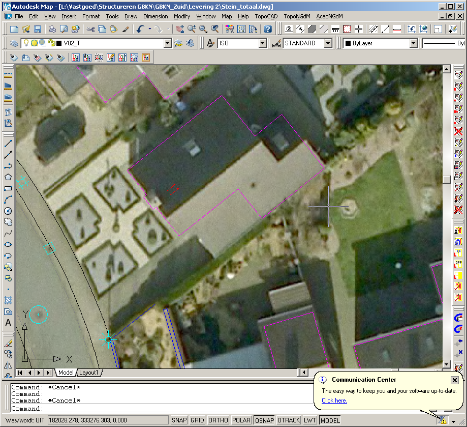

Door de inwinregels stringent toe te passen, levert dit het volgende op:

Maaiveld van huis en garage is BGT-geometrie.

De overbouw onder carport is BAG-geometrie. De carport zelf is geen BAG of
BGT-inhoud en kan eventueel worden geclassificeerd als IMGeo-inhoud.

Deze carport is geen inhoud voor de BAG of BGT, het vormt immers geen onderdeel
voor pand of vbo. Eventueel kan de luifel worden geclassificeerd als
plustopografie in IMGeo.

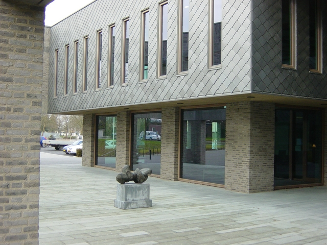

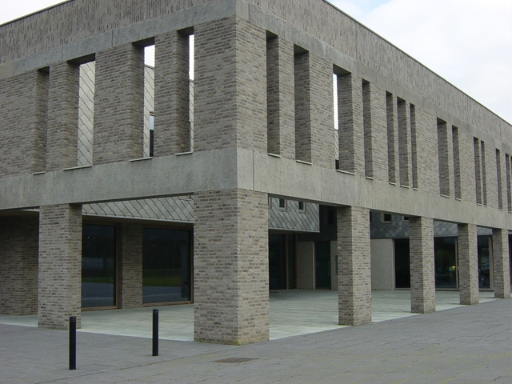

Rondom het gemeentehuis is een galerij met pilaren waar de bovenverdieping op
rust.

De pilaren zijn onderdeel van de pandgeometrie in de BGT (multivlak).

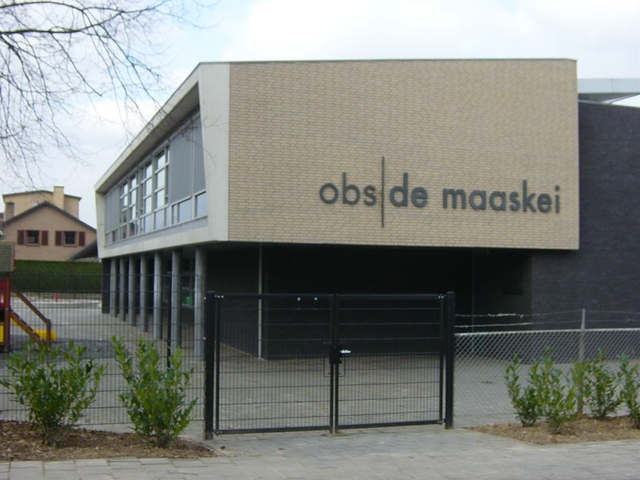

Dit voorbeeld toont een forse overbouw, ondersteund door ronde pilaren. De gevel
op maaiveld en de pilaren zijn onderdeel van de BGT-geometrie.

Dit is vergelijkbaar met de situatie in voorgaande voorbeelden. Dergelijke
kolommen komen regelmatig voor en vallen niet onder de definities van een pand
en zijn dus geen inhoud voor de BAG.

Voor de BGT die de situatie op maaiveld weergeeft, maakt deze kolom onderdeel
uit van de voetafdruk van het pand (multivlak).

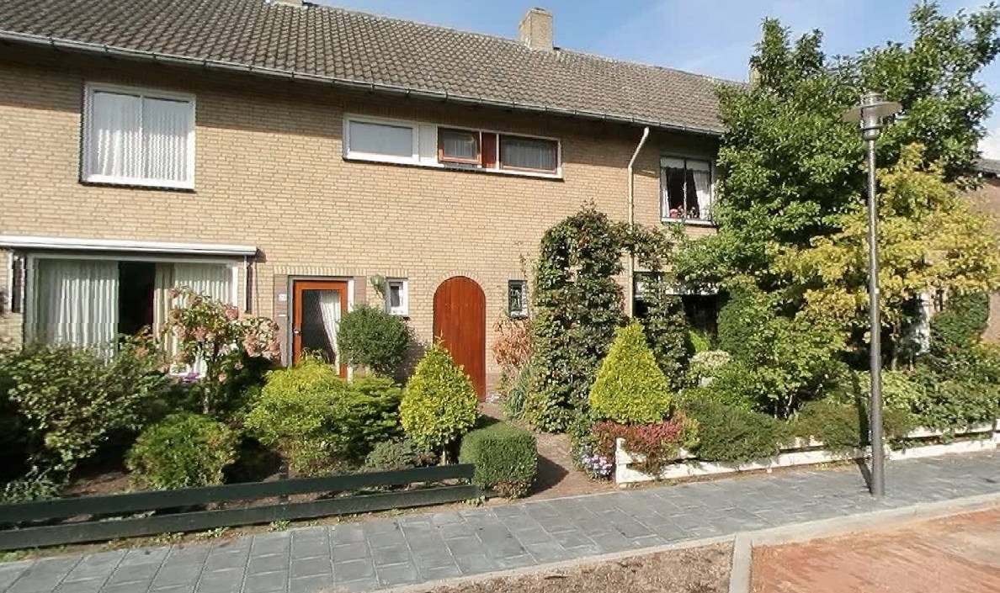

Tussen de woningen, bij de bruine poort, bevindt zich een gemeenschappelijke
doorgang naar de achtertuinen. Boven de poort hebben de naastliggende woningen
elk een deel van de verdieping liggen.

De geometrie op maaiveld is:

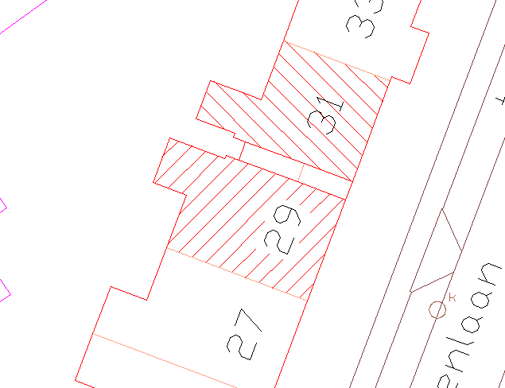

De situatie op verdieping vormt de BAG-geometrie omdat dit voor elke woning
buiten de geometrie van het maaiveld ligt:

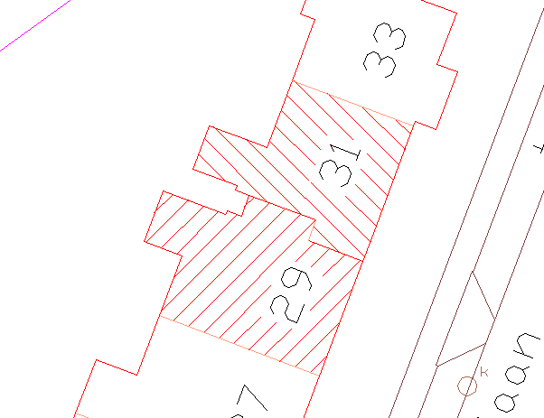

#### Luifels, overkappingen, overige bouwwerken

In onderstaande voorbeelden gelden steeds de volgende richtlijnen:

1.  Is het BAG inhoud? Zo ja, dan inwinnen overeenkomstig de regels voor BGT- en
    BAG-geometrie;

2.  Is het geen BAG inhoud, bijvoorbeeld omdat het een opslagruimte is die aan
    één zijde open is? Dan valt het object in de BGT-klasse OverigBouwwerk;

3.  Is het een luifel of overkapping? Zo ja, dan respectievelijk opnemen in
    IMGeo of BGT. Ondersteunende pilaren zijn BGT inhoud wanneer de afmetingen
    \> 0,30 x 0,30 m of \> ∅ 0,30 m bedragen. De dakrand van het afdak kan
    eventueel in IMGeo worden vastgelegd met een waarde voor de relatieve hoogte
    die 1 hoger bedraagt dan die van de pilaren.

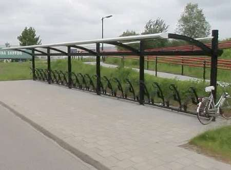

Dit afdak voor fietsen is geen BAG inhoud en ook geen BGT-inhoud en kan
eventueel worden geclassificeerd in IMGeo.

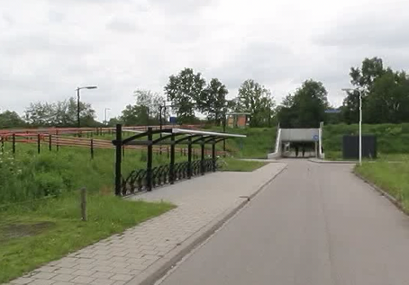

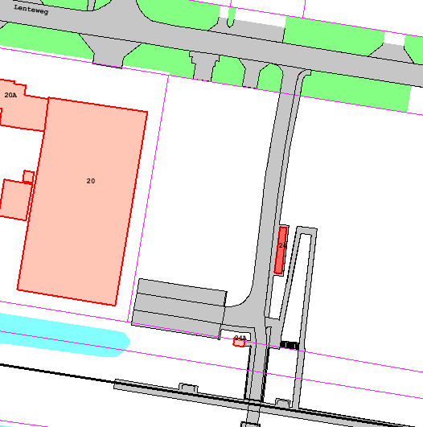

Dit is geen BGT-inhoud en kan eventueel worden geclassificeerd als plustopo in
IMGeo.

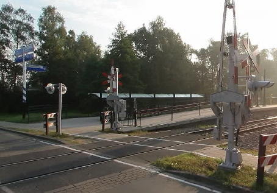

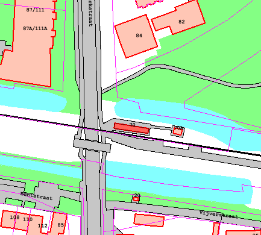

Hier geldt hetzelfde als bij voorgaande voorbeelden.

Dit is de luifel van de entree van een pand, zijnde winkelcentrum. De luifel
wordt eventueel geclassificeerd als plustopografie in IMGeo. De bij de luifel
horende pilaar is BGT inhoud wanneer \> 0,30 x 0,30 m of \> ∅ 0,30 m.

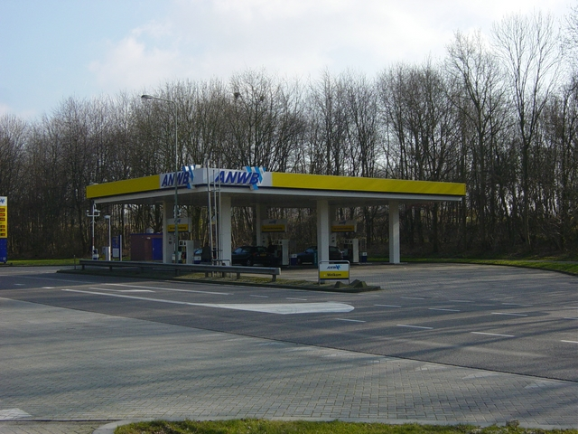

Dit is een tankstation met een overkapping. Op de kaart staat een klein pand met
huisnummer. De voetafdruk van het pand vormt onderdeel van de BGT-inhoud, de
BAG-geometrie is daarmee identiek. De bij de overkapping behorende pilaren zijn
BGT inhoud wanneer \> 0,30 x 0,30 m of \> ∅ 0,30 m. De dakrand vormt desgewenst
inhoud voor IMGeo (niveau +1).

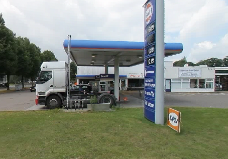

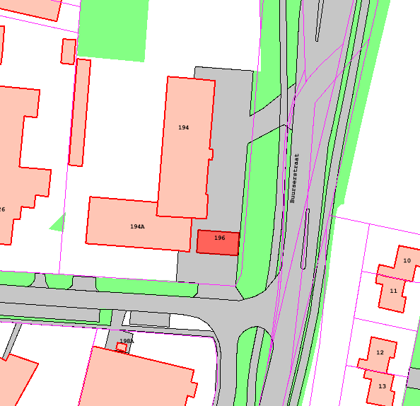

Dit is weer een overkapping bij een tankstation waarvoor hetzelfde geldt als
hiervoor.

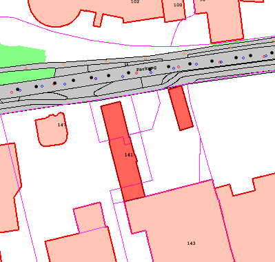

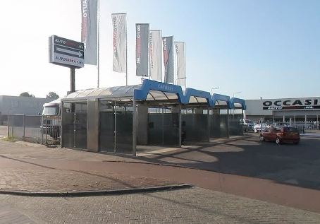

In het algemeen geldt dat de dakrand van overkappingen boven benzinepompen en
wasboxen kunnen worden geclassificeerd als IMGeo-inhoud met hoogte +1.

Ondersteunende pilaren zijn BGT-inhoud wanneer de afmetingen \> 0,30 x 0,30 m of
\> ∅ 0,30 m.

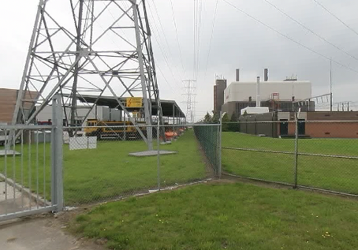

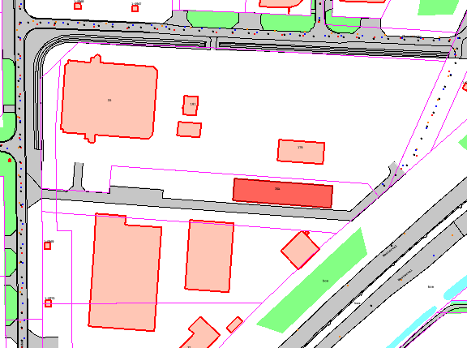

Dit betreft een groot afdak zonder wanden, waar voertuigen staan opgesteld zoals
vrachtauto’s, sneeuwschuivers, zoutstrooiers e.d. Ook hier geldt dat de dakrand
van de overkappingen desgewenst worden geclassificeerd als IMGeo-inhoud op
hoogte +1. Ondersteunende pilaren zijn BGT-inhoud wanneer de afmetingen \> 0,30
x 0,30 m of \> ∅ 0,30 m.

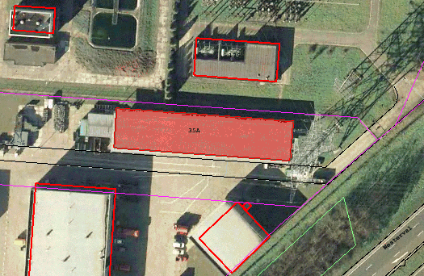

Terreinverkenning moet uitmaken of hier sprake is van richtlijn 1, 2 of 3, zoals
is vermeld aan het begin van deze paragraaf.

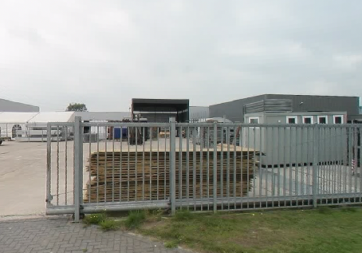

Dit betreft een loods met drie dichte wanden voor opslag van een bouwbedrijf.
Hier geldt richtlijn 2: OverigBouwwerk en is met de voetafdruk inhoud van de
BGT.

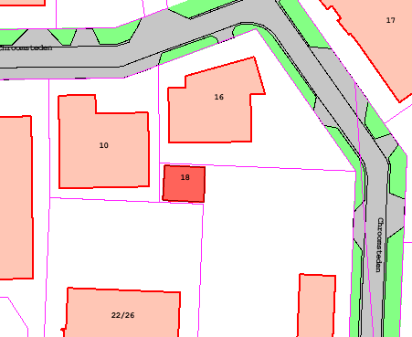

#### Panden met of zonder verblijfsobject

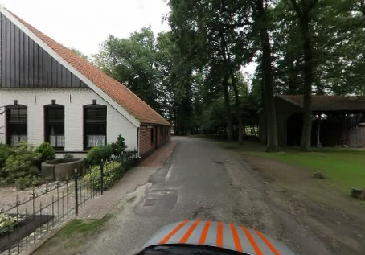

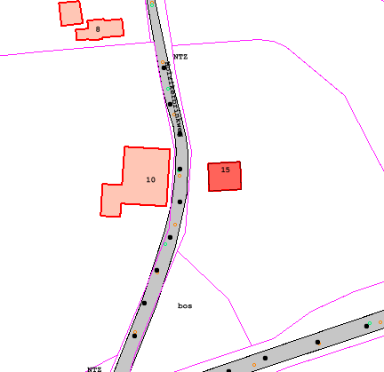

Het pand met vbo staat aan een kant van de weg, de bijbehorende schuur (pand
zonder vbo) aan de andere kant, rechts van de weg. Beide hebben een eigen
huisnummer.

Afgezien van het feit of de huisnummering overeenkomstig de BAG-regelgeving is,
worden beide panden in de BGT opgenomen met maaiveldgeometrie.

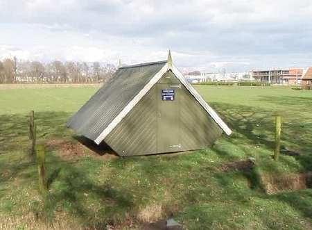

Dit betreft een verplaatsbaar houten omhulsel en komt regelmatig voor in de
omgeving van Enschede en Hengelo (Overijssel) ten behoeve van zoutwinning.

Volgens BAG regelgeving is dit geen pand en vormt door het ’mobiele’ karakter
ook geen BGT-inhoud.

#### Mestsilo’s

Mestsilo’s behoren tot BGT en BAG inhoud.

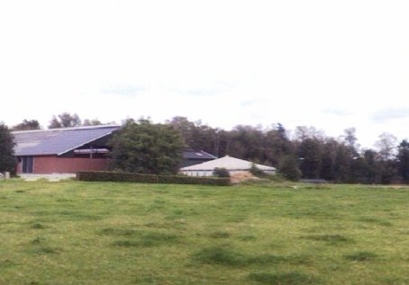

Mestsilo.

Met als bovenaanzicht:

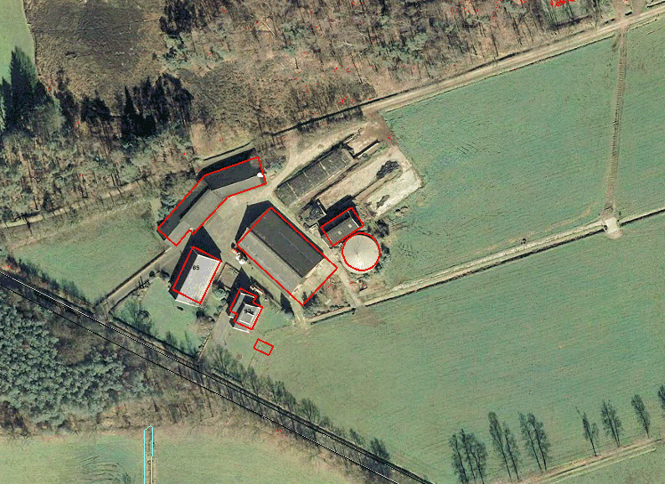

#### Trafo’s

Trafo’s bestaan in verschillende verschijningsvormen en zijn, afhankelijk van
toegankelijkheid en grootte, al of niet inhoud van de BGT of de BAG.
Onderstaande trafo’s komen voor:

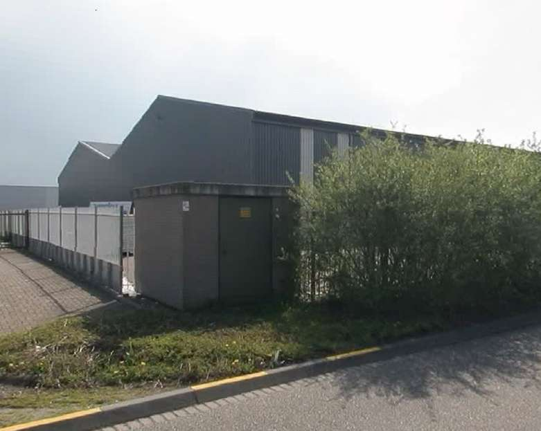

Een toegankelijk transformatorhuis, incl. deur. Deze is als pand inhoud voor de
BGT en de BAG.

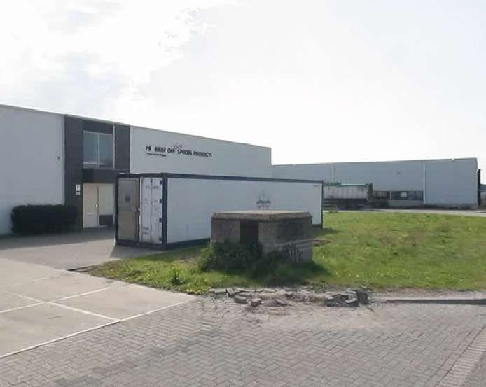

Voorgaand voorbeeld betreft een lage trafo, incl. een toegangsdeurtje. De BAG
geeft als regel dat de betreedbaarheid van het object als criterium geldt: een
object dat niet betreedbaar is en waar een volwassen persoon niet rechtop in kan
staan en lopen, wordt niet als pand aangemerkt. Deze trafo is dus geen BAG
inhoud.

Voor de BGT is dit als lage trafo onderdeel van de objectklasse OverigBouwwerk.

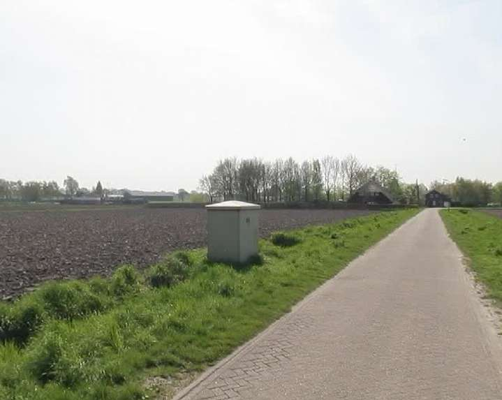

Dit is geen BAG en geen BGT-inhoud. Eventueel wordt dit in IMGeo geclassificeerd
als plustopografie (schakelkast openbare verlichting of verkeersinstallatiekast
of telecomkast of elektrakast of gaskast of rioolkast).

#### muren

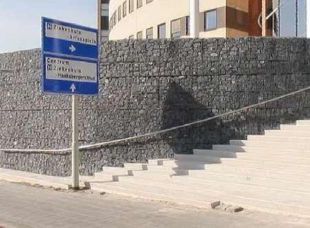

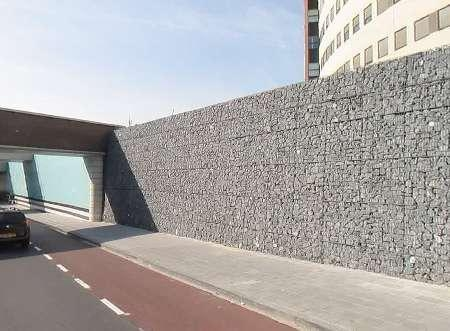

Deze foto’s tonen gazen bakken met steenbrokken, zoals in bergachtige streken
wordt toegepast als versteviging van bergwanden en lawinekering, hier in gebruik
als alternatief voor betonwanden. Voor de BGT is dit inhoud wanneer de muur een
scheiding tussen twee objecten vormt.
