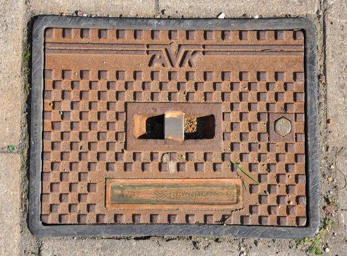
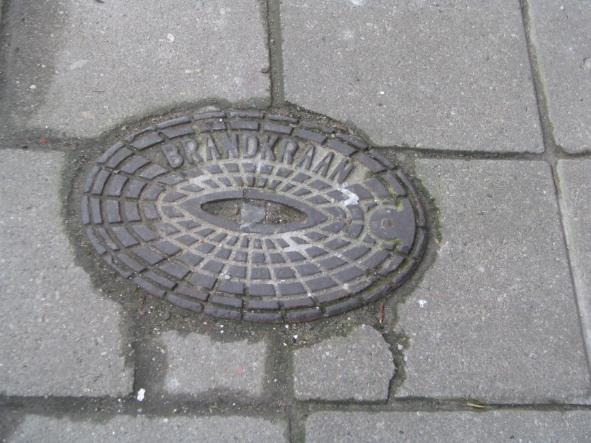
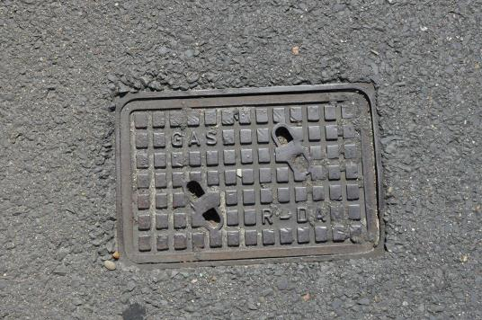
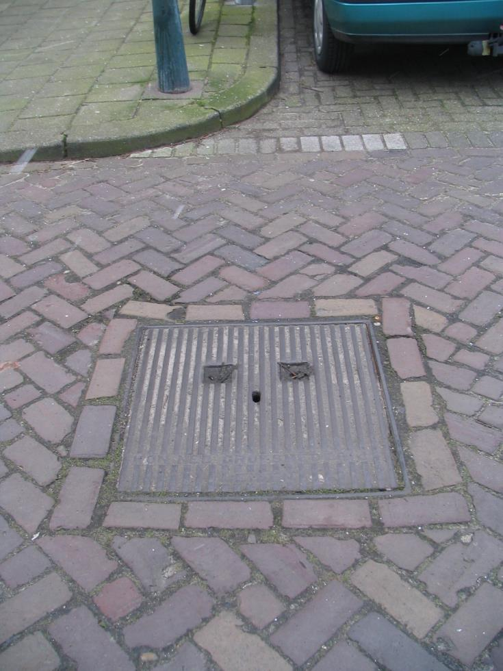
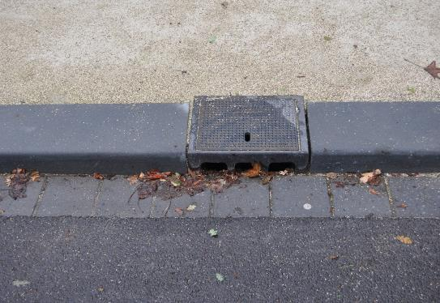
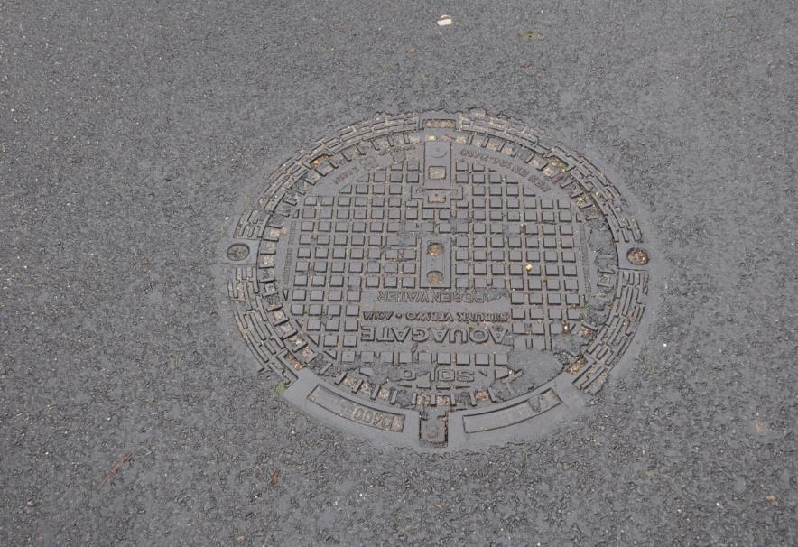

Put
===

**Definitie**

Gegraven of geboorde kokervormige diepte waarin zich (vloei)stoffen bevinden.

type
----

**Definitie**

Het soort put.

### benzine- / olieput

**Definitie**

Putdeksel die toegang geeft tot een benzine- of olietank ten behoeve van vullen,
onderhoud of inspectie.

**Verplicht?**

Nee, optionele inhoud IMGeo.

**Voorbeeld**

Een afbeelding van een benzine- / olieput kunt u sturen
aan: [imgeo\@geonovum.nl](mailto:info@geonovum.nl)

| **Put**                | **Attribuutwaarde** | **Opmerkingen** |
|------------------------|---------------------|-----------------|
| type                   | benzine- / olieput  |                 |
| relatieveHoogteligging |                     |                 |

### brandkraan / -put

**Definitie**

Op de drinkwaterleiding aangesloten kraan, of deksel van een put voor het
plaatsen van een brandkraan, op of nabij de openbare weg, voor brandbestrijding.

**Verplicht?**

Nee, optionele inhoud IMGeo.

**Voorbeeld**

| **Put**                | **Attribuutwaarde** | **Opmerkingen** |
|------------------------|---------------------|-----------------|
| type                   | brandkraan / -put   |                 |
| relatieveHoogteligging |                     |                 |

### drainageput

**Definitie**

Putdeksel welke toegang geeft naar een poreuze of geperforeerde buisleiding,
aangebracht onder de grond om de afwatering van de grond te verbeteren.

**Verplicht?**

Nee, optionele inhoud IMGeo.

**Voorbeeld**

Een afbeelding van een drainageput kunt u sturen
aan: [imgeo\@geonovum.nl](mailto:info@geonovum.nl)

| **Put**                | **Attribuutwaarde** | **Opmerkingen** |
|------------------------|---------------------|-----------------|
| type                   | drainageput         |                 |
| relatieveHoogteligging |                     |                 |

### gasput

**Definitie**

Putdeksel met afsluitkraan ten behoeve van het ondergrondse leidingenstelsel
voor gastransport.

**Verplicht?**

Nee, optionele inhoud IMGeo.

**Voorbeeld**

| **Put**                | **Attribuutwaarde** | **Opmerkingen** |
|------------------------|---------------------|-----------------|
| type                   | gasput              |                 |
| relatieveHoogteligging |                     |                 |

### inspectie- / rioolput

**Definitie**

Putdeksel die toegang geeft tot een (riool)leiding.

**Verplicht?**

Nee, optionele inhoud IMGeo.

**Voorbeeld**

| **Put**                | **Attribuutwaarde**   | **Opmerkingen** |
|------------------------|-----------------------|-----------------|
| type                   | inspectie- / rioolput |                 |
| relatieveHoogteligging |                       |                 |

### kolk

**Definitie**

Deksel van een op het riool aangesloten voorziening voor de opvang van hemel- en
afvalwater afkomstig van erop aangesloten oppervlakken.

**Verplicht?**

Nee, optionele inhoud IMGeo.

**Voorbeeld**

| **Put**                | **Attribuutwaarde** | **Opmerkingen** |
|------------------------|---------------------|-----------------|
| type                   | Kolk                |                 |
| relatieveHoogteligging |                     |                 |

### waterleidingput

**Definitie**

Putdeksel met afsluitkraan ten behoeve van het ondergrondse leidingenstelsel
voor watertransport.

**Verplicht?**

Nee, optionele inhoud IMGeo.

**Voorbeeld**

| **Put**                | **Attribuutwaarde** | **Opmerkingen** |
|------------------------|---------------------|-----------------|
| type                   | waterleidingput     |                 |
| relatieveHoogteligging |                     |                 |
