Scheiding
=========

**Definitie**

Kunstmatig obstakel met een werende functie.

inwinningsregels
----------------

### BGT

Bron: [Gegevenscatalogus BGT
1.2](https://docs.geostandaarden.nl/imgeo/catalogus/bgt/#objectafbakening-scheiding)

>   **Indeling**
>   
>   De volgende scheidingen zijn BGT-inhoud: hekken, geluidsschermen, muren,
>   kademuren en walbeschermingen.
>   
>   **Regels voor opname**
>   
>   Scheidingen worden als lijnobject vastgelegd als de breedte kleiner is dan
>   30cm. Bij scheidingen breder dan 30cm moet de buitenomtrek waar het object
>   de grond raakt worden ingewonnen en vastgelegd als vlakgeometrie.
>   
>   Een scheiding wordt vastgelegd waar het object de ondergrond raakt.
>   
>   In de scheidingen worden onderbrekingen van \<1m genegeerd. Doorgangen
>   worden gezien als integraal onderdeel van de scheiding.
>   
>   Scheidingen van het type hek die een minimale lengte van 10m en een minimale
>   hoogte van 1m hebben, worden vastgelegd.
>   
>   Scheidingen van de typen kademuur en walbescherming worden opgenomen aan de
>   bovenzijde aan de waterkant. Kademuren breder dan 30cm worden ingewonnen als
>   vlakobject; de omtrek van het object aan de bovenzijde wordt dan vastgelegd.
>   
>   Scheidingen van het type muur, met een minimale lengte van 1m en met een
>   minimale breedte van 30cm worden opgenomen. Een muur smaller dan 30cm wordt
>   als lijnobject vastgelegd, een bredere muur als vlakobject. Muren met een
>   minimale hoogte van 50cm worden vastgelegd.
>   
>   In terreinen met een fysiek voorkomen ‘erf’ worden alleen die scheidingen
>   opgenomen die direct aan de straatzijde zijn gelegen.
>   
>   Ter ondersteuning bij het vaststellen welk objecttype het betreft, geldt
>   onderstaande beslisboom voor muren en wanden.
>
>   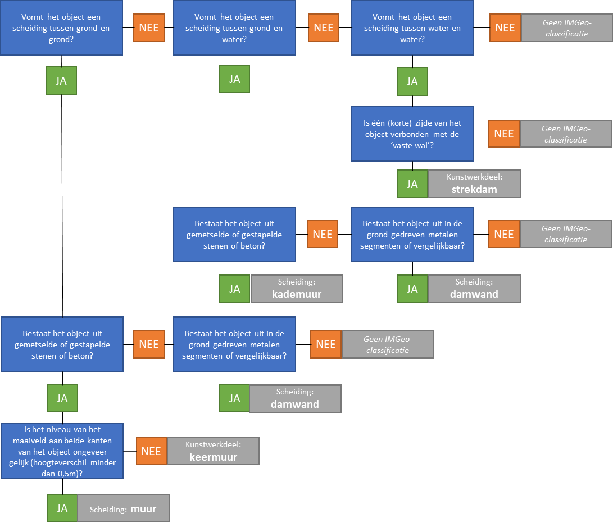

### IMGeo

Bron: [Gegevenscatalogus IMGeo
2.2](https://docs.geostandaarden.nl/imgeo/catalogus/imgeo/#scheiding-0)

>   IMGeo kent naast de BGT typen scheiding ook draadraster en faunaraster.
>   Bovendien zijn heggen/hagen in IMGeo vertegenwoordigd, zij het niet als
>   scheiding maar als vegetatieobject. Draadraster en faunaraster worden als
>   lijnobject opgenomen.

>   In de BGT worden scheidingen alleen vastgelegd als ze bepaalde minimum
>   afmetingen hebben, die per type scheiding verschillen (zie deel I). In IMGeo
>   kunnen scheidingen worden opgenomen die kleiner zijn dan de voor de BGT
>   vermelde minimum afmetingen. Ook kunnen in IMGeo scheidingen worden
>   opgenomen die binnen een erf en niet aan de straatzijde of openbare ruimte
>   zijde zijn gelegen.

>   De populatie van Scheiding in IMGeo bestaat uit:

-   Scheidingen die niet voldoen aan de BGT minimummaat;

-   Scheidingen in terrein met fysiek voorkomen ‘erf’ die niet aan de
    straatzijde gelegen zijn.

>   IMGeo muren en kademuren van breder dan 30 cm worden als vlakobject
>   vastgelegd; smallere worden als lijnobject vastgelegd.

type
----

**Definitie**

Specificatie van het soort scheiding

### muur

**Definitie**

Een scheiding gemaakt van steen.

**Verplicht?**

Ja, verplichte inhoud BGT.

**Voorbeeld**

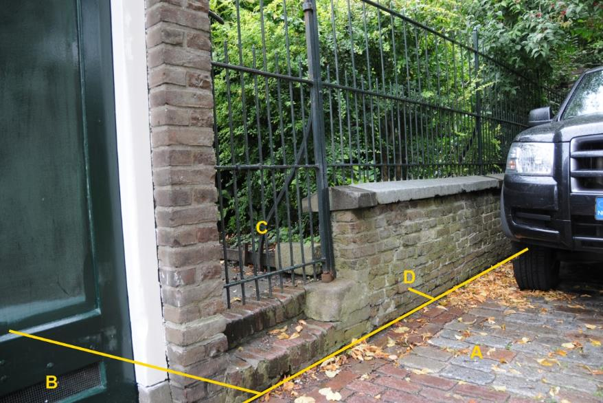

D:

| **Scheiding**          | **Attribuutwaarde** | **Opmerkingen**                                                                  |
|------------------------|---------------------|----------------------------------------------------------------------------------|
| type                   | muur                | Muur met hek is \> 1m hoog; de voet van de muur aan de straatzijde is BGT-inhoud |
| relatieveHoogteligging |  0                  |                                                                                  |

A: wegdeel, rijbaan: lokale weg, open verharding.

B: pand

C: onbegroeid terreindeel, erf.

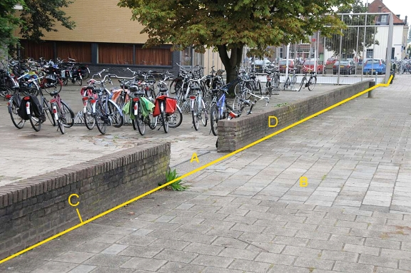

2325b

2325b

C en D zijn BGT-inhoud want de hoogte van de muur \> 0,5 m. Het zijn
afzonderlijke objecten omdat de onderbreking bij A \> 1 m.

C en D:

| *Scheiding*            | *Attribuutwaarde* | *Opmerkingen*               |
|------------------------|-------------------|-----------------------------|
| typeScheiding          | Muur              | Lijn, want breedte \< 0.3 m |
| relatieveHoogteligging |  0                |                             |

A: onbegroeid terreindeel, open verharding.

B: wegdeel, voetpad, open verharding.

### kademuur

**Definitie**

Verticale wand ter scheiding van land en water, opgebouwd uit een muur van
gemetselde stenen of gestort beton.

**Verplicht?**

Ja, verplichte inhoud BGT.

**Voorbeeld**

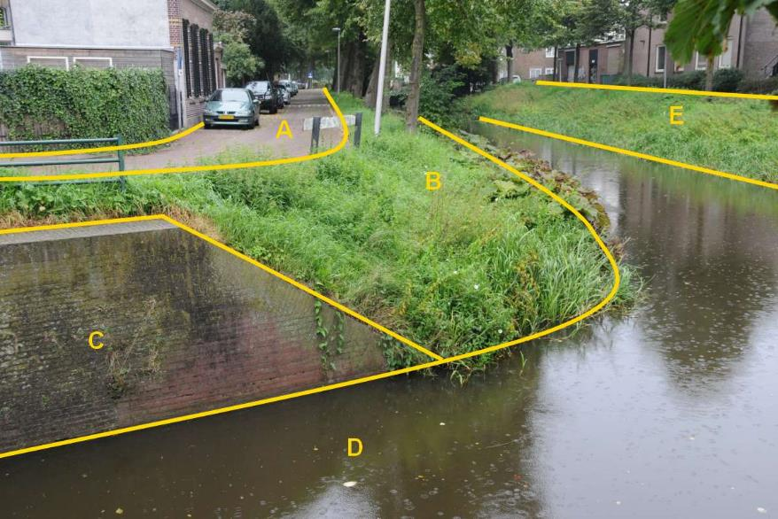

C:

| **Scheiding**          | **Attribuutwaarde** | **Opmerkingen** |
|------------------------|---------------------|-----------------|
| type                   | kademuur            |                 |
| relatieveHoogteligging |  0                  |                 |

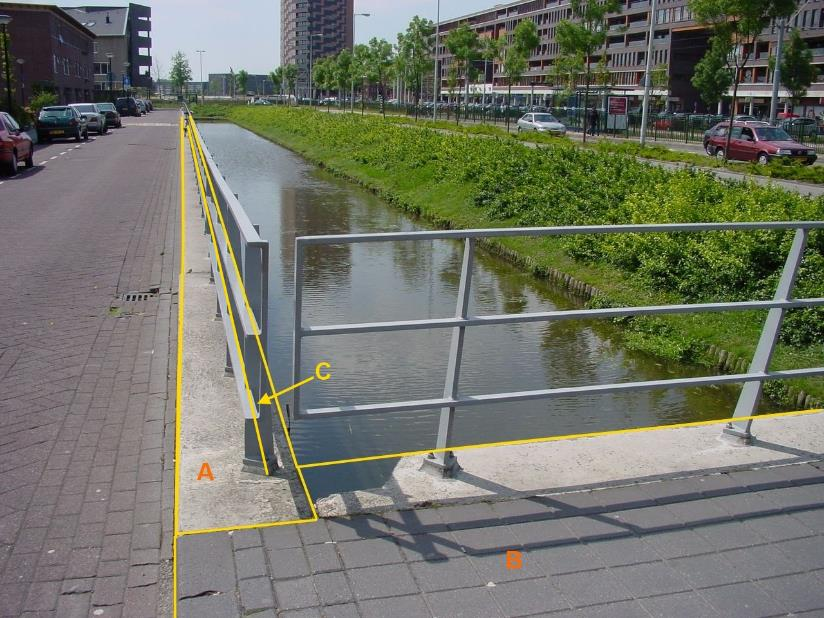

Hek C wordt **niet** opgenomen in de BGT omdat het op scheiding kademuur staat,
deze gaat voor in de hiërarchie bij scheidingen.

A:

| *Scheiding*            | *Attribuutwaarde* | *Opmerkingen* |
|------------------------|-------------------|---------------|
| typeScheiding          | Kademuur          |               |
| relatieveHoogteligging |  0                |               |

B: overbruggingsdeel en wegdeel, beide op niveau 1.

### geluidsscherm

**Definitie**

Een scheiding bedoeld om geluidshinder in de buitenlucht te verminderen.

**Verplicht?**

Ja, verplichte inhoud BGT.

**Voorbeeld**

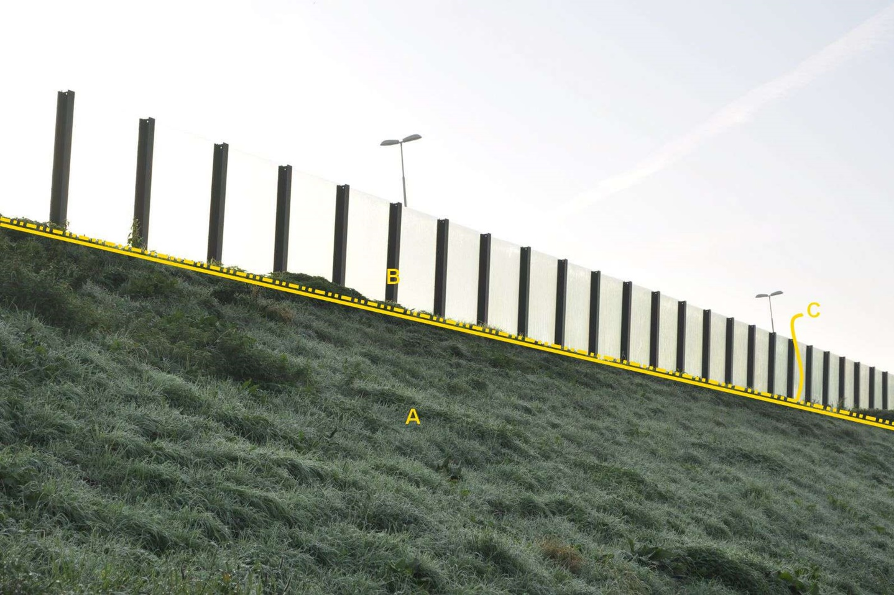

B:

| **Scheiding**          | **Attribuutwaarde** | **Opmerkingen** |
|------------------------|---------------------|-----------------|
| type                   | geluidsscherm       |                 |
| relatieveHoogteligging |  0                  |                 |

A: begroeid terreindeel, grasland overig, talud, kruinlijn, niveau 0.

### damwand

**Definitie**

Een grondkerende constructie die bestaat uit een verticaal in de grond
geplaatste wand.

**Verplicht?**

Ja, verplichte inhoud BGT.

**Voorbeeld**

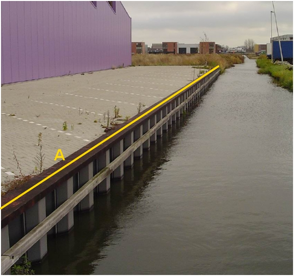

A:

| **Scheiding**          | **Attribuutwaarde** | **Opmerkingen** |
|------------------------|---------------------|-----------------|
| type                   | damwand             |                 |
| relatieveHoogteligging |  0                  |                 |

### walbescherming

**Definitie**

Een nagenoeg verticale wand tot kering van grond om afkalving van water te
voorkomen, niet zijnde een kademuur.

**Verplicht?**

Ja, verplichte inhoud BGT.

**Voorbeeld**

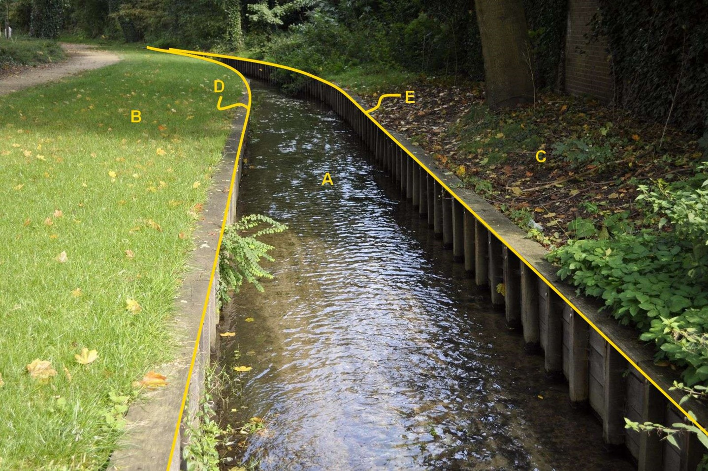

D en E:

| **Scheiding**          | **Attribuutwaarde** | **Opmerkingen** |
|------------------------|---------------------|-----------------|
| type                   | walbescherming      |                 |
| relatieveHoogteligging |  0                  |                 |

A: waterdeel, waterloop.

B en C: begroeid terreindeel, groenvoorziening.

### hek

**Definitie**

Een hekwerk of schutting, typisch ten behoeve van erfafscheiding.

**Verplicht?**

Ja, verplichte inhoud BGT.

**Voorbeeld**

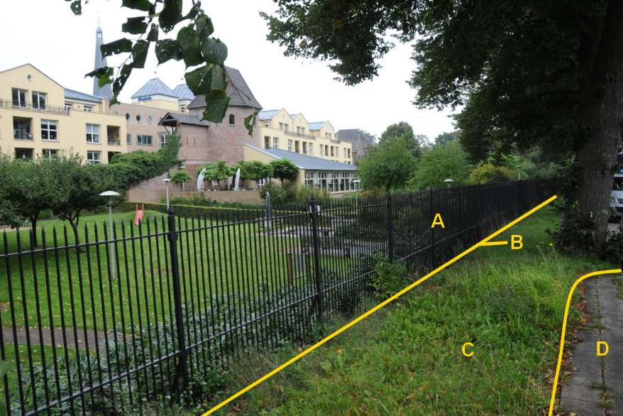

B:

| **Scheiding**          | **Attribuutwaarde** | **Opmerkingen** |
|------------------------|---------------------|-----------------|
| type                   | hek                 |                 |
| relatieveHoogteligging |  0                  |                 |

A: onbegroeid terreindeel, erf.

C: ondersteunend wegdeel, berm, fysiek voorkomen: groenvoorziening.

D: wegdeel, voetpad, open verharding.

### draadraster

**Definitie**

Kunstmatige terreinafscheiding, niet zijnde een faunaraster, in de vorm van een
overwegend houten, metalen of kunststoffen rechtopstaande palen met daartussen
een of meerdere draden.

**Verplicht?**

Nee, optionele inhoud IMGeo.

**Voorbeeld**

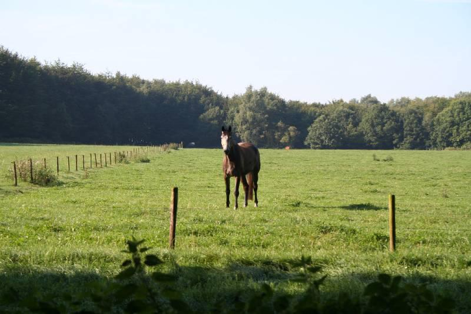

scheiding draadrsater

scheiding draadrsater

HTML niet gevonden:: example/html/scheiding-draadraster.html

### faunaraster

**Definitie**

Kunstmatig aangebrachte scheiding van metaaldraad tussen palen, bedoeld voor het
leiden van dieren.

**Verplicht?**

Nee, optionele inhoud IMGeo.

**Voorbeeld**

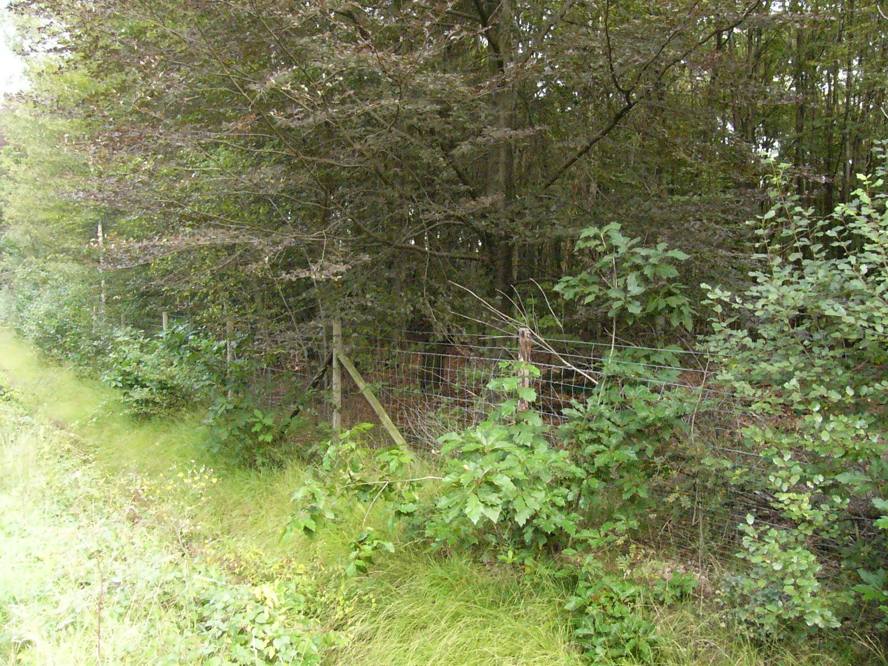

scheiding faunaraster

scheiding faunaraster
