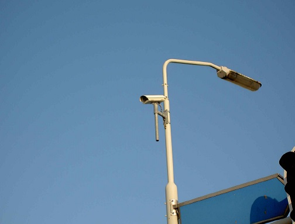
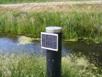
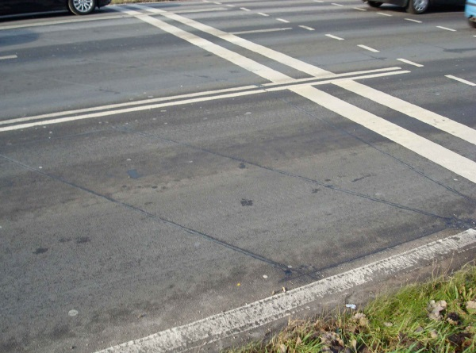
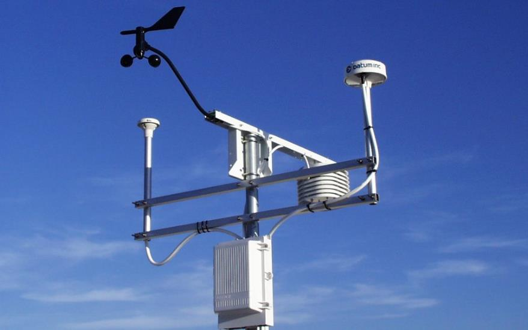
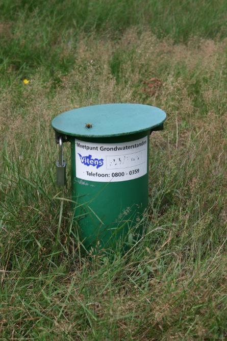
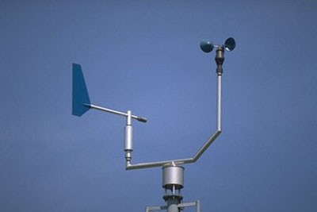
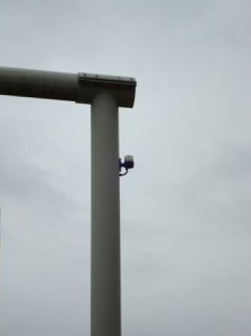
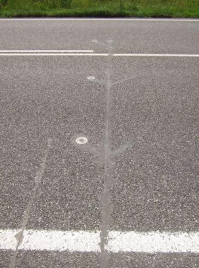
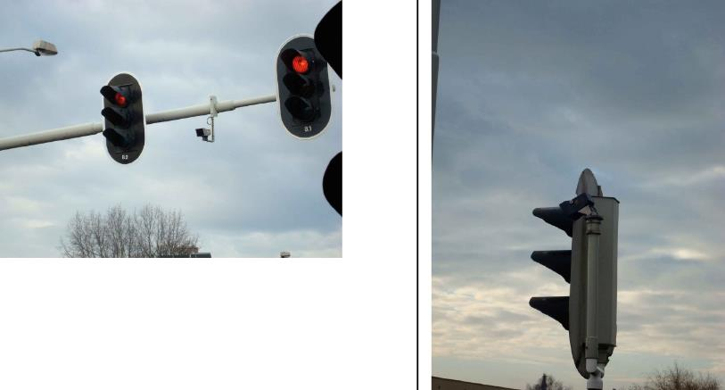
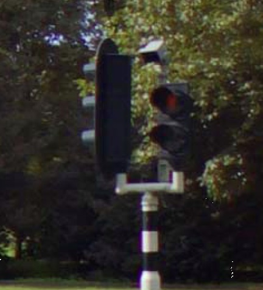

Sensor
======

**Definitie**

Apparaat voor de meting van een fysieke grootheid (bijv. temperatuur, licht,
druk, elektriciteit).

type
----

**Definitie**

Het soort sensor.

### camera

**Definitie**

Installatie voor de registratie van beelden van situaties, waarvan direkte
observatie moeilijk of niet permanent mogelijk is.

**Verplicht?**

Nee, optionele inhoud IMGeo.

**Voorbeeld**

| **Sensor**             | **Attribuutwaarde** | **Opmerkingen** |
|------------------------|---------------------|-----------------|
| type                   | camera              |                 |
| relatieveHoogteligging |                     |                 |

### debietmeter

**Definitie**

Een instrument dat de (afvoer)capaciteit van de volumestroom meet.

**Verplicht?**

Nee, optionele inhoud IMGeo.

**Voorbeeld**

| **Sensor**             | **Attribuutwaarde** | **Opmerkingen** |
|------------------------|---------------------|-----------------|
| type                   | debietmeter         |                 |
| relatieveHoogteligging |                     |                 |

### hoogtedetectieapparaat

**Definitie**

Een mechanisch of elektronisch waarschuwingssysteem, dat in werking treedt bij
overschrijding van de aangegeven maximale doorrijhoogte.

**Verplicht?**

Nee, optionele inhoud IMGeo.

**Voorbeeld**

Een afbeelding van een hoogtedetectieapparaat kunt u sturen
aan: [imgeo\@geonovum.nl](mailto:info@geonovum.nl)

| **Sensor**             | **Attribuutwaarde**    | **Opmerkingen** |
|------------------------|------------------------|-----------------|
| type                   | hoogtedetectieapparaat |                 |
| relatieveHoogteligging |  1                     |                 |

### detectielus

**Definitie**

In de verharding opgenomen lusvormig onderdeel van een verkeersdetector.

**Verplicht?**

Nee, optionele inhoud IMGeo.

**Voorbeeld**

| **Sensor**             | **Attribuutwaarde** | **Opmerkingen** |
|------------------------|---------------------|-----------------|
| type                   | detectielus         |                 |
| relatieveHoogteligging |                     |                 |

### weerstation

**Definitie**

Een weerstation is een verzameling instrumenten die het weer kunnen meten.

**Verplicht?**

Nee, optionele inhoud IMGeo.

**Voorbeeld**

| **Sensor**             | **Attribuutwaarde** | **Opmerkingen** |
|------------------------|---------------------|-----------------|
| type                   | weerstation         |                 |
| relatieveHoogteligging |  1                  |                 |

### flitser

**Definitie**

Een flitser bevat een mechanisme om een snelheidsmeting uit te voeren om
snelheidsovertredingen in het verkeer te kunnen vaststellen.

**Verplicht?**

Nee, optionele inhoud IMGeo.

**Voorbeeld**

| **Sensor**             | **Attribuutwaarde** | **Opmerkingen** |
|------------------------|---------------------|-----------------|
| type                   | flitser             |                 |
| relatieveHoogteligging |  1                  |                 |

### waterstandmeter

**Definitie**

Een meter die de waterstand, over het algemeen ten opzichte van NAP, meet.

**Verplicht?**

Nee, optionele inhoud IMGeo.

**Voorbeeld**

| **Sensor**             | **Attribuutwaarde** | **Opmerkingen** |
|------------------------|---------------------|-----------------|
| type                   | waterstandmeter     |                 |
| relatieveHoogteligging |                     |                 |

### windmeter

**Definitie**

Apparatuur waarmee de snelheid en de richting van de wind kan worden gemeten.

**Verplicht?**

Nee, optionele inhoud IMGeo.

**Voorbeeld**

| **Sensor**             | **Attribuutwaarde** | **Opmerkingen** |
|------------------------|---------------------|-----------------|
| type                   | windmeter           |                 |
| relatieveHoogteligging |  1                  |                 |

### lichtcel

**Definitie**

Lichtcel waarmee het verlichtingsniveau naar een lager verlichtingsniveau
omgeschakeld wordt (dimmen) wanneer de situatie dit toelaat.

**Verplicht?**

Nee, optionele inhoud IMGeo.

**Voorbeeld**

| **Sensor**             | **Attribuutwaarde** | **Opmerkingen** |
|------------------------|---------------------|-----------------|
| type                   | lichtcel            |                 |
| relatieveHoogteligging |  1                  |                 |

### GMS sensor

**Definitie**

Gladheidsmeldsysteem (GMS) waarmee de kans op gladheid wordt voorspeld aan de
hand van meting en interpretatie van de parameters die een rol spelen bij het
ontstaan van gladheid.

**Verplicht?**

Nee, optionele inhoud IMGeo.

**Voorbeeld**

| **Sensor**             | **Attribuutwaarde** | **Opmerkingen** |
|------------------------|---------------------|-----------------|
| type                   | GMS sensor          |                 |
| relatieveHoogteligging |                     |                 |

### radar detector

**Definitie**

Met een radardetector wordt het verkeer gedetecteerd, bijvoorbeeld voor het
beïnvloeden van verkeerslichten.

**Verplicht?**

Nee, optionele inhoud IMGeo.

**Voorbeeld**

| **Sensor**             | **Attribuutwaarde** | **Opmerkingen** |
|------------------------|---------------------|-----------------|
| type                   | radar detector      |                 |
| relatieveHoogteligging |  1                  |                 |
