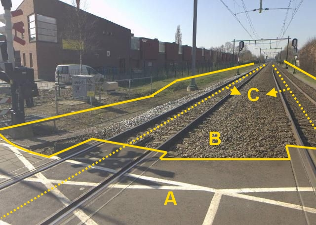
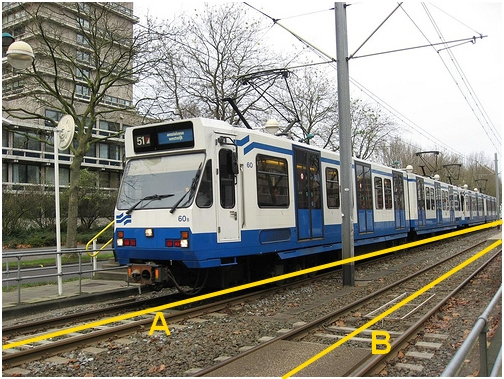
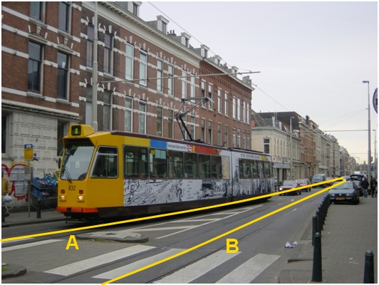

# Spoor

**Definitie**

De as van het spoor, dat wil zeggen het midden van twee stalen staven op een
onderling vaste afstand, waarover trein, tram, of sneltram rijdt.

## inwinningsregels

### BGT

Bron: [Gegevenscatalogus BGT 1.2](https://docs.geostandaarden.nl/imgeo/catalogus/bgt/#objectafbakening-spoor)

>   **Regels voor opname**
>   
>   Het midden tussen de twee staven van een spoor, de as van het spoor, wordt
>   als lijn vastgelegd.
>   
>   De as van elk afzonderlijk spoor wordt weergegeven.

## functie

**Definitie**

Specificatie van het soort gebruik van het spoor.

### trein

**Definitie**

Spoor voor een railvoertuig voor de langere afstand dat sneller dan 45 km per
uur kan, bestaande uit een enkele of een reeks van locomotieven, treinstellen
en/of wagons.

**Verplicht?**

Ja, verplichte inhoud BGT.

**Voorbeeld**

C (verschillende objecten):

| **Spoor**              | **Attribuutwaarde** | **Opmerkingen** |
|------------------------|---------------------|-----------------|
| functie                | trein               |                 |
| relatieveHoogteligging |  0                  |                 |

A: Wegdeel, Overweg.

B: Wegdeel, functie: Spoorbaan.

### sneltram

**Definitie**

Spoor voor een boven- danwel ondergrondse interlokale tram met een vrije baan.

**Verplicht?**

Ja, verplichte inhoud BGT.

**Voorbeeld**

A en B (gescheiden objecten):

| **Spoor**              | **Attribuutwaarde** | **Opmerkingen** |
|------------------------|---------------------|-----------------|
| functie                | sneltram            |                 |
| relatieveHoogteligging |  0                  |                 |

Een (spoorbaan voor de) metro beschouwt de BGT als een verbijzondering van een
(spoorbaan voor) sneltram.

### tram

**Definitie**

Spoor voor een railvoertuig voor personenvervoer voor de korte afstand.

**Verplicht?**

Ja, verplichte inhoud BGT.

**Voorbeeld**

A en B (gescheiden objecten):

| **Spoor**              | **Attribuutwaarde** | **Opmerkingen** |
|------------------------|---------------------|-----------------|
| functie                | Tram                |                 |
| relatieveHoogteligging |  0                  |                 |

### (haven)kraan

**Definitie**

Spoorbaan waarop een hefkraan (bij een haven) zich voortbeweegt.

**Verplicht?**

Nee, optionele inhoud IMGeo.

**Voorbeeld**

Een afbeelding van een spoor havenkraan kunt u sturen
aan: [imgeo\@geonovum.nl](mailto:info@geonovum.nl)

| **Spoor**              | **Attribuutwaarde** | **Opmerkingen** |
|------------------------|---------------------|-----------------|
| functie                | Havenkraan          |                 |
| relatieveHoogteligging |  0                  |                 |
