Straatmeubilair
===============

**Definitie**  
Een ruimtelijk object ter inrichting van de openbare ruimte.

type
----

Definitie

Het soort straatmeubilair.

### abri

**Definitie**

Overdekte wachtplaats voor passagiers van het openbaar vervoer.

**Verplicht?**

Nee, optionele inhoud IMGeo.

**Voorbeeld**

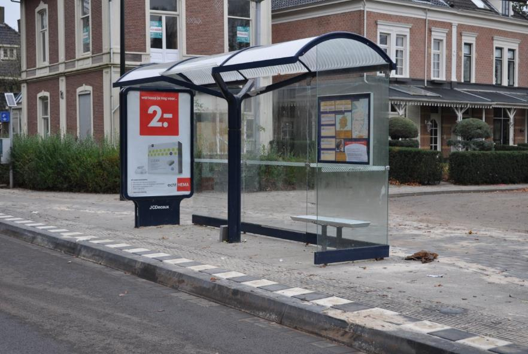

| **Straatmeubilair**    | **Attribuutwaarde** | **Opmerkingen** |
|------------------------|---------------------|-----------------|
| type                   | abri                |                 |
| relatieveHoogteligging |                     |                 |

### bolder

**Definitie**

Een inrichting aan de wal, waar een schip, door middel van een tros of landvast,
aan vastgelegd kan worden.

**Verplicht?**

Nee, optionele inhoud IMGeo.

**Voorbeeld**

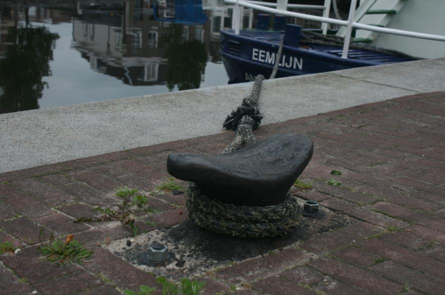

| **Straatmeubilair**    | **Attribuutwaarde** | **Opmerkingen** |
|------------------------|---------------------|-----------------|
| type                   | bolder              |                 |
| relatieveHoogteligging |                     |                 |

### brievenbus

**Definitie**

Uitpandige kast waar post in kan worden gedeponeerd ter bezorging.

**Verplicht?**

Nee, optionele inhoud IMGeo.

**Voorbeeld**

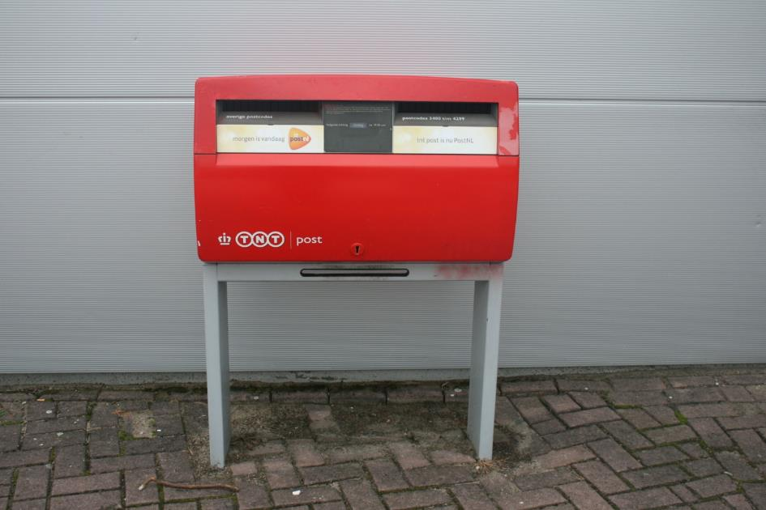

| **Straatmeubilair**    | **Attribuutwaarde** | **Opmerkingen** |
|------------------------|---------------------|-----------------|
| type                   | brievenbus          |                 |
| relatieveHoogteligging |                     |                 |

### fietsenrek

**Definitie**

Een duurzaam verankerd rek in de openbare ruimte voor het stallen van fietsen.

**Verplicht?**

Nee, optionele inhoud IMGeo.

**Voorbeeld**

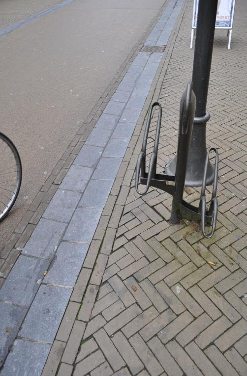

| **Straatmeubilair**    | **Attribuutwaarde** | **Opmerkingen** |
|------------------------|---------------------|-----------------|
| type                   | fietsenrek          |                 |
| relatieveHoogteligging |                     |                 |

### kunstobject

**Definitie**

Een object dat als kunst gezien wordt en een bepaalde schoonheid heeft, niet
door de natuur gemaakt.

**Verplicht?**

Nee, optionele inhoud IMGeo.

**Voorbeeld**

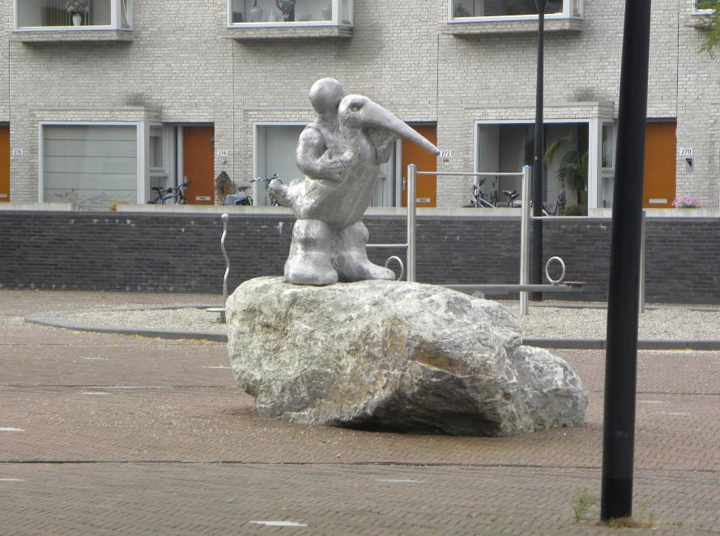

| **Straatmeubilair**    | **Attribuutwaarde** | **Opmerkingen** |
|------------------------|---------------------|-----------------|
| type                   | kunstobject         |                 |
| relatieveHoogteligging |                     |                 |

### openbaar toilet

**Definitie**

Voor mensen bedoeld toilet niet zijnde een pand, langs de openbare weg.

**Verplicht?**

Nee, optionele inhoud IMGeo.

**Voorbeeld**

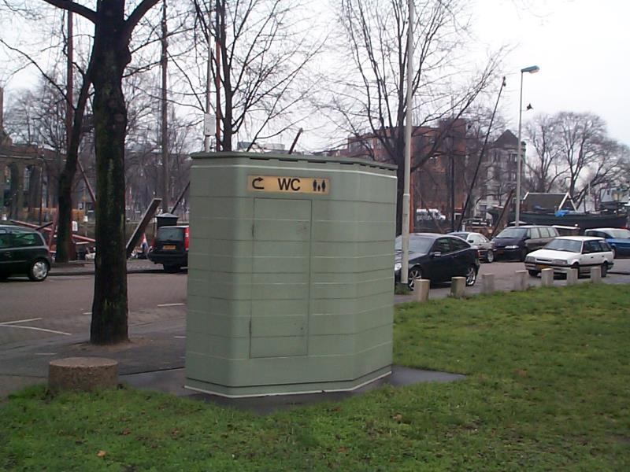

| **Straatmeubilair**    | **Attribuutwaarde** | **Opmerkingen** |
|------------------------|---------------------|-----------------|
| type                   | openbaar toilet     |                 |
| relatieveHoogteligging |                     |                 |

### slagboom

**Definitie**

Boom of balk om de weg of een gedeelte hiervan af te sluiten.

**Verplicht?**

Nee, optionele inhoud IMGeo.

**Voorbeeld**

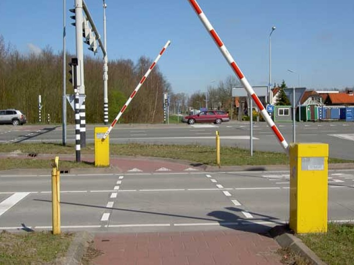

| **Straatmeubilair**    | **Attribuutwaarde** | **Opmerkingen** |
|------------------------|---------------------|-----------------|
| type                   | slagboom            |                 |
| relatieveHoogteligging |                     |                 |

### speelvoorziening

**Definitie**

Aard en nagelvast met de grond verbonden constructie in de openbare ruimte,
bedoeld als speelmateriaal voor kinderen.

**Verplicht?**

Nee, optionele inhoud IMGeo.

**Voorbeeld**

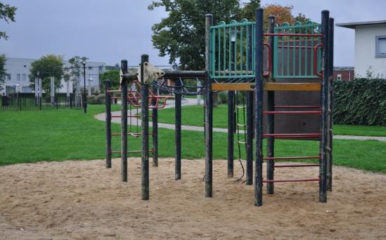

| **Straatmeubilair**    | **Attribuutwaarde** | **Opmerkingen** |
|------------------------|---------------------|-----------------|
| type                   | speelvoorziening    |                 |
| relatieveHoogteligging |                     |                 |

### telefooncel

**Definitie**

Niet-inpandige ruimte in openbaar gebied louter bestemd voor telefoneren.

**Verplicht?**

Nee, optionele inhoud IMGeo.

**Voorbeeld**

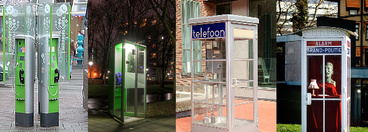

| **Straatmeubilair**    | **Attribuutwaarde** | **Opmerkingen** |
|------------------------|---------------------|-----------------|
| type                   | telefooncel         |                 |
| relatieveHoogteligging |                     |                 |

### bank

**Definitie**

Aaneengesloten zitplaats voor verscheidene personen, bedoeld voor openbaar
gebruik en geplaatst in de openbare ruimte (vnl. in parken, plantsoenen, bossen
en langs wegen).

**Verplicht?**

Nee, optionele inhoud IMGeo.

**Voorbeeld**

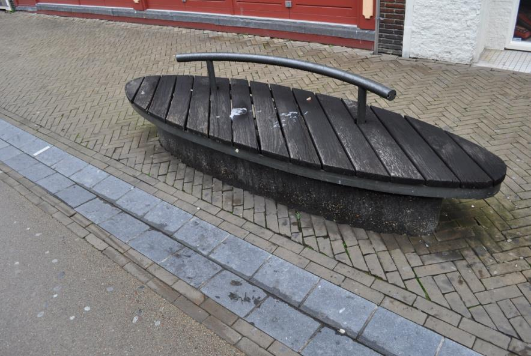

| **Straatmeubilair**    | **Attribuutwaarde** | **Opmerkingen** |
|------------------------|---------------------|-----------------|
| type                   | bank                |                 |
| relatieveHoogteligging |                     |                 |

### picknicktafel

**Definitie**

Een \`picknicktafel\` is een tafel met vaak daaraan gemonteerde zitbanken of
stoelen die kan gebruikt worden om te picknicken.

**Verplicht?**

Nee, optionele inhoud IMGeo.

**Voorbeeld**

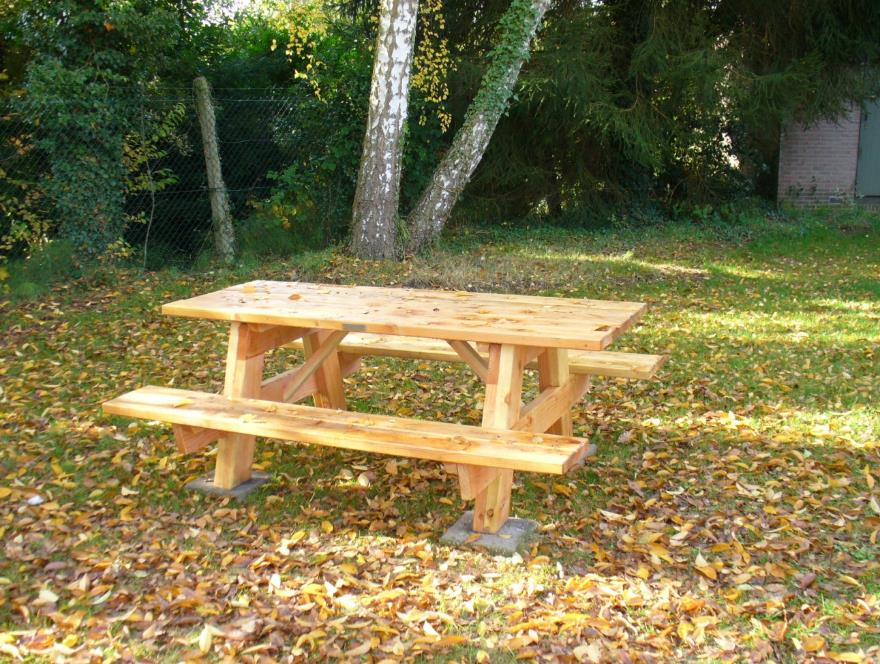

| **Straatmeubilair**    | **Attribuutwaarde** | **Opmerkingen** |
|------------------------|---------------------|-----------------|
| type                   | picknicktafel       |                 |
| relatieveHoogteligging |                     |                 |

### fontein

**Definitie**

Een fontein is een natuurlijke of kunstmatige installatie die water spuit.

**Verplicht?**

Nee, optionele inhoud IMGeo.

**Voorbeeld**

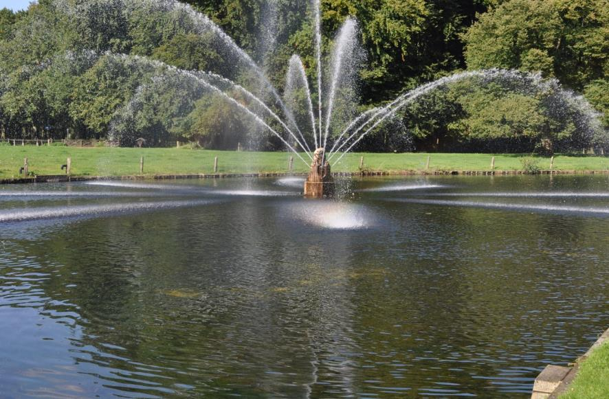

| **Straatmeubilair**    | **Attribuutwaarde** | **Opmerkingen** |
|------------------------|---------------------|-----------------|
| type                   | fontein             |                 |
| relatieveHoogteligging |                     |                 |

### lichtpunt

**Definitie**

Een lichtpunt is een lamp die licht uitzendt niet verbonden met een mast die het
maaiveld raakt.

**Verplicht?**

Nee, optionele inhoud IMGeo.

**Voorbeeld**

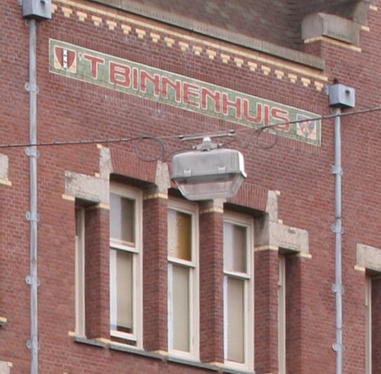

| **Straatmeubilair**    | **Attribuutwaarde** | **Opmerkingen** |
|------------------------|---------------------|-----------------|
| type                   | lichtpunt           |                 |
| relatieveHoogteligging |  1                  |                 |

### parkeerbeugel

**Definitie**

Een omklapbare beugel voor het afschermen van een parkeerplaats.

**Verplicht?**

Nee, optionele inhoud IMGeo.

**Voorbeeld**

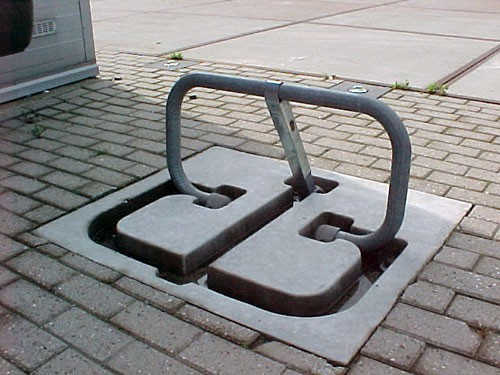

| **Straatmeubilair**    | **Attribuutwaarde** | **Opmerkingen** |
|------------------------|---------------------|-----------------|
| type                   | parkeerbeugel       |                 |
| relatieveHoogteligging |                     |                 |

### betaalautomaat

**Definitie**

Een apparaat dat betaalkaarten en/of contant geld accepteert om betalingen uit
te voeren.

**Verplicht?**

Nee, optionele inhoud IMGeo.

**Voorbeeld**

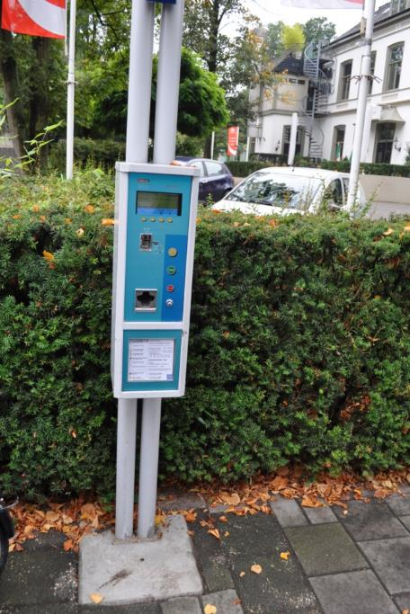

| **Straatmeubilair**    | **Attribuutwaarde** | **Opmerkingen** |
|------------------------|---------------------|-----------------|
| type                   | betaalautomaat      |                 |
| relatieveHoogteligging |                     |                 |

### reclamezuil

**Definitie**

Vrijstaand bord/zuil waarop rondom of aan één of meer zijden affiches kunnen
worden (of zijn) geplakt.

**Verplicht?**

Nee, optionele inhoud IMGeo.

**Voorbeeld**

| **Straatmeubilair**    | **Attribuutwaarde** | **Opmerkingen** |
|------------------------|---------------------|-----------------|
| type                   | reclamezuil         |                 |
| relatieveHoogteligging |                     |                 |

### fietsenkluis

**Definitie**

Een fietskluis is een kluis om een fiets in te bewaren, meestal ter voorkoming
van diefstal of beschadiging.

**Verplicht?**

Nee, optionele inhoud IMGeo.

**Voorbeeld**

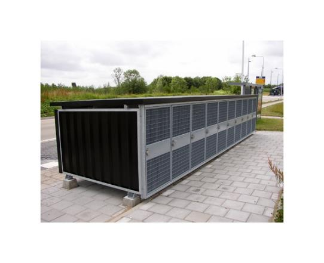

| **Straatmeubilair**    | **Attribuutwaarde** | **Opmerkingen** |
|------------------------|---------------------|-----------------|
| type                   | fietsenkluis        |                 |
| relatieveHoogteligging |                     |                 |

### herdenkingsmonument

**Definitie**

Langs de weg of elders in het terrein aangelegd object ter herdenking van
personen of evenementen.

**Verplicht?**

Nee, optionele inhoud IMGeo.

**Voorbeeld**

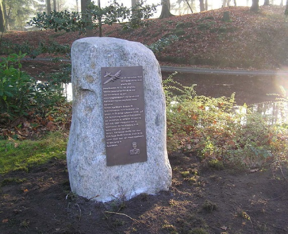

| **Straatmeubilair**    | **Attribuutwaarde** | **Opmerkingen** |
|------------------------|---------------------|-----------------|
| type                   | herdenkingsmonument |                 |
| relatieveHoogteligging |                     |                 |
