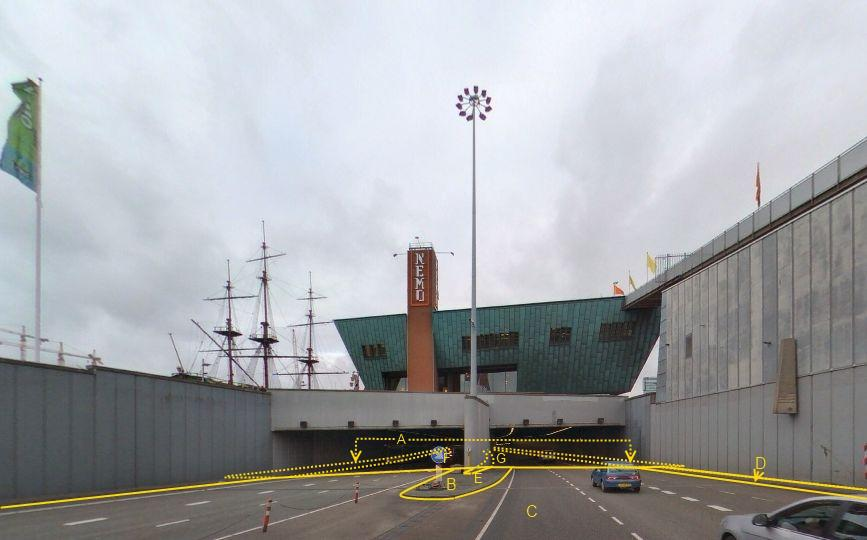

Tunneldeel
==========

**Definitie**

Onderdeel van een kunstmatig aangelegde, kokervormige onderdoorgang dat
essentieel is voor de constructie.

**Verplicht?** 

Ja, verplichte inhoud BGT

**Voorbeeld**

Type: tunneldeel

Op de foto is het tunneldeel A enerzijds begrensd door de overgang met het
bovengrondse wegdeel C ter hoogte van het dichte tunneldak en anderzijds door de
buitenste zijbegrenzing van het tunneldeel overeenkomstig het ontwerp (de
bouwtekening). Uitsluitend de in het tunneldeel aanwezige wegdelen vormen
overeenkomstige BGT-objecten met dezelfde relatieve hoogteligging als het
tunneldeel waarin ze liggen. In het tunneldeel eventueel aanwezige
scheidingsmuren, trappen e.d. vormen geen BGT-inhoud.

A:

| **Tunneldeel**         | **Attribuutwaarde** | **Opmerkingen**                                                                   |
|------------------------|---------------------|-----------------------------------------------------------------------------------|
| relatieveHoogteligging |  -1                 | Een tunneldeel ligt altijd ‘onder’ maaiveld en de attribuutwaarde is daarom \< 0. |

B ,C en D: vormen buiten het tunneldeel als ‘zichtbare’ wegdelen BGT-inhoud. E:
scheiding, type muur. F en G zijn in de tunnel gelegen wegdelen. De relatieve
hoogteligging daarvan is hetzelfde als het tunneldeel waarin ze liggen, dus -1.

inwinningsregels
----------------

### BGT

Bron: [Gegevenscatalogus BGT
1.2](https://docs.geostandaarden.nl/imgeo/catalogus/bgt/#objectafbakening-tunneldeel)

>   **Regels voor opname**

>   Er is sprake van een tunnel wanneer deze bestaat uit een gesloten
>   kokerconstructie met een in- en een uitgang. Bij overbruggingsdelen zoals
>   bijvoorbeeld een viaduct is er altijd sprake van een afzonderlijk dek dat op
>   een bak en/of pijlers rust.

>   De buitenste begrenzing van tunneldelen ligt onder het maaiveld en is niet
>   zichtbaar. Opname daarvan in de BGT gebeurt aan de hand van beschikbare
>   informatie, zoals bouwtekeningen. Dat geldt ook voor de in het tunneldeel
>   gelegen wegdelen.

>   Interieur van tunnels, zoals (scheidings)muren, trappen, vormen geen
>   BGT-inhoud, omdat dit nadere invulling is van CityGML LOD1 en hoger.

>   **Aandachtspunten**

>   Zichtbare muren enzovoort die de buitenste delen van een tunnel vormen
>   worden in de BGT als muur enzovoort geclassificeerd.

>   **Relatieve hoogte**

>   De relatieve hoogte van tunneldelen bedraagt altijd \< 0. In tunneldelen
>   ligt of liggen altijd één of meer wegdelen. Deze wegdelen bezitten dezelfde
>   aanduiding voor relatieve hoogte als het tunneldeel waarin zij liggen.
