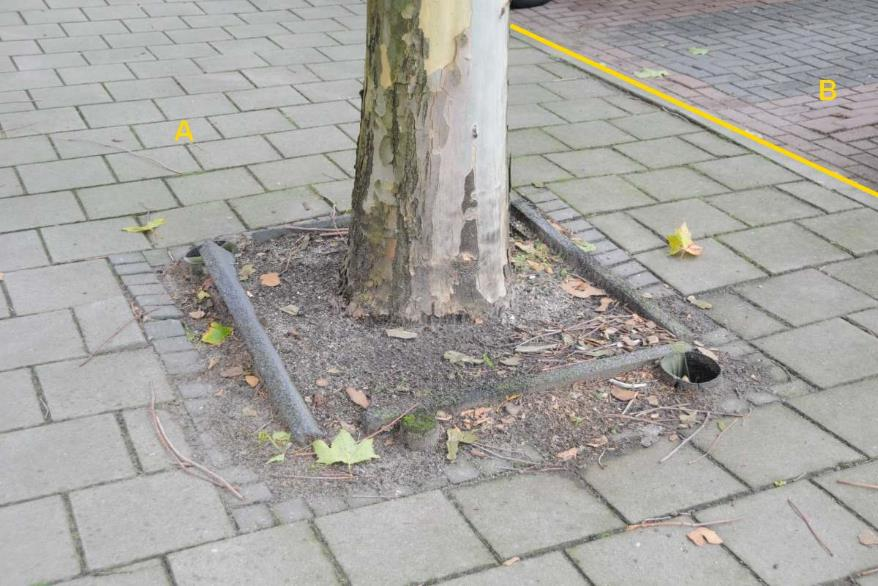
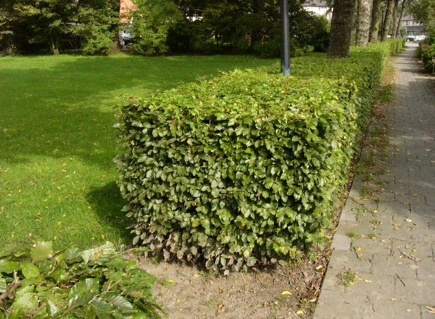
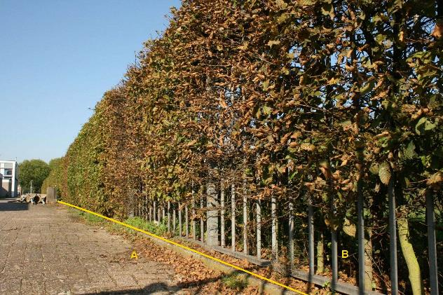

VegetatieObject
===============

**Definitie**

Solitair vegetatieobject of lijn- of vlakvormige groep gelijksoortige
vegetatieobjecten met een beperkte omvang.

type
----

**Definitie**

De specificatie van het soort vrijstaand vegetatieobject.

### boom

**Definitie**

Een markante boom die geen onderdeel uitmaakt van een ander boom- of
struikbeplanting.

**Verplicht?**

Nee, optionele inhoud IMGeo.

**Voorbeeld**

| **VrijstaandVegetatieObject** | **Attribuutwaarde** | **Opmerkingen** |
|-------------------------------|---------------------|-----------------|
| type                          | boom                |                 |
| relatieveHoogteligging        |                     |                 |

### haag

**Definitie**

Een rijvormige afscheiding van zeer beperkte breedte bestaande uit aangeplante
aaneengesloten struiken.

**Verplicht?**

Nee, optionele inhoud IMGeo.

**Voorbeeld**

| **VrijstaandVegetatieObject** | **Attribuutwaarde** | **Opmerkingen** |
|-------------------------------|---------------------|-----------------|
| type                          | haag                |                 |
| relatieveHoogteligging        |                     |                 |
