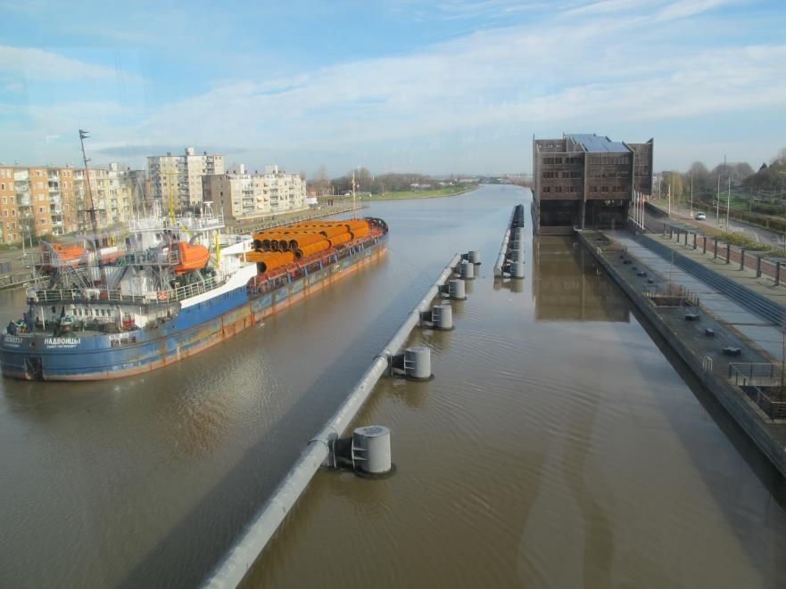
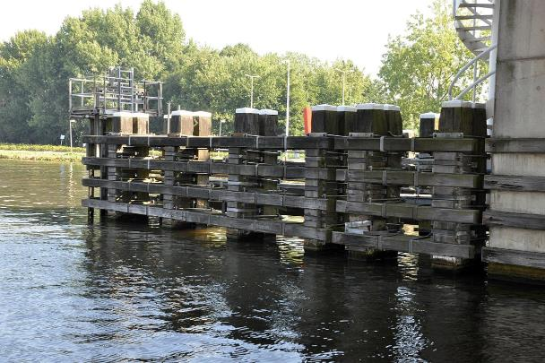
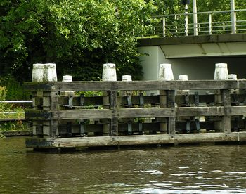
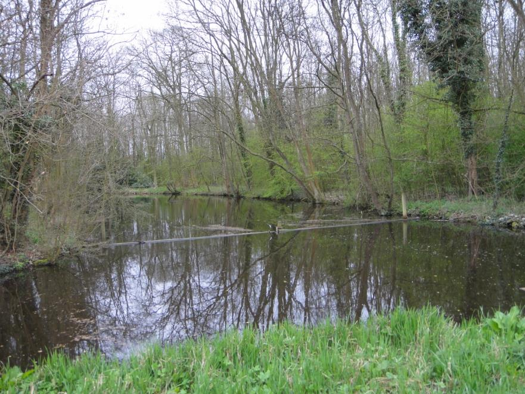
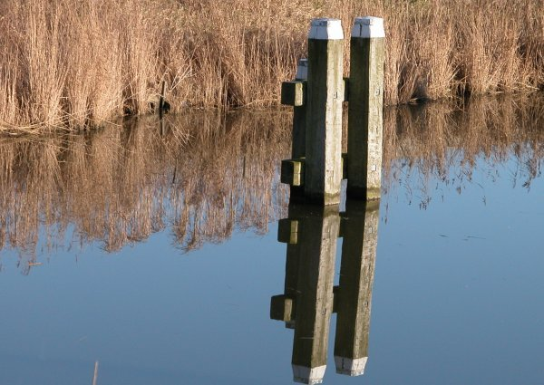
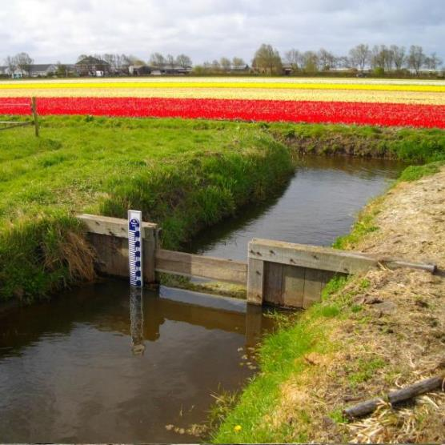
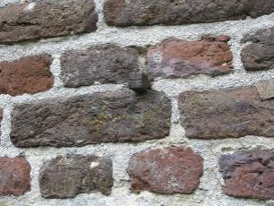

Waterinrichtingselement
=======================

**Definitie**

Een ruimtelijk object ter inrichting van het water.

type
----

**Definitie**

Het soort waterinrichtingselement

### remmingswerk

**Definitie**

Constructie langs de opstelruimte en wachtruimte bedoeld voor het afmeren van
schepen.

**Verplicht?**

Nee, optionele inhoud IMGeo.

**Voorbeeld**

| **Waterinrichtingselement** | **Attribuutwaarde** | **Opmerkingen** |
|-----------------------------|---------------------|-----------------|
| type                        | remmingswerk        |                 |
| relatieveHoogteligging      |                     |                 |

### betonning

**Definitie**

Een systeem van boeien en bakens, waarmee in open zee of in een vaarwater
ondiepten of de aanwezigheid van gevaarlijke objecten worden aangegeven.

**Verplicht?**

Nee, optionele inhoud IMGeo.

**Voorbeeld**

| **Waterinrichtingselement** | **Attribuutwaarde** | **Opmerkingen** |
|-----------------------------|---------------------|-----------------|
| type                        | betonning           |                 |
| relatieveHoogteligging      |                     |                 |

### geleidewerk

**Definitie**

Fuikvormige constructie aansluitend aan het hoofd van een kunstwerk voor het
geven van mechanische en visuele geleiding tijdens het invaren van dat
kunstwerk.

**Verplicht?**

Nee, optionele inhoud IMGeo.

**Voorbeeld**

| **Waterinrichtingselement** | **Attribuutwaarde** | **Opmerkingen** |
|-----------------------------|---------------------|-----------------|
| type                        | geleidewerk         |                 |
| relatieveHoogteligging      |                     |                 |

### vuilvang

**Definitie**

Een voorziening om de waterloop dan wel één of meerdere objecten benedenstrooms
te vrijwaren van drijvend vuil en dergelijke.

**Verplicht?**

Nee, optionele inhoud IMGeo.

**Voorbeeld**

| **Waterinrichtingselement** | **Attribuutwaarde** | **Opmerkingen** |
|-----------------------------|---------------------|-----------------|
| type                        | vuilvang            |                 |
| relatieveHoogteligging      |                     |                 |

### meerpaal

**Definitie**

Paal voor een kade of in een haven waaraan een schip kan worden afgemeerd.

**Verplicht?**

Nee, optionele inhoud IMGeo.

**Voorbeeld**

| **Waterinrichtingselement** | **Attribuutwaarde** | **Opmerkingen** |
|-----------------------------|---------------------|-----------------|
| type                        | meerpaal            |                 |
| relatieveHoogteligging      |                     |                 |

### hoogtemerk

**Definitie**

Relatief permanent merk, natuurlijk of kunstmatig, met daarin een punt met een
bekende hoogte ten opzichte van een bepaald referentievlak.

**Verplicht?**

Nee, optionele inhoud IMGeo.

**Voorbeeld**

| **Waterinrichtingselement** | **Attribuutwaarde** | **Opmerkingen** |
|-----------------------------|---------------------|-----------------|
| type                        | hoogtemerk          |                 |
| relatieveHoogteligging      |                     |                 |
