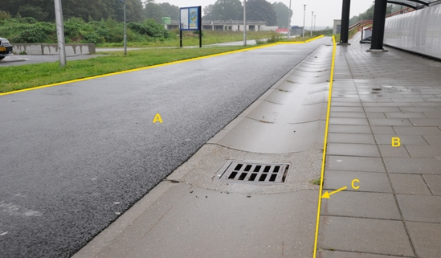
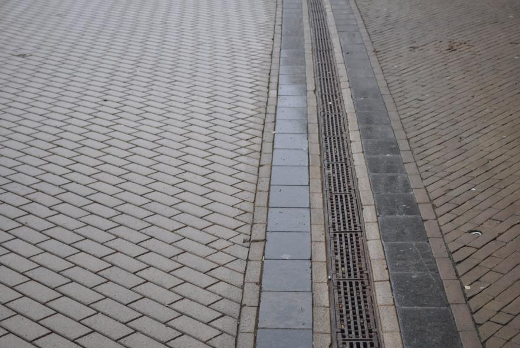
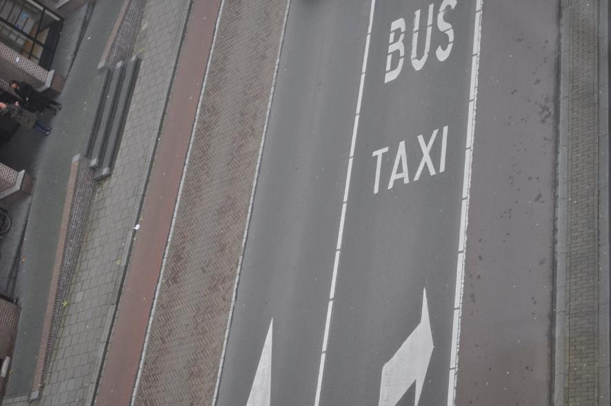
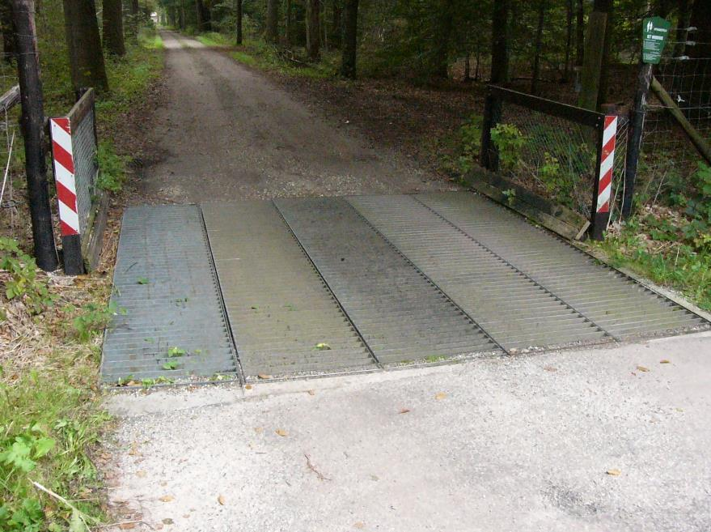
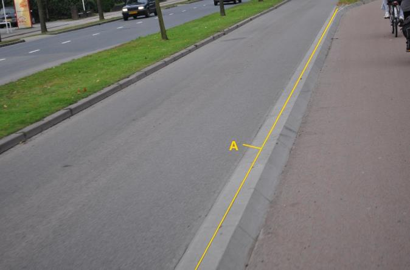
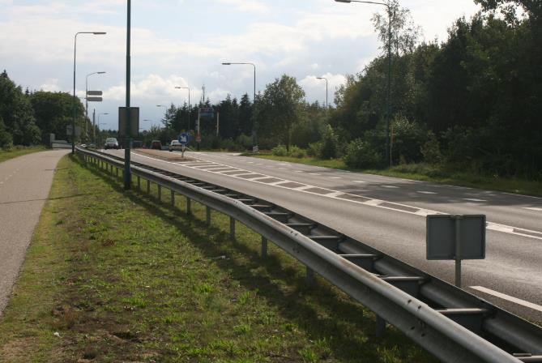
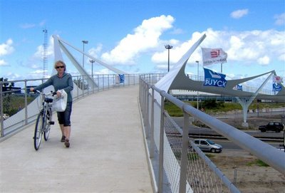
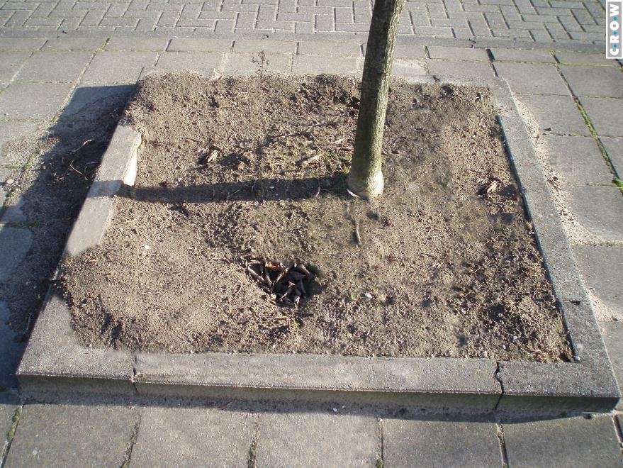
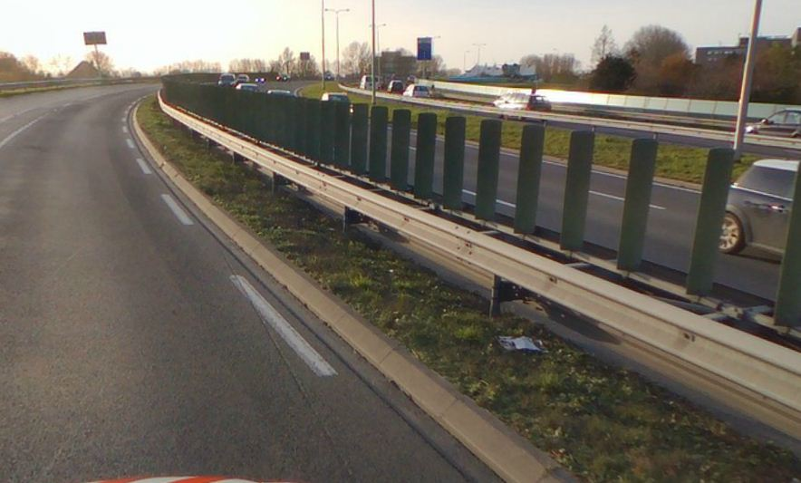

Weginrichtingselement
=====================

**Definitie**

Een ruimtelijk object dat dient voor de inrichting van de openbare weg.

type
----

**Definitie**

Het soort weginrichtingselement.

### molgoot

**Definitie**

Smalle goot (lijngeometrie) in de lengterichting van de verharding, met veelal
een cirkelsegment als dwarsprofiel.

**Verplicht?**

Nee, optionele inhoud IMGeo.

**Voorbeeld**

Voor de BGT is de molgoot geen inhoud en wordt bij wegdeel A gerekend. In IMGeo
kan de molgoot als weginrichtingselement met lijngeometrie worden opgenomen.

C:

| **Weginrichtingselement** | **Attribuutwaarde** | **Opmerkingen** |
|---------------------------|---------------------|-----------------|
| type                      | molgoot             |  lijn           |
| relatieveHoogteligging    |                     |                 |

### lijnafwatering

**Definitie**

Goot in de lengterichting van de verharding, niet zijnde molgoot. Bijvoorbeeld
roostergoot en verholen goot.

**Verplicht?**

Nee, optionele inhoud IMGeo.

**Voorbeeld**

| **Weginrichtingselement** | **Attribuutwaarde** | **Opmerkingen** |
|---------------------------|---------------------|-----------------|
| type                      | lijnafwatering      |                 |
| relatieveHoogteligging    |                     |                 |

### wegmarkering

**Definitie**

Op of in het oppervlak van de verharding aangebrachte tekens ter geleiding,
waarschuwing, regeling of informatie van het verkeer.

**Verplicht?**

Nee, optionele inhoud IMGeo.

**Voorbeeld**

| **Weginrichtingselement** | **Attribuutwaarde** | **Opmerkingen** |
|---------------------------|---------------------|-----------------|
| type                      | wegmarkering        |                 |
| relatieveHoogteligging    |                     |                 |

### wildrooster

**Definitie**

Horizontaal raamwerk dat dient om wild de doorgang te beletten.

**Verplicht?**

Nee, optionele inhoud IMGeo.

**Voorbeeld**

| **Weginrichtingselement** | **Attribuutwaarde** | **Opmerkingen** |
|---------------------------|---------------------|-----------------|
| type                      | wildrooster         |                 |
| relatieveHoogteligging    |                     |                 |

### rooster

**Definitie**

Een rooster niet zijnde lijnafwatering of wildrooster.

**Verplicht?**

Nee, optionele inhoud IMGeo.

**Voorbeeld**

| **Weginrichtingselement** | **Attribuutwaarde** | **Opmerkingen** |
|---------------------------|---------------------|-----------------|
| type                      | rooster             |                 |
| relatieveHoogteligging    |                     |                 |

### geleideconstructie

**Definitie**

Bermbeveiligingsconstructie bedoeld voor fysieke geleiding van voertuigen die
uit de koers zijn geraakt.

**Verplicht?**

Nee, optionele inhoud IMGeo.

**Voorbeeld**

A:

| **Weginrichtingselement** | **Attribuutwaarde** | **Opmerkingen** |
|---------------------------|---------------------|-----------------|
| type                      | geleideconstructie  |                 |
| relatieveHoogteligging    |                     |                 |

### balustrade

**Definitie**

Een balustrade is een hekwerk of afzetting aan de rand van een overbrugging. Een
balustrade beveiligt tegen het vallen.

**Verplicht?**

Nee, optionele inhoud IMGeo.

**Voorbeeld**

| **Weginrichtingselement** | **Attribuutwaarde**                    | **Opmerkingen** |
|---------------------------|----------------------------------------|-----------------|
| type                      | balustrade                             |                 |
| relatieveHoogteligging    |  Hetzelfde als object waarop dit staat |                 |

### boomspiegel

**Definitie**

Het stuk grond rondom de stam van een boom dat van boven toegankelijk is voor
lucht en water.

**Verplicht?**

Nee, optionele inhoud IMGeo.

**Voorbeeld**

| **Weginrichtingselement** | **Attribuutwaarde** | **Opmerkingen** |
|---------------------------|---------------------|-----------------|
| type                      | boomspiegel         |                 |
| relatieveHoogteligging    |                     |                 |

### verblindingswering

**Definitie**

Constructie bedoeld om verblinding van weggebruikers door tegenlicht te
voorkomen.

**Verplicht?**

Nee, optionele inhoud IMGeo.

**Voorbeeld**

| **Weginrichtingselement** | **Attribuutwaarde** | **Opmerkingen** |
|---------------------------|---------------------|-----------------|
| type                      | verblindingswering  |                 |
| relatieveHoogteligging    |                     |                 |
