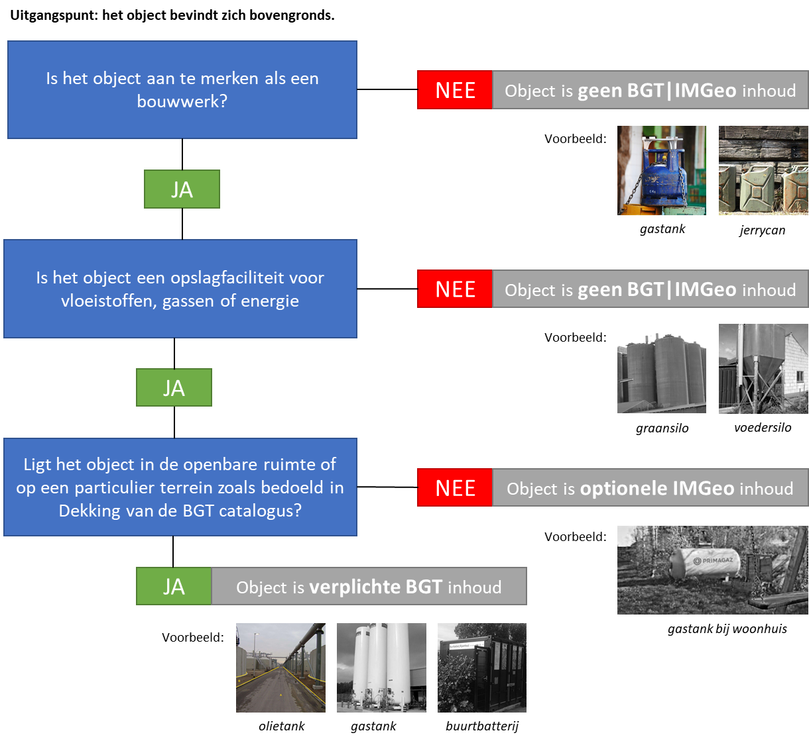

Praktijkrichtlijn Opslagtanks in BGT 1.\| IMGeo 2.2

In de BGT worden bovengrondse opslagtanks opgenomen. In BGT 1.1.1 \| IMGeo 2.1.1
was dit beperkt tot enkel de bovengrondse opslagtanks voor vloeistoffen, in BGT
1.2\| IMGeo 2.2 is dit uitgebreid met opslagtanks voor gassen en energie. Aan
bronhouders wordt gevraagd om deze opslagtanks voor gassen en energie op te
nemen in de BGT. Deze praktijkrichtlijn beschrijft enkele regels om de
uitvoering hiervan te verduidelijken.

Wat is een opslagtank in de BGT?
================================

Opslagtank is een type OverigBouwwerk in de BGT met de volgende definitie:

>   *Opslagfaciliteit voor vloeistoffen, gassen of energie.*

Welke opslagtanks moet ik opnemen in de BGT?
============================================

Alleen bovengrondse opslagtanks worden opgenomen in de BGT.

Elke opslagtank

1.  die aangemerkt kan worden als bouwwerk, ofwel een constructie van enige
    omvang bedoeld om voor een bepaalde periode ter plaatse te functioneren, en

2.  die een opslagfaciliteit is voor vloeistoffen, gassen of energie, en

3.  die zich bevinden in de openbare ruimte of op particuliere terreinen waar
    deze informatie voorziet in een betere of zelfs noodzakelijke, wettelijk
    geregelde dienstverlening door bronhouders en gebruikers (zie
    [Dekking](https://docs.geostandaarden.nl/imgeo/catalogus/bgt/#dekking) in de
    BGT catalogus versie 1.2)

behoort tot de verplichte inhoud van de BGT.

De BGT stelt geen eisen aan de minimale of maximale afmetingen van een
opslagtank.

Welke opslagtanks mag ik opnemen in IMGeo?
==========================================

Opslagtanks op overige particuliere terreinen bijvoorbeeld bij een woonhuis voor
de gasvoorziening mogen optioneel in IMGeo worden opgenomen.

IMGeo beschrijft geen eisen en regels voor de opname van ondergrondse
opslagtanks.

Welke opslagtanks neem ik niet op in IMGeo?
===========================================

Opslagtanks die geen opslag faciliteren van vloeistoffen, gassen of energie,
zoals een graansilo bij een landbouwbedrijf of voedersilo bij een veehouderij,
en opslagtanks die aangemerkt kunnen worden als bouwwerk, zoals jerrycans en
gastanks voor barbecues en (camping)kookstellen.

Beslisboom
==========

Onderstaande beslisboom is bedoeld als hulpmiddel bij de afbakening van
bovengrondse opslagtanks.

Hulpbronnen
===========

De volgende hulpbronnen kunnen worden geraadpleegd bij het opnemen van
bovengrondse opslagtanks bij de implementatie van BGT 1.2 \| IMGeo 2.2:

1.  **Luchtfoto’s:** de meeste bronhouders laten jaarlijks een nieuwe
    luchtopname maken ten behoeve van mutatiesignalering voor bijhouding van de BGT en eigen beheerkaart.

2.  **BRT:** de kleinschalige topografische kaart kan worden gebruikt om
    ontbrekende opslagtanks op te sporen.

3.  **Interne registraties:** kunnen gegevens bevatten over vergunning/meldingen
    van opslagtanks in de openbare ruimte (bijv. VTH) of nadere detaillering van
    objecten in de openbare ruimte (bijv. BOR)

4.  **Terug- of mutatiemeldingen:** via verbeterdekaart kunnen afnemers van de
    BGT ontbrekende of onjuiste geclassificeerde terugmelden, of beheerders van
    de openbare ruimte dienen meldingen in bij de BGT beheerder dat er een
    mutatie in het terrein ten opzichte van de BGT kaart is geconstateerd.
