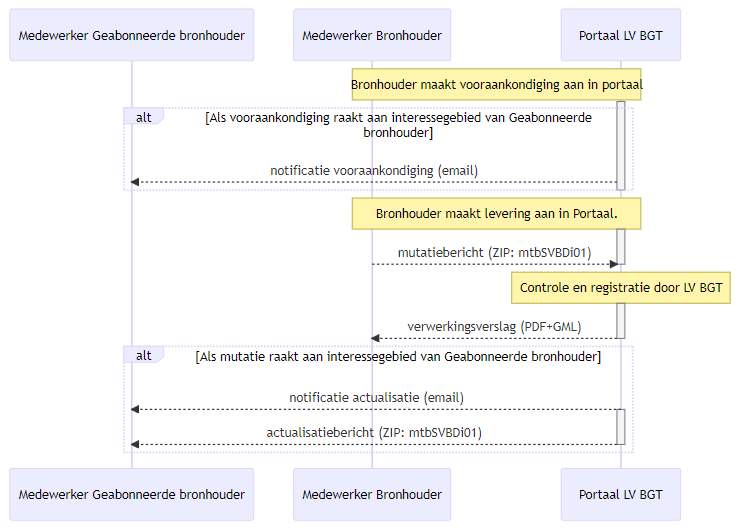
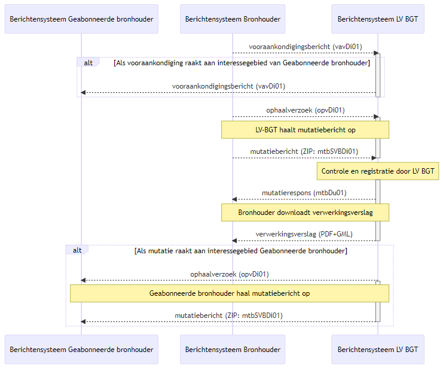

# Werkafspraak

De volgende werkafspraak geldt voor de BGT keten voor de uitwisseling van
berichten tussen bronhouder en de Landelijke Voorziening BGT (LV BGT):

>   Het portaal en berichtensysteem BRAVO van SVB-BGT wordt geschrapt in het BGT
>   berichtenverkeer. De communicatie / uitwisseling tussen bronhouders en LV
>   BGT is in het vervolg rechtstreeks, zonder tussenkomst van het systeem BRAVO
>   van SVB-BGT.

>   Bronhouder of dataleverancier levert de berichten aan het LV BGT
>   berichtensysteem en/of portaal aan (al dan niet via broker) In de
>   stuurgegevens van een bericht aan het LV BGT berichtensysteem of portaal
>   dient bronhouder of dataleverancier de code ‘K0001’ op te nemen in het
>   element «organisatie» van «ontvanger».

Deze werkafspraak treedt in werking bij het beschikbaar komen van het nieuwe LV
BGT berichtensysteem en portaal. In een overgangsperiode van 3 maanden

beschikbaar is gekomen voor aansluiting door bronhouders en dataleveranciers op
het nieuwe LV BGT berichtensysteem en portaal. (zie [impact](#impact) voor meer
informatie over de releasedatum, implementatie en overgangsperiode).

## Wijzigingen in het berichtenverkeer

De gewijzigde uitwisseling tussen bronhouder en LV BGT voor **handmatige
upload/download** wordt weergegeven in onderstaand sequentiediagram.

De gewijzigde uitwisseling tussen
bronhouder en LV BGT voor **automatisch berichtenverkeer** wordt weergegeven in
onderstaand sequentiediagram.

### Vooraankondigen

1.  Bronhouder maakt vooraankondiging aan via Portaal LV BGT of stuurt
    vooraankondigingsbericht aan Berichtensysteem LV BGT.

2.  Bronhouder neemt in de stuurgegevens van het vooraankondigingsbericht
    (vavDi01) de gegevens van SVB-BGT of LV BGT op als «ontvanger»

3.  LV BGT ontvangt en verwerkt het vooraankondigingsbericht (vavDi01).

4.  LV BGT notificeert geraakte bronhouder rechtstreeks van vooraankondiging(en)
    binnen zijn interessegebied, middels een email of geautomatiseerd bericht.

5.  LV BGT neemt in de stuurgegevens van het vooraankondigingsbericht (vavDi01)
    de gegevens van geraakte bronhouder op als «ontvanger».

6.  Tot 3 maanden na de releasedatum stuurt LV BGT in de stuurgegevens van het
    bericht als «zender» de gegevens van SVB-BGT. Vanaf 3 maanden na de
    releasedatum stuurt LV BGT in de stuurgegevens van het bericht als «zender»
    de eigen stuurgegevens.

### Aanleveren van mutaties en terugkoppeling van werking

1.  Bronhouder levert mutaties rechtstreeks aan LV BGT van het Kadaster.

2.  Bronhouder levert een mutatiebericht van het type mtbSVBDi01 aan LV BGT. Het
    mutatiebericht tussen SVB-BGT en LV BGT (mtbLVDi01) vervalt in de Standaard
    BGT berichtenverkeer.

3.  Bronhouder neemt in de stuurgegevens van het ophaalverzoek (opvDi01) en
    mutatiebericht (mtbSVBDi01) de gegevens van SVB-BGT of LV BGT op als
    «ontvanger».

4.  LV BGT stuurt het verwerkingsresultaat middels emailnotificatie (bij
    handmatige upload/download) of in een mtbDu01-reponsbericht (bij automatisch
    berichtenverkeer) rechtstreeks naar bronhouder.

5.  LV BGT neemt in de stuurgegevens van het responsbericht (mtbDu01) de
    gegevens van bronhouder op als «ontvanger».

6.  Tot 3 maanden na de releasedatum stuurt LV BGT in de stuurgegevens van het
    bericht als «zender» de gegevens van SVB-BGT. Vanaf 3 maanden na de
    releasedatum stuurt LV BGT in de stuurgegevens van het bericht als «zender»
    de eigen stuurgegevens.

### Actualiseren

1.  Bronhouder actualiseert rechtstreeks via de LV BGT. Bronhouder kan via het
    Portaal LV BGT een interessegebied aanmaken of uploaden (GML).

2.  LV BGT notificeert geraakte bronhouder rechtstreeks van mutaties binnen zijn
    interessegebied, middels een email of geautomatiseerd bericht.

3.  LV BGT neemt in de stuurgegevens van het ophaalverzoek (opvDi01) en
    mutatiebericht (mtbSVBDi01) de gegevens van bronhouder op als «ontvanger».

4.  Tot 3 maanden na de releasedatum stuurt LV BGT in de stuurgegevens van het
    bericht als «zender» de gegevens van SVB-BGT. Vanaf 3 maanden na de
    releasedatum stuurt LV BGT in de stuurgegevens van het bericht als «zender»
    de eigen stuurgegevens.

### 

### Vervallen: initieel leveren

Omdat de opbouwfase van de BGT is afgerond wordt in deze werkafspraak ook
geregeld dat alle berichten en scenario’s voor het initieel leveren van BGT
gegevens komen te vervallen:

1.  Processtap Assembleren vervalt in het BGT berichtenverkeer.

2.  Scenario’s in hoofdstuk 3 Initieel leveren vervallen in zijn geheel.

3.  Bericht actualisatiebericht na assemblage (mtoDi01) vervalt.

Het gewijzigde berichtenverkeer wordt samengevat in het volgende document.
