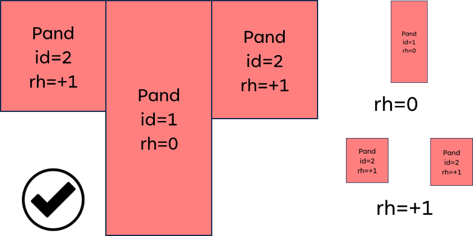

# Werkafspraak

De volgende werkafspraak geldt voor de BGT keten voor het opdelen van panden in
de BGT:

*Voor overbouw en onderbouw van een pand uit de BAG mogen de uitstekende
betreedbare delen als apart Pand-object(en) op andere relatieve hoogteligging
dan de grondvlakgeometrie van het Pand worden geregistreerd in de Landelijke
Voorziening BGT.*

## Nadere toelichting en aanvullende eisen voor overbouw en onderbouw

### Mogen, dus optioneel

De werkafspraak regelt dat bronhouders optioneel overbouw en onderbouw van een
pand mogen opnemen en registreren in de Landelijke Voorziening BGT. Er geldt dus
geen verplichting: bronhouders maken hun eigen afweging of het opnemen van
overbouw en onderbouw in hun BGT van toegevoegde waarde is.

De verplichting dat voor ieder pand in de BAG vanaf status ‘bouw gestart’ de
grondvlakgeometrie van dit pand in de BGT moet worden opgenomen, blijft met deze
werkafspraak ongewijzigd.

De afspraken in deze werkafspraak gelden ook de opname van een BAG-pand vanaf
status ‘bouwvergunning verleend’ als planinformatie in BGT.

### Uitstekende delen

Enkel de **uitstekende delen** van het pand ten opzicht van de
grondvlakgeometrie mogen worden opgenomen in een BGT Pand voor onderbouw en
onderbouw. Het is niet de bedoeling om een hele verdieping af te bakenen.

GOED: 1 BAG Pand is opgedeeld in 3 BGT panden:

-   1 object met grondvlakgeometrie op rel.hoogte 0

-   1 object voor onderbouw op rel.hoogte -1

-   1 object voor overbouw op rel.hoogte +1

FOUT: 1 BAG Pand is opgedeeld in 2 BGT panden:

-   Het object voor overbouw bevat niet enkel de uitstekende delen maar bevat
    ook de grondvlakgeometrie.

Situatieschets:

-   LINKS is GOED afgebakend: alleen het uitstekende deel voor overbouw wordt
    opgenomen in een apart BGT Pand-object op relatieve hoogte +1 .

-   RECHTS is FOUT afgebakend bevat het object voor overbouw ook de
    grondvlakgeometrie bevat, en dus niet enkel de uitstekende delen.

### Betreedbare delen

Enkel het **betreedbare deel** van overbouw of onderbouw dient als Pand te
worden afgebakend. Het niet -betreedbare deel kan optioneel als
Gebouw-installatie in IMGeo worden opgenomen, vergelijkbaar met een luifel.

### Per relatieve hoogte één object

Uitstekende delen op **dezelfde relatieve hoogte** worden in één BGT Pand-object
met *multivlak*geometrie opgenomen. Het is niet de bedoeling om elk afzonderlijk
deel opdezelfde relatieve hoogte in een apart BGT Pand object op te nemen.

GOED: 1 BAG Pand is opgedeeld in 3 BGT panden:

-   1 object met grondvlakgeometrie op rel.hoogte 0

-   1 object voor overbouw op rel. hoogte +1

-   1 object voor overbouw op rel. hoogte +2.

GOED: 1 BAG Pand is opgedeeld in 2 BGT panden:

-   1 object met grondvlakgeometrie op rel.hoogte 0

-   1 object met multivlakgeometrie voor overbouw op rel.hoogte +1

FOUT: 1 BAG Pand is opgedeeld in 3 BGT panden:

-   De objecten voor overbouw op gelijke relatieve hoogte worden opgenomen in
    één Pand-object met multivlakgeometrie.

### Topologie

De objecten voor overbouw en onderbouw moeten (weliswaar op andere relatieve
hoogte) **naadloos grenzen aan de grondvlakgeometrie** van het Pand. Overlap en
gaten tussen grondvlakgeometrie en overbouw/onderbouw is niet toegestaan.

FOUT: 1 BAG Pand is opgedeeld in 3 BGT Panden

-   De geometrie van het object voor overbouw overlapt met het object met
    grondvlakgeometrie.

-   De geometrie van object voor onderbouw grenst niet aan het object met
    grondvlakgeometrie.

### BAG identificatie en nummeraanduidingreeks

Bij elk pand(deel) in de BGT moet een geldige identificatie van het bijbehorende
pand in de BAG worden opgenomen. Nummeraanduidingreeksen (reeksen van
huisnummers van verblijfsobjecten) worden conform de huidige regels opgenomen,
en mogen niet dubbel worden opgenomen. Wel is het toegestaan om een
nummeraanduidingreeks te splitsen in meerdere nummeraanduidingreeksen en deze
toe, als dit de vindbaarheid van objecten en leesbaarheid van informatie via de
kaart vergroot.

### Luifels en overkappingen

Luifels en overkappingen dienen als GebouwInstallatie of OverigBouwwerk conform
de geldige regels worden opgenomen, waarbij in het algemeen geldt dat een luifel
vast zit aan (de gevel van) een Pand (*of OverigBouwwerk*) en een overkapping
een vrijstaand bouwwerk is.
